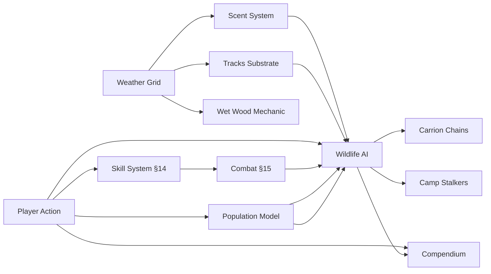

# Survival Game Design Document

> Working version for design iteration. Original at `docs/originals/survival-design.docx`.
> Edit this file directly. Re-extract from the .docx if William updates the original.

---

Working title TBD — Design Synthesis v1

## 1. The Pitch

A 2D top-down multiplayer survival simulation where nature is the antagonist and the only goal is to live. No bosses, no quests, no win condition. Heat, cold, hunger, thirst, exhaustion, injury, and weather behave like a real body answering a real environment. The entertainment isn't progression — it's the player's own learning curve. Every run is a different survival problem, and the meta-game is everything you carry from one life to the next.

Comparable titles: Project Zomboid without the zombies, The Long Dark with other people, Rust without the raid meta. A survival simulation where the entertainment is the player's own learning curve, and where the only thing they keep when they die is what they've come to understand.

### Design North Star

Every run is a different survival problem, and the meta-game is the player's own learning curve.

This principle is the test for every design decision: does it create variance between runs, and does it reward learning? If yes, build it. If no, cut it.

### No Dominant Strategy

Foundational pillar: **no one way is the best way to play.** Every design decision is tested against this rule.

The principle says: if any single weapon, class, playstyle, server mode, progression path, or system becomes objectively optimal, the design has failed. Every "best option" must be paired with a specific cost that makes alternatives equally viable in their own lanes.

Concrete applications:

- **Combat tools** — guns are powerful AND loud, ammo-scarce, meat-damaging, socially hostile-coded. Bows are clean AND limited at range against apex predators. Snares are passive AND require patience. No tool dominates; each trades capability for cost.
- **Character archetypes** — Hunter, Forager, Trapper, Naturalist, Survivalist, Builder, Botanist, Tracker are all viable game-completion paths. A Forager must be able to complete a long arc *without ever firing a weapon* — they're not "a Hunter who can't fight yet," they're a fully realized alternative archetype with their own defensive options (better stealth, scent management, avoidance routing, deterrent crafting).
- **Playstyles** — kill-big-game runs, foraging-only runs, trap-only runs, naturalist-observation runs, builder-fortress runs all complete. No single loop is "the win condition."
- **Camp strategy** — settled fortification AND nomadic ranging are both valid. Resource depletion radius, scent buildup, and Camp Stalkers prevent indefinite settled play; weather, energy budget, and gear weight prevent indefinite nomadic play.
- **Progression** — deep specialization in one domain AND breadth across many are both viable, with different rewards (signature abilities vs more milestones unlocked).
- **MP interaction** — kill-on-sight, trade, cooperation, and pure avoidance are all viable jungle-rules approaches. None dominates; each has costs.
- **Server mode** — solo, friends-only, and public are full-fidelity experiences. Public isn't "the real game"; solo isn't "training mode." Each mode is its own complete arc.

The principle is the design's central immune system against feature creep collapsing into a single optimal path. Every new system added must be tested: does it make one existing path obviously better, or does it open a new path with its own costs?

When a system inadvertently violates this principle (a craftable that trivializes hunting; a weapon with no real cost; a class with universal applicability), the system is wrong, not the principle.

### Platform & Engine

- Target platform: Steam (PC)
- Engine: Godot — chosen for AI-assisted development workflow (text-based scenes, GDScript, full text-editable wiring of nodes, signals, and resources)
- Art style: 2D top-down or isometric

## 2. The Learning Curve as Game

Players survive longer than their last run. Each run is meaningfully different from the last. The compendium grows. The player's own knowledge grows. The game has no progression bars to fill — it has a world to learn, and learning it is the reward.

### Variance vs. Randomness

There is a critical distinction between random and variable. Randomness — "the bear attacks 20% of the time" — feels unfair and teaches nothing because there is no signal to read. Variability — "this bear is in a defensive state because there are cubs nearby, and the player can see them if they look" — produces different outcomes across runs and rewards the player who learns to read the signs.

Every system that produces variance must also produce signals the player can learn to read.

### Mechanical Behavior, Not Scripted Narrative

Every entity that exhibits behavior — wildlife, weather, predator, prey, plant — operates from mechanical state and rules, not story arcs. A bear approaches a player camp because scent + hunger + behavioral memory aligned, not because a Storyteller meta-system arranged a dramatic encounter. A wolf pack pressures a drainage because their hunger crossed a threshold, not because the design wanted the player to feel hunted.

The story is the player's, not the system's. The player tells themselves "the bear of the meadow came back for me." The system computes "hunger high + scent reached + location memory said this drainage = sometimes food." Both are true; they are not the same thing. The player's narrative is real to them; the system has no narrative state.

This principle has the same shape as Variance vs. Randomness above, applied at a deeper level. Variance vs. Randomness says: outcomes vary, but in ways the player can read. Mechanical Behavior says: behaviors emerge from agent state, not from designer-arranged story beats. Both demand observable mechanical inputs. Neither permits a hidden authorial hand.

Implication for §12.6 (Storyteller meta-agent): held-open status is now LEAN-REJECT. RimWorld's Storyteller paces narrative dramatically by adjusting probabilities behind the scenes — exactly the opposite shape. Mother Nature's principle says emergence comes from agents behaving on their own logic, not from a meta-system arranging events for dramatic effect. Adopting a Storyteller would directly contradict this principle.

The test for any new system: does its behavior emerge from observable mechanical inputs that the player can perceive and predict? If yes, build it. If no — if it adjusts probabilities or arranges events to "make the story better" — it's the wrong shape, no matter how compelling the narrative payoff might seem.

### Sources of Per-Run Variance

- Spawn variance: biome, season, time of day, starting weather. A spring forest spawn is a fundamentally different game than a late-autumn tundra spawn.
- World seed: hand-authored map geography with procedural overlays — animal populations, plant distributions, water sources, seasonal effects shift per seed. The land is learnable; the ecology is per-run.
- Anomaly events: rare per-run conditions that change the survival problem — a drought year, a harsh winter, a wildfire that already burned a region before the player spawned. Roughly one notable anomaly per run.
- Animal individuality: each meaningful animal has its own state, needs, and territory; encounters emerge from individual circumstance, not spawn rolls.
- Weather emergence: weather is simulated, not scripted; no two runs have the same storm sequence even on the same map and season.

## 3. The World

### 3.1 Launch Biomes

Three launch biomes, each its own survival problem. Same systems, but the dominant threats, survival priorities, and daily rhythm differ enough that mastery in one biome does not equal competence in another.

#### Deep Forest

The forgiving one — relatively. The recommended starting biome for new players. Where the compendium fills fastest. The survival problem is abundance with hidden danger.

- Climate: Temperate, four real seasons. Moderate rainfall. Long growing season. Liquid water everywhere.
- Resources: Plentiful. Wood for everything. The widest plant diversity in the game — including the highest density of toxic lookalikes. Game is plentiful and varied.
- Threats: What you don't see. Dense canopy hides predators, weather, and routes. Visibility is limited; sound carries strangely; scent moves unpredictably under canopy. The forest punishes inattention more than incompetence.
- Signature experience: Getting lost. The forest is dense and repetitive, and a player who hasn't built a way to mark their path or read the sun can lose track of where they are.

#### Desert

The brutal one for new players, the puzzle one for veterans. The survival problem is scarcity managed against time.

- Climate: Hot days, cold nights. Two effective seasons: a long hot/dry season and a brief wet/cool season with flash floods and rare rainfall.
- Resources: Sparse. Wood is rare and scrubby. Water is the constant problem — sources are few, far apart, often shared with predators. Specialized plant life. Game is scarce but high-value when found.
- Threats: Heat exhaustion, dehydration, hypothermia at night, sandstorms, flash floods in canyon terrain, venomous animals. The visibility paradox — you can see for kilometers, but so can everything else.
- Signature experience: The water calculation. Every day is a math problem: how much water, where is the next source, can I get there before dehydration becomes critical, and what's between me and it.

#### Tundra

The lethal one. Where veteran players go to test themselves and where most first-time visitors die quickly.

- Climate: Cold most of the year, brutal in winter. Brief intense summer of perpetual daylight. Long winter of perpetual or near-perpetual night. Treacherous shoulder seasons.
- Resources: Concentrated and seasonal. Driftwood and stunted trees only. Short summer plant abundance. Game follows migrations strictly — missing the migration window means missing the year's main calorie source.
- Threats: Cold above all. Wet-cold from falling through ice has minutes to kill, not hours. Frostbite as permanent injury. Whiteouts. Apex predators desperate in winter. The dark itself in deep winter — six or more hours of barely-twilight, eighteen of full night.
- Signature experience: The first winter night the fire goes out. Everything else in the game leads up to "can I keep this fire alive."

### 3.2 Map Sizes

Map size scales with the play style. A small map for seven friends on a private server. A continent for thousands on a public world server. Same systems, same stakes — only scope changes.

### 3.3 Weather Simulation

Weather is simulated, not scripted. A coarse atmospheric model produces emergent weather rather than rolling from a table or running on a schedule.

#### Approach: Coarse-Grid Simulation

A grid of cells over the map (roughly 50–200 cells depending on map scale) maintains atmospheric state — temperature, pressure, humidity, wind vector, cloud density, precipitation. The simulation runs at low frequency. Visible weather effects (rain, wind gusts, cloud cover, fog) are interpolated and stylized on top.

This produces most of the emergent behavior of true atmospheric simulation at a fraction of the cost. Pressure systems drift across the map; fronts arrive over hours; warm moist air condenses into clouds and precipitation; mountains create rain shadows; valleys trap cold air. None of this is special-cased — it falls out of the simulation.

#### Player-Visible Effects

- Sky shader, rain particles, wind animation, fog density, temperature on HUD all read from the simulation cell the player occupies.
- Audio: thunder distance, wind howl, rain on canopy.
- Predictability for skilled players: the player who learns to read the sky, the wind, and the pressure trend (eventually with a craftable barometer) can forecast the weather. This is a survival skill that mirrors a real one.
- Storms have approach, peak, and aftermath. The player sees the front coming for an hour. Sky darkens, animals go quiet, wind shifts.

#### Microclimates

Terrain feeds back into the atmospheric grid. Valley floors are reliably foggier in the morning. South-facing slopes melt snow first in spring. Coasts are milder than the interior. Players learn the map in a way no scripted system can teach.

## 4. The Day-Night & Seasonal Cycle

### 4.1 The Two Clocks

- Day length: how long a single in-game day takes in real time. Sets the texture of moment-to-moment play.
- Season length: how many in-game days in a season. Sets the arc of a run.

### 4.2 Day Length

Default: 60 minutes of daylight, 20–30 minutes of night. Total cycle 80–90 minutes.

Day is the game; night is recovery. Real survivalists don't operate at night — they wake at dawn, work through the day, are at shelter before dusk. The game reflects this. Day is the survival problem; night exists for sleep and is punishment for poor planning when the player is caught out.

A 60-minute day has shape — morning, midday, afternoon. There is time within a day to do real work (a hunt, a build, travel) and time to be in the world between urgent activities. A 30-minute day delivers a survival game; a 60-minute day delivers a survival simulation.

The 20–30 minute night is short enough that a player caught out is not sentenced to an hour of hiding, but long enough to have real teeth when conditions are bad.

### 4.3 Sleep & the Time-Skip

Sleep is a conditional time-skip. The player initiates sleep at a prepared sleeping spot (bedroll, shelter, fire). The game compresses 20–30 minutes of in-game night into roughly 30 seconds of real time. The player wakes at dawn rested.

The skip is conditional on: adequate warmth (fire, shelter, clothing), sufficient food and water reserves, reasonable safety (no predator within detection range, no immediate environmental hazard), and hunger/thirst not in critical range.

If conditions go bad during the skip — fire goes out, predator approaches, weather turns — the game interrupts the skip and drops the player back into real-time at the moment of the disturbance. They wake up to a wolf at the camp edge, or to rain on their face, or to embers and creeping cold.

Prepared players effectively get a "skip night" privilege earned by their day's work. Unprepared players lose that privilege and live through what they brought on themselves. Same mechanic, different experience based on preparation.

#### Resting (When Sleep Isn't Possible)

If the player can't sleep (inadequate conditions, dangerous area, no shelter), they can rest in real-time. Rest passes time slightly faster (~1.5x) but doesn't time-skip. The player stays in control, can react to threats, and survives the night with their thumbs on the wheel — at the cost of poor recovery for the next day.

### 4.4 Seasonal Day-Length Scaling

Day length varies dramatically with biome and season. The same atmospheric simulation that drives temperature drives day length, modulated by latitude (biome) and time of year. This is one of the highest-leverage atmospheric levers — it makes the seasonal experience feel different in a way no other mechanic can replicate.

#### Approximate Day-Length Distribution

- Forest, summer: 70 min day, 15 min night. Long days, brief twilight nights.
- Forest, winter: 35 min day, 25 min night. Days are tight; nights have weight from cold.
- Desert, summer: 75 min day, 15 min night. Brief precious cool window. Inverted strategy possible (travel by night).
- Desert, winter: 50 min day, 25 min night. Cold nights with frost.
- Tundra, summer: 80 min day, 10 min night. Near-perpetual day; the midnight-sun effect.
- Tundra, winter: 20 min day, 30 min night. The signature horror — only place in the design where night outweighs day.

#### Floor & Ceiling

- Minimum night length: ~10 minutes — even at its shortest, night is still a thing.
- Maximum night length: ~30–35 minutes — past this, players will not roleplay through it.
- Twilight: 3–5 minutes of dawn/dusk. Crepuscular predators are most active here. Don't compress out.

### 4.5 Season Length

Default: 8 in-game days per season, 32-day year.

Each season is a distinct survival problem with its own threats, opportunities, and correct strategies. The eight-day length is long enough that each season has internal arc and feeling, short enough that a dedicated player sees a full year in 2–4 sessions.

#### Server-Configurable Presets

- Standard: 8 days/season, 32-day year. Default.
- Extended: 14 days/season, 56-day year. For dedicated groups who want each season to be a chapter.
- Compressed: 4 days/season, 16-day year. For learning runs, single-session play, or hardcore players.

### 4.6 The Four Seasons (Forest Template)

#### Spring — Establishment

The world recovers. Snow melts; ground becomes mud; rivers swell with snowmelt; plants come back; bears emerge desperate and irritable. Migrations arrive — birds return, fish run, ungulates move out of winter range.

- Threats: mud, wet-cold (hypothermia in spring kills players who think the cold is over), violent storms with sudden temperature drops, aggressive emerging bears, the "hungry gap" where winter stores are gone but new growth isn't ready.
- Opportunity: fish runs (huge food windfall), nesting birds, medicinals at peak harvest, rapidly lengthening days.
- Strategy: establish position, build the shelter you'll keep all year, learn local geography, stockpile preservation materials.

#### Summer — Harvest

The world gives. Long days, short nights, warm temperatures. Plant life at maximum. Animals at healthiest body weights. Predator activity peaks because prey is abundant.

- Threats: heat exhaustion and dehydration, insect-borne illness, parasites, fevers, harder-to-keep-clean wounds, thunderstorms, defensive predators raising young — and the psychological trap of summer's apparent ease.
- Opportunity: the harvest. Calories should come in faster than they're going out. Smoking, drying, salting, fermenting. Tanning hides. Running traps. Tool upgrades.
- Strategy: convert abundance into stored reserves. A summer that didn't prepare for winter is a summer wasted, and the next two seasons will tell you so.

#### Autumn — Preparation Deadline

The most strategic season. Days shorten visibly. Temperature drops. First frost arrives partway through. Leaves fall — visibility in the forest dramatically increases. Animals at peak body weight. Bears pre-hibernation hyperphagic and aggressive about food. Migrations begin in reverse.

- Threats: the hungry shoulder in reverse, dramatic temperature swings (warm afternoon to freezing night), the most dangerous bear encounters of the year, predators bulking up.
- Opportunity: the big hunt window. Largest single-kill calorie windfalls. Last harvests. Last good window for traveling — winter locks the map down.
- Strategy: top off everything. Verify stores. Reinforce shelter. End autumn with full provisioning, ample fuel, processed food, layered cold-weather clothing, and a sense of where migrating animals went.

#### Winter — The Test

The world takes back. Short days, long nights. Sub-freezing temperatures. Storms hit harder and last longer. Snow accumulates and changes the world — tracks become readable like nowhere else, but movement slows, fires need more fuel, water is locked up. Many animals migrate out, den, or die. The animals that remain are the ones built for the cold: wolves at peak hunting form, scavengers, overwintering birds.

- Threats: cold as dominant threat. Wet-cold is fast-acting and lethal. Frostbite as permanent injury. Snow-blindness. Whiteouts. A fire going out at 3 AM in a winter storm is a death sentence the player saw coming for an hour. Wolves at most dangerous because prey is lean.
- Opportunity: tracking at its best. Some big game more vulnerable in deep snow. Cold preserves meat indefinitely. Surviving a winter yields disproportionate compendium and challenge progress.
- Strategy: conserve. Stay close to base. Burn fuel efficiently. Hunt selectively. Trust the storehouse. Sleep through the worst nights. Use long dark hours for repair, processing, and long-form crafts. Wait for spring.

### 4.7 Biome Distortions of the Seasonal Template

All biomes share the same calendar synchronization, but each season's content is biome-specific.

- Desert: Two effective seasons matter — a long hot/dry stretch and a brief wet/cool window where everything that grows in the desert grows, where flash floods are real, and where conditions are forgiving enough to seek out. Migration is toward water sources, not toward warmer ground.
- Tundra: A brief intense summer of perpetual daylight, plant abundance, melted ground, calving herds — followed by a long brutal winter of darkness, cold, and scarcity. Spring and autumn are short treacherous transitions with breakup ice, freeze-up ice, and sudden storms. Players who don't harvest the boom intensely will not survive the bust.

### 4.8 Spawn Season

New characters spawn into a safe season window. For the forest: spring or summer. For desert: the wet/cool season. For tundra: summer. Veterans who have earned harder spawn windows through challenges ("survive a winter") may opt into them. Custom characters may be configured to spawn into any season the player has earned.

This applies across all server tiers. On public world servers with continuous clocks, new spawns are gated to whatever the easiest currently-available season window is across the map — even if that means spawning in a different biome than intended. Players walk to the biome they want once they're alive.

### 4.9 The Year as Meta-Arc

Surviving a full year on a single character — all four seasons, full calendar, returns to spring — is a major meta-progression milestone. By that point all season-locked compendium entries (migratory animals, season-specific plants, seasonal weather phenomena) have been unlocked. The player has, in a real sense, learned the world. "Survive a full year" is a candidate marquee challenge feeding into the custom-character unlock.

## 5. Wildlife

### 5.1 The Principle: Animals Are Agents, Not Encounters

In most survival games, animals are encounters — walk into a zone, animal spawns, fight or flee, encounter ends. In this game, animals are agents living in the world whether or not the player is there. They have hunger, thirst, fatigue, territory, social bonds. Most of the time they are doing things that have nothing to do with the player. When the player intersects with one, they are walking into the middle of its day, not triggering its appearance.

This is the source of every emergent story the game produces. A scripted bear attacks when you enter its zone — predictable, gameable, eventually boring. A simulated bear is hungry, hasn't eaten in three days, smells the deer carcass on the player's back, and is now stalking them across two kilometers of forest. The first is a mechanic. The second is a story.

Not every animal is deeply simulated — squirrels don't need a hunger meter. But every animal that matters to survival (predators, large prey, anything dangerous, anything edible) runs the same kinds of needs the player runs.

### 5.2 Tiered Danger

The respect-without-paralysis balance comes from this distribution. Players need to feel that most animals are not a threat, some require caution, and a few are genuinely dangerous — and they need to be able to tell which is which on sight.

- Ambient fauna: birds, squirrels, fish, insects. React to player but pose no threat. Functionally signal — birds going silent means something larger moved through. Fish surfacing means the water is healthy. Insects out in force means the air is warm and still.
- Small prey: rabbits, hares, pheasants, ducks, small fish. Edible, catchable with patience and the right tools. Where basic hunting skills are learned.
- Large prey: deer, elk, moose-as-prey (when not in rut), wild boar. Calorie windfalls. Hard to take down without proper tools or traps. Bringing one home is a multi-hour project that feeds the player for days.
- Mid-tier predators: wolves (especially in packs), coyotes, lynx, wolverines. Reactive threats — generally avoid healthy adult humans but pursue weakness, scavenge corpses, harass camps. Most player-predator encounters are this tier.
- Apex predators: bears (brown and black behave differently), big cats (cougar in appropriate biome), and contextually dangerous large herbivores (moose in rut, wounded boar). Uncommon encounters that genuinely change the player's plans for the day. Fighting is almost never the right answer.

Proportional rule: an average player on an average run might have one genuine apex encounter per in-game week, several mid-tier predator encounters, and constant background contact with prey and ambient fauna. Apex encounters are rare; their presence in the world — tracks, scat, distant sounds, scavenged kills — is constant. The player should always know there are bears in this forest and rarely see one.

### 5.3 Behavioral States

Every meaningful animal has a current state and transitions between states based on its needs and the world. The state determines reaction to the player. The player can't directly see the state, but the signs of the state should be readable — body posture, pace, what the animal is doing, time of day, time of year, environmental context.

- Resting / sleeping: low alertness; won't attack unless directly threatened.
- Feeding: focused on food, defensive of it. A bear at a carcass is the most dangerous bear.
- Hunting / foraging: active, alert, looking for food. Predators in this state may track players carrying food or smelling of blood.
- Traveling: moving between locations. Lower threat than hunting; higher awareness.
- Defensive: triggered by threat. A bear with cubs nearby; a wounded animal; a cornered animal. The most dangerous state for the player to encounter.
- Fleeing: running from something. Possibly the player; possibly something bigger.
- Mating / rutting: seasonal; erratic and aggressive. Where seasons interlock with wildlife to produce per-run variance.

Critical example: a bear standing on its hind legs is not in attack posture — it's trying to see and smell better. A player who learns this from a high-tier compendium entry has an advantage; a player who panics and runs has triggered a chase response.

### 5.4 Senses & Detection

Animals have sight, hearing, and smell as separate detection systems with different ranges, reliabilities, and environmental modifiers.

- Sight: line of sight, limited by terrain, vegetation, and light. Movement is more visible than stillness. A crouched player behind a bush can be invisible; the same player walking past at distance is spotted.
- Hearing: omnidirectional but attenuated by distance, vegetation, and ambient noise (wind, rain, river). Footstep noise depends on substrate and pace. Crafting sounds, voices, and fire are detectable.
- Smell: the most underused sense in survival games. Carried by wind. A bear three kilometers downwind of a fresh kill knows about it. A wolf upwind doesn't. This single mechanic produces enormous variance per encounter and rewards players who consider wind direction. It also makes carrying and storage of food strategic.

These three senses also give the player levers. Cover scent (some plants, mud, smoke). Crouch and move slowly to defeat sight. Wait for wind, rain, or river noise to mask sound. The player isn't fighting predators — they're working around them.

### 5.5 Population, Territory & Ecology

Animals do not respawn from spawn points. They exist, in finite numbers, with territories and home ranges, and reproduce slowly over seasons.

- Over-hunting a region depletes it. The player who stays in one valley shooting deer eventually has no more deer.
- Predator-prey populations are linked. Removing predators can cause prey booms then crashes.
- On multiplayer servers, this creates real territory dynamics — popular hunting grounds get hunted out; players who range further or hunt sustainably have an edge.

#### Implementation Approach

Population dynamics run on a per-region, per-species basis as a coarse simulation. Individual animals are spawned only as players approach. The abstraction matters: when an animal is killed, the regional population genuinely decreases by one and recovers slowly.

#### Apex Predator Identity

Apex predators near the player are tracked individually with persistent identity ("this bear has a damaged ear and avoids the river"). Ambient population members aren't. This middle path gives memorable apex encounters without paying the cost of individual tracking for every animal in the world.

### 5.6 Migration & Seasonality

Migrations are the strongest per-run variability lever for wildlife. The same map in spring vs. autumn has fundamentally different animals available in different places.

- Deer move down from the highlands in autumn.
- Fish run upriver in spring.
- Bears den in winter (and become threats again in spring when they're starving).
- Caribou-equivalents in tundra move from summer range to winter range.
- Birds migrate seasonally.

The player who learns the calendar gets food the player who doesn't will starve looking for. This is survival-as-curriculum baked directly into the world.

### 5.7 Tracks, Signs & Reading the World

Tracks are physical objects in the world — left by every animal as it moves, with characteristics that depend on species, size, substrate (mud, snow, dry ground, sand), and time elapsed (fresh tracks are sharp; old tracks degrade with weather).

Other readable signs: scat, scratch marks on trees, hair caught on bark, partially eaten kills (different predators leave different remains), broken vegetation along game trails, beds where deer have lain. The forest should be full of information for the player who learns to see it.

This works in two directions. The player tracks animals to hunt or avoid. Predators track players the same way — a wounded player leaves a blood trail and a wolf will follow it for kilometers. Smell-as-tracking complements vision-tracking. The wounded player who thinks they've escaped because they're out of sight is in a worse position than they realize.

### 5.8 Domesticated Animals — Deferred

Dogs, horses, and other tameable animals are deliberately deferred from launch. They are huge design levers (a dog dramatically changes threat profile via early predator detection; a horse changes traversal economics) and warrant being built as a deep system in a major content update rather than rushed for launch. AI architecture should be built with their eventual addition in mind.

## 6. The Body

Vital systems are systems, not meters. Each is deep enough that managing it is a real decision rather than a slider to top off.

#### Cold

Not a single slider. Core temperature affected by ambient temperature, wet vs. dry state, wind chill, what the player is wearing, and activity level. Wet-cold is faster than dry-cold. A player who falls through ice has minutes, not hours.

#### Heat

Heat exhaustion and dehydration linked but distinct. Time-of-day matters in desert and summer. Activity level interacts with ambient heat. Shade, water, clothing choice all factor.

#### Hunger

Calories, but also calorie type (fat vs. protein vs. carbs), digestion time, food poisoning risk from spoiled food, nutritional deficiency over weeks.

#### Thirst

Water consumption tracked. Source quality matters — purified vs. running vs. stagnant. Waterborne illness is real and slow to develop.

#### Exhaustion

Stamina for physical action; fatigue accumulating over the day; sleep debt accumulating across days. Hands shake when tired or cold (relevant for fine tasks like fire-starting). Recovery requires real sleep, which requires the conditions described in §4.3.

#### Injury

Wounds bleed, infect, scar. Bone fractures impair movement long-term. Frostbite leaves permanent reduced dexterity in affected fingers and toes. Snow-blindness as temporary visual impairment. Bites and stings carry venom and disease.

### Death-as-Lesson

Permadeath is locked. When the player dies, that life is over. Their corpse stays where it fell and so does everything they carried. There is no expected lifespan — a seasoned player making a routine water run can cross a hostile bear and be gone in thirty seconds.

But every death is meant to be a lesson, not a punishment. Predators give warning. Environmental dangers have onset. The death screen reconstructs what killed the player and why — core temperature graph, last meal timestamp, wound timeline. This converts every loss into a learning artifact rather than a frustration. "That was bullshit" becomes "oh, I see what I did."

## 7. Characters

### 7.1 The Roster

Twelve characters at launch. Each starts with different equipment, different physical traits, and a different specialization in the crafting tree.

Examples (full roster TBD):

- Hunter — masters traps, butchery, animal behavior. Strong in tundra and forest.
- Medic — wound care, infection treatment, herbal remedies. Centrally valuable in tundra (frostbite) and desert (heatstroke, venom).
- Forager — plants that heal and plants that kill. Strongest in forest, weakest in tundra.

### 7.2 Soft-Locked Crafting

Specializations are soft-locked, not hard-locked. Craft enough within your tree and you'll begin to glimpse the next, slowly broadening what you can make. Mastery in everything is a long road; other players will almost always be a faster one.

The soft-lock mechanic: making enough items in one tree gains insight into the next level — randomized skill upgrades that incrementally open adjacent crafting nodes. This preserves character identity while preventing solo isolation from feeling impossibly punishing.

### 7.3 Character–Biome Balance

No single character is optimal in all three biomes. The forager is strongest in forest, weakest in tundra. The hunter has roughly even utility but excels in tundra. The medic's value is most visible in tundra and desert. This is a feature — players naturally rotate characters when rotating maps, and the compendium fills out across both axes.

### 7.4 Custom Character Unlock

After completing enough developer-designed challenges across runs, the player unlocks the ability to build a custom character of their own. The challenges are universal (not per-character) and exist to ensure the player has genuinely engaged with the game's systems before configuring their own.

Example challenges: survive 15 days with a single character; walk X amount of steps; treat a wound in the field; weather a blizzard without shelter; survive a full year. The point is that before a player can make a custom character they have learned the different game systems through experience.

## 8. The Compendium

### 8.1 Purpose

A persistent personal knowledge base that fills only through play. The compendium is the player's meta-progression. Empty at start. Every plant, animal, weather pattern, and crafting recipe the player encounters generates an entry. Across runs, the compendium is the only thing the player keeps.

### 8.2 The Critical Design Insight

The compendium is for when the player is operating outside their current character's specialty. The expert character does not need the compendium for things in their domain — they have the knowledge, and the recipes are unlocked in their crafting tree directly. The compendium exists for the gap between what the current character knows and what past characters have learned.

#### Player Loop

Play a forager. The forager learns plants deeply. Those plant recipes are in the forager's crafting tree, available in real-time without ever opening a book.

The forager dies. The plant knowledge gets recorded into the compendium at expert tier.

Now play a hunter. The hunter's crafting tree doesn't include plant recipes. But when the hunter encounters a plant, they can consult the compendium and read the expert-tier entry the forager wrote. The hunter knows what's safe, what's dangerous, what's nutritious — but cannot craft with the plant the way a forager could (their hands don't know how). Some plant uses are accessible to anyone (don't eat the wolfsbane); some require the specialist (brewing it into a sedative).

This means specialists become genuinely valuable to other players in multiplayer. The hunter knows wolfsbane is poisonous because the compendium says so. The hunter cannot turn it into a sedative — only a forager can. Specialists trade not just goods but capabilities.

### 8.3 Skill Tiers (Static)

Entries do not have character voice. They are static skill-level recordings, written in neutral reference tone. The player can trust the compendium as a reference.

- Unknown: no entry. The plant or animal is just a colored shape with no name.
- Glimpsed: "A red berry. Looks similar to ones I've seen before, but I'm not sure." Generated when a non-specialist character encounters something briefly. Useless except as a placeholder.
- Novice: "Wolfsbane berry. Poisonous." Bare minimum — name and headline danger. Generated by a non-specialist who has actually learned the consequence.
- Practiced: "Wolfsbane berry. Poisonous if eaten. Causes nausea within an hour, can be fatal in quantity. Often grows near streams in shaded areas." Generated by a non-specialist with sustained experience, or a specialist on first encounter.
- Expert: "Wolfsbane (Aconitum). Highly toxic — alkaloid poisoning. Symptoms within 30 minutes: numbness, nausea, irregular heart rate. Lethal dose is small. Roots and leaves equally toxic. The dried root, in carefully measured quantities, can be used as a sedative — but the margin between sedation and death is narrow." Generated only by the relevant specialist with experience.

The expert entry is not just more text — it contains actionable information the novice entry doesn't. The expert knows wolfsbane has a use case as a sedative or weapon coating; the novice just knows not to eat it. Specialist runs are genuinely valuable to a long-term player because they're the only way to unlock certain uses of certain things.

### 8.4 Cost of Consultation

The compendium is a real object, not a wiki. Pulling it out costs:

- Time: the world keeps running. Predators don't wait, rain keeps falling, cold keeps biting. No consulting during a fight or while sprinting.
- Hands: reading occupies the player's hands. Can't be holding a torch, carrying water, or nocking an arrow.
- Light: can't be read in the dark without a light source.

Optional refinements: physical wear (the book degrades, pages get water-damaged); no symptom-based search (must flip to plant section trying to remember which one looked like the one eaten). The compendium is a book, not a database.

### 8.5 First-Run Behavior

The compendium is empty at start. No seeded "common knowledge" entries — every entry must represent something the player has personally lived through. Seeding entries the player didn't earn would erode the system's premise.

To compensate: the world is visually readable enough that a new player can survive without a populated compendium. Ripe berries look ripe. Predators look dangerous. Clear running water is probably drinkable; stagnant pool water is probably not. The compendium is the deep-knowledge layer; visual cues handle the surface layer.

First-run learning is forgiving in terms of how entries are earned (low interaction cost to generate first novice entries) but uncompromising in terms of what they represent. The first death is the first real lesson, and the resulting compendium entries — the things that just killed or saved the player — mean something.

### 8.6 Cross-Tier Persistence

Compendium content carries across all server tiers. Knowledge built in solo carries to private and public servers. By the time a player walks onto a world server, their compendium represents real hours of learning.

Open question for later resolution: whether the compendium is per-account or per-server on public world servers. Per-account is more rewarding but creates a soft pay-to-win dynamic for veterans on public servers. A possible middle path: per-account, but with read-only restrictions on entries until the player has survived some baseline threshold on that server.

## 9. Multiplayer Architecture

### 9.1 Three Tiers

Players progress outward from solo through private to public world servers. Each tier serves one need cleanly rather than every server trying to be everything.

#### Solo / Tutorial Tier

- Where new players learn. Where everyone builds compendium content.
- Single-player or fully instanced. Clock pauses when not playing.
- Complete game in itself — all systems, all biomes, full character roster (with early-unlocked subset visible to first-time players), full permadeath.
- Compendium and challenge progress transfers to all higher tiers.
- Unlocked from the start.

#### Private Server Tier

- Friend groups of 2–10 (configurable to small tight maps).
- World pauses when no one is online (default on, host-toggleable).
- Same systems and content as solo. Same character roster. Same compendium.
- Unlocked after baseline competence (e.g., complete one survived run, or survive 24 hours on a single character — exact threshold tunable in playtest).

#### Public World Server Tier

- Hundreds to thousands of players on persistent shared worlds.
- Continuous global clock — runs whether or not players are online.
- Regional timezone alignment — server clock aligns to primary regional player base. Servers tagged by region (e.g., "World Server EU", "World Server NA-East").
- Real seasons, persistent player camps, multi-day events that affect everyone simultaneously.
- Unlocked after demonstrated competence — a serious threshold (e.g., survive 7 days on a single character; reach a compendium completeness mark; weather a winter).

### 9.2 Why Tiered Access

New players don't enter world servers. This is a positive design decision, not a workaround. It respects the world server's integrity (no compromised difficulty, no special spawn accommodations needed) and respects new players (who deserve to fail in dignity, not in front of a thousand-player audience).

It also creates aspirational progression. Earning world server access becomes a meaningful milestone. By the time a player walks into the persistent shared world, they have a compendium, instincts, and the right to the experience.

Gates are one-time per account, not per character. A veteran with thirty deaths doesn't re-prove themselves on world server access just because their last character died.

### 9.3 Player Interaction — Jungle Rules

Jungle rules — the same as meeting a stranger in the wild in real life. The player reads them, they read the player, and what happens next is on both of you. No mechanical alignment system, no faction structure. Trade, cooperation, conflict, and avoidance all emerge from the systems and the situation.

The character-locked crafting trees give specialists genuine value to other players. The compendium-versus-tree distinction makes that value durable: knowing a thing and being able to use a thing are different, and only specialists can use the things their tree includes.

## 10. Meta-Progression

### 10.1 What Persists

- The compendium (with skill-tier entries).
- Challenge completion progress.
- Server tier unlocks (private access, public access).
- Custom character unlock and configuration.
- Spawn-window unlocks (e.g., earned ability to spawn into a winter season).

### 10.2 What Doesn't

- The character. Permadeath is total.
- Inventory, gear, shelter, stored food. All on the corpse, where the corpse fell.
- In-character knowledge of the current run's specifics — locations of resources, tracks, weather patterns.

### 10.3 The Challenge System

Universal developer-designed challenges that ensure the player has engaged with the game's systems. Examples: survive 15 days, walk X steps, treat a wound, weather a blizzard, survive a winter, survive a full year. Completing enough unlocks the custom-character builder. Specific challenge thresholds and content are TBD and will be tuned in playtest.

## 11. Open Design Items

Areas that need further design work before this becomes an implementation document:

- Character roster: twelve names, twelve specializations, twelve starting kits. Full roster definition.
- Crafting trees: specific node structures for each specialization. The mechanics of "insight" — how randomized skill upgrades unlock adjacent nodes.
- Combat & interaction feel: moment-to-moment combat mechanics for player-vs-predator and player-vs-player. Twitchy vs. deliberate. Wound persistence after fights.
- Building & shelter: modular vs. freeform placement. Degradation. Raidability in multiplayer.
- Death corpse rules: how long a corpse persists, looting rules, decomposition, predator attraction.
- Specific challenge thresholds: exact requirements for private server unlock, public server unlock, custom character unlock.
- Compendium scope question: per-account vs. per-server on public worlds.
- Sound, light, and tracking depth: how deeply player noise, light sources, and player-left tracks are simulated.
- Steam-specific scope: Steamworks integration plan (achievements, cloud saves, workshop), Steam page timing for wishlist marketing (target 6–12 months pre-launch).

## 12. Architecture Commitments (Phase 2 Research, 2026-05-09)

This section records architectural and design commitments arising from the Phase 2 research wave (`docs/_research/18-23`) and a follow-on design conversation. Items here either close, supersede, or hold-open items in §11.

### 12.1 Multiplayer scope reduced for launch

DECISION: Launch with reduced per-shard player counts. The §1 framing of "thousands of players" reframes as "thousands of concurrent players across many regional shards." Per-shard concurrent target TBD pending playtest; research suggests 64–128 as the indie-viable range. Single-shard-thousands deferred to v2.0 or never.

Rationale: indie survival multiplayer that promises single-shard CCU thousands has historically failed (Worlds Adrift, Mavericks, Crowfall). Indie survival multiplayer that delivers scoped persistent worlds at dozens-per-shard has historically shipped (Valheim, Conan Exiles, Project Zomboid).

Closes: aspirational §1 / §9.1 framing. Implementation work scopes to Conan/PZ-class servers.

### 12.2 No cabin-fever pressure

DECISION: NO cabin-fever-style mechanic. The Long Dark's pattern of punishing time spent indoors is rejected. Routine maintenance, weather pressure, and wildlife pressure carry the de-camping motivation without a separate mechanic.

Rationale: cabin fever in The Long Dark divides its audience and inverts the survival fantasy by forbidding the player's natural response to bad weather (wait it out). Mother Nature's pressure to leave shelter comes from food/water/fuel running out, not from an artificial timer.

### 12.3 Combat / weapons — RESOLVED → see §15

STATUS: RESOLVED 2026-05-09. Pre-industrial ranged tools (knife, axe, spear, bow, crossbow, atlatl, slingshot) and limited firearms (.22 rifle, shotgun, hunting rifle) are IN. Lethality is hit-zone-based, not HP-bar. Each weapon has a specific cost matrix that prevents dominance, per the No Dominant Strategy pillar (§1, "No Dominant Strategy"). Full spec lives in §15.

### 12.4 Logout model

DECISION: Sleeping-bag tether.

- Safe regions (own camp, claimed territory): logout vanishes the body.
- Wilderness: body sleeps for 5–10 minutes (during which combat-loggers can be punished) and then despawns to a tracked "sleep state" rejoined on next login.

Rationale: balances anti-combat-log without permanent AFK vulnerability. Avoids Rust's full-vulnerability model that punishes solo players who can't predict raid windows; avoids Valheim's vanish-on-logout that lets anyone combat-log to safety.

Closes: ambiguity in §9 about what happens to disconnected character bodies.

### 12.5 Compendium per-account vs per-server

DECISION: Per-account by default for solo and friends-only servers. Public servers default to compendium-isolated — a veteran starts a public-server run with the same blank compendium as a new player. Server administrators can flip the policy at server creation.

Rationale: resolves the soft-pay-to-win risk on public servers without forfeiting the personal long-arc the compendium represents. Account-shared for the personal arc, server-isolated for the social arc; the player chooses by choosing the server.

Closes: §8.6 / §10.1 open question.

### 12.6 Storyteller meta-agent — LEAN REJECT

STATUS: LEAN REJECT (as of 2026-05-09). A RimWorld-style meta-agent pacing weather/wildlife/event rhythms across biomes was surfaced by Phase 2 research as the highest-leverage genre import. However, the §2 "Mechanical Behavior, Not Scripted Narrative" principle (added 2026-05-09) directly contradicts the Storyteller pattern: a meta-agent that adjusts probabilities to pace narrative dramatically is exactly the kind of "designer-arranged story beats" the principle rejects. Final rejection deferred only because the Storyteller question can be revisited if playtest reveals that pure agent-driven emergence produces flat pacing.

### 12.7 Sanity / morale 7th meter — held open

STATUS: OPEN. The 6 body meters in §6 are physical. Adding sanity/morale/isolation as a 7th would shift Mother Nature toward Don't Starve's psychological-horror lane and away from the realist Long Dark/PZ lane the design is committed to. Recommendation: skip for v1; revisit if playtest surfaces a need.

### 12.8 Architectural patterns confirmed by Phase 2 research

Validated and committed without dispute:

- Server-authoritative state via Godot 4 high-level multiplayer API (MultiplayerSpawner, MultiplayerSynchronizer, typed `@rpc`).
- Per-shard SQLite WAL save with hourly/daily/weekly rolling backups.
- Account-level central database (separate from per-shard world DB) for compendium, characters, challenges, custom-character unlocks.
- Hex grid weather (~100 cells, 6 floats per cell, 0.5 Hz server tick, semi-Lagrangian advection, front director for storms, server-authoritative with 9-cell client-window deltas).
- Barometer item + telegraphed front lifecycle (APPROACH → ARRIVE → PEAK → DEPART) as the predictability mechanic.
- Scent-on-the-weather-grid for wildlife — directional smell with wind advection. (The differentiator: no surveyed game does this properly.)
- Apex individual identity capped at ~10 tracked individuals near player; ambient prey via per-region per-species population counters with Lotka-Volterra-with-carrying-capacity dynamics.
- Tracks as substrate-aware decay-buffer objects; symmetric API — predators read player tracks via the same `emit_track()` path.
- Compendium event-sourced: append-only `ObservationEvent` log + pure `project(entity_id, events) → CompendiumEntry` function. Tier promotion is grep-able from the event log. (Event sourcing is now optional with the wrong-info mechanic removed — a simple counter-per-entity would also work — but is retained for future-extensibility headroom.)
- Daily state-preserving server restart, no wipes ever.
- Regional in-world clock offset per shard so prime-time content aligns with regional evening hours.

These commitments are the architectural defaults; deviations require explicit rationale.

---

## 13. Brainstorming — Mechanic ideas (pending development)

STATUS: BRAINSTORMING. None of the items below are committed design. Each is a candidate mechanic that extends a system already in §6–§9 and §12.8. Every entry needs further development before it ships. Items marked OPEN-CONCERN have a known design-discipline question that must be resolved before implementation.

### 13.1 Player communication — non-verbal signaling

**Forest Signs.** On public-world servers (and optionally elsewhere), players leave persistent in-world marks — broken branches, stacked stones, scratched bark — to communicate without chat. A hunter marks a trail leading to a known bear den to warn allies or lure rivals into a trap.

- Rides on: persistent per-shard world DB; jungle-rules-no-chat commitment.
- OPEN-CONCERN: symbol vocabulary needs explicit design. Dark Souls works because messages are templated. If any stick arrangement can mean anything, the world fills with noise. Define a tight alphabet (~10–15 templated meanings: warning, kill site, water, trap, do-not-pass) and let players invent grammar within it.
- Storage: every sign is a small entity in the per-shard DB; needs decay rules so the world doesn't accumulate forever.

### 13.2 Wildlife behavior extensions

**Carrion Chains.** A killed large animal becomes a multi-day event. The carcass first attracts ambient fauna (crows, flies), then mid-tier scavengers (coyotes), then an apex predator (bear) who claims and defends the territory until the meat is gone.

- Rides on: scent-on-weather-grid; wildlife utility AI; apex individual identity.
- Implementation: carcass is a scent-emitting entity with intensity decaying over time; AI utility curves include "scavenge" priority modulated by hunger; apex claim creates a temporary territory the player cannot easily re-enter.

**Camp Stalkers.** A specific bear or wolf that successfully scavenges a player's poorly-secured food storage learns the lesson permanently. That individual stops hunting natural prey, loses caution, and becomes a personal antagonist — testing defenses, waiting just outside firelight.

- Rides on: apex-individuals-capped-at-10; persistent per-shard wildlife identity.
- Player response paths: better food storage, kill the stalker, relocate camp.
- Multiplayer interaction: another player who kills a Camp Stalker bear gets a notable trophy; the original player's threat ends. Emergent shared story.

**The Starvation State (Desperate Predators).** When local prey populations crash (harsh winter, player overhunting), remaining predators enter a "Desperate" behavioral state. Wolves coordinate daytime attacks on healthy adults. Bears push through fire and traps. Localized overhunting becomes an emergent lethal consequence.

- Rides on: Lotka-Volterra-with-K population model; wildlife AI behavior states.
- Multiplayer note: on shared servers, one player's overhunting can destabilize ecology for everyone in the region. Compendium must communicate WHY predators are aggressive ("ravenous: prey scarce") so players can diagnose the cause.

**The Corvid Escort & Shadow Scavengers.** Crows and ravens follow apex predators because they know a kill is coming — a player who notices a slow-moving canopy flock can deduce a bear or cougar below. Mid-tier predators (coyotes, wolverines) shadow apex predators from a safe distance for scraps — a player tracking coyote prints might suddenly realize the coyotes are tracking a grizzly.

- Rides on: wildlife utility AI; sense systems; apex identity.
- Cost: adds corvid behavior class with "follow apex" utility. Bounded.
- Value: layered environmental storytelling — the player who reads the world deeply gets free intelligence.

### 13.3 Tracking & observation

**Track Age & Weather Erasure.** Tracks degrade based on the weather grid, not a uniform timer. The sharpness of a hoofprint in mud tells the player whether the animal passed ten minutes or ten hours ago. A sudden downpour washes away blood trails completely. A hunter who shoots a deer just as a storm front arrives faces a brutal decision: rush the tracking job and risk spooking the wounded animal into a sprint, or wait out the storm and lose the trail entirely.

- Rides on: substrate-aware tracks (§12.8); hex weather grid; front lifecycle (APPROACH → ARRIVE → PEAK → DEPART).
- Implementation: each track records substrate, age, and weather exposure since creation; renders to the player as a graded sharpness cue.

### 13.4 Player action & consequence

**Wet Wood & Fire.** Wood items have a wetness state tied to the weather grid. Wet wood burns poorly, produces more smoke (more visible to other players AND wildlife), and outputs less heat. Players must gather and store fuel before a storm front arrives — dry firewood becomes high-value temporary currency.

- Rides on: hex weather grid (humidity field); scent/visibility systems for smoke.
- Implementation: every wood item has a `wetness` float that updates from cell humidity when not sheltered; combustion behavior reads wetness directly.
- High value: forces planning loop, ties storm prediction to concrete reward.

**First Principles of Field Dressing + Scent Beacon.** A dead moose is too heavy to carry — players must decide what to strip, what to debone, what to leave. Higher yield demands more stationary time at the carcass. The moment butchery begins, fresh blood scent catches the wind; the longer the player stays, the wider the scent radius grows, acting as a dinner bell for every downwind predator.

- Rides on: scent-on-weather-grid; wildlife AI utility curves.
- OPEN-CONCERN: time scale. "Hours" of real-time at a carcass is a frustration trap and an AFK-vulnerability invitation in a 64-player shard. Compress: ~5–10 min real-time for full debone, 2–3 for rough strip. The whole loop's tension is *watching the tree line while you work* — duration must be short enough that the player stays present.

**Decoy Sounds.** Throwing a rock to snap a branch in the opposite direction shifts a predator from "Hunting" to "Investigating," directed away from the player.

- Rides on: hearing attenuation system; predator AI sense states.
- Cost: trivial. Rocks are likely already throwable.

**Trap Bycatch (Execution Paths).** A snared rabbit doesn't disappear into an inventory slot — it remains in the world as a struggling, noisy agent. The struggling rabbit becomes bait. A player checking their trap line might find the snare broken with fresh wolf tracks, or arrive just as a wolverine claims the catch.

- Rides on: wildlife as persistent agents; scent and noise systems.
- Behavioral consequence: forces players to check trap lines often or accept losses to predators.

### 13.5 Long-term body state — OPEN-CONCERN

**Metabolic Debt.** Beyond the instantaneous hunger meter, prolonged starvation imposes a recovery debuff — a player who starved for days suffers a multi-day reduction to maximum stamina even after eating, as the body recovers.

- Rides on: §6 body-meter system.
- OPEN-CONCERN: this is structurally the same shape as the cabin-fever mechanic rejected in §12.2 (long-term debuff carrying forward from a past condition). Before committing, confirm whether the cabin-fever objection ("don't want pressure that compounds suffering across multiple play sessions") applies here too.
- If kept, bind tightly to avoid frustration-stacking:
  - ONE visible tier ("Recovering"), not a stacking ladder.
  - Capped at ~-25% stamina max.
  - Recoverable within 24–48 game hours via calorie surplus, not just elapsed time.
  - Surfaced explicitly in HUD and compendium so the player knows what triggered it and what ends it.
- Without those guardrails: hidden state, compounding penalties, and reverse-catharsis (player solved the problem but still feels bad for days). All three are frustration mechanics, not depth.

### 13.6 v1 leverage ranking

If the v1 launch must pick a subset, highest-leverage candidates (each is a forcing function for the planning loop and rides on already-committed systems):

1. **Carrion Chains** — turns kills into multi-day events; ties scent, AI, territory together.
2. **Wet Wood & Fire** — concrete reward for storm-prediction; uses existing humidity field.
3. **Camp Stalkers** — emergent personal antagonist; uses apex-individual identity directly.
4. **Track Age & Weather Erasure** — completes the tracking system; uses substrate + weather grid.

Forest Signs depends on whether public-world servers ship in v1. The remaining items (Corvid Escort, Shadow Scavengers, Decoy Sounds, Trap Bycatch, Field Dressing duration, Metabolic Debt) are excellent v1.x material — enrichment without being load-bearing.

All of §13 is brainstorming. Commit nothing until each item has its own design pass.

---

## 14. Skill System Architecture (Locked, 2026-05-09)

STATUS: LOCKED through 14 design decisions taken in conversation 2026-05-09. Numbers in this section (magnitudes, thresholds, time-scales) are proposals for tuning in playtest, not committed values. The architecture is locked; the dials are open.

This section supersedes §8's mechanical-progression role. §8 must be rewritten to its new role as a read-only lore log when build begins. §6 (body meters) and §13 (perception ladder) need integration passes to fold into the structure below.

### 14.1 Four artifacts

The progression system is built from four interacting pieces:

- **Compendium** — read-only lore log. Per-account. Persists across deaths. Pre-populated to Expert tier in the character's domain at start; otherwise filled by observation. Holds *what the player has seen and understood*. No mechanical capability gate; pure reference.
- **Passive skill tree** — auto-applied perks. Per-character. Resets on death. Removes specific debuffs (sub-baseline) or adds capped bonuses (above-baseline). Holds *what the character automatically is*.
- **Active skill tree** — toggleable abilities. Per-character. Resets on death. Each skill is an action the player triggers. Holds *what the character can do on input*.
- **Linked-skill graph** — relatedness map. Globally defined design content. Each skill names its links. Determines which skills can emerge from which actions. Holds *the structure of knowledge transfer*.

The Compendium is data. The two trees are character state. The Linked-skill graph is the bridge between actions and learning.

### 14.2 The debuff-removal inversion

Baseline = a clueless modern human dropped in wilderness. Mastery direction has two regions:

- **Sub-baseline (debuff removal)** — every novice starts with the full debuff stack: walking pace tax, running stamina tax, hiking tax, terrain friction tax, noise emission, scent emission, tracking-literacy tax, plant-ID tax, animal-behavior-reading tax, fire-starting fumble, knot slippage, cold tolerance reduction, sleep efficiency reduction, etc. Skills *remove* these debuffs. A character at "competent baseline" in a domain has all that domain's debuffs removed.
- **Above-baseline (mastery bonuses)** — past competent baseline, mastery yields capped bonuses (proposed 15–30% over baseline depending on attribute). Domain-locked: a master cook is only special at cooking, not at carrying. Slow accrual: above-baseline takes ~2–3× the time of sub-baseline.

The skill tree IS the debuff-removal map. Every passive skill = remove or reduce a specific debuff. Every active skill = an ability the baseline novice literally cannot perform until trained.

The cognitive debuffs are removed via the Compendium's expert-tier grants — a Hunter's "bear-reading" debuff is removed because the Hunter starts with Expert compendium on bears.

### 14.3 Multi-axis quality grading

Every produced/processed/gathered item carries three attributes that scale with the character's debuff stack:

- **Action time** — duration to complete (novice 4h shack vs expert 1h)
- **Output quality grade** — A → A+ → S above baseline; B / C / D / F below
- **Failure mode** — primary failure is continuous degradation (a grade-D shelter is leaky and short-lived, *predictably*). Catastrophic failure (probabilistic full destruction) is reserved for genuinely extreme conditions where physics is itself stochastic — a category-4 storm hitting a grade-D shelter may roll for collapse.

Quality flows through the world: a grade-D shelter renders as recognizably worse, decays differently, performs at reduced spec. Not "a normal shelter with a hidden penalty"; an observably worse object.

By action type:
- **Production / processing** (build, butcher, craft, cook, preserve) — full time + grade + failure axes
- **Gathering** (firewood, water, plants) — quality axis applies (novice grabs wet wood, expert picks dry deadfall)
- **Real-time** (movement, combat, perception, navigation) — execution-friction axis instead of completion-time

### 14.4 XP and emergence

Progression mechanics, unified across both trees:

- **XP-by-action** — every action ticks XP for the relevant skill plus its linked skills. Doing fishing ticks fishing AND linked skills (trapping, patience-craft, etc.).
- **Linked-skill graph bounds emergence** — emergence is deterministic via the graph. No randomness in which skills ARE eligible; randomness only in which of the eligible skills emerge first within a tier.
- **Mastery diminishing returns (both trees)** — once a skill is mastered, XP from same-context repetition drops to near-zero. To keep progressing, vary the activity. Setting the same snare 100× doesn't level Trapper post-mastery.
- **Novelty multiplier** — post-mastery, only novel context refreshes a trickle. New biome, new species, new tool, new conditions = small XP returns. Same context = nothing.
- **Tier-crossing is deterministic** — same total accumulated experience yields the same tier crossing for everyone. Public, transparent, MP-fair.
- **Within-tier skill selection is random** — when crossing into Practiced, you draw 2–3 of the 8 Practiced skills randomly. Every Practiced player has the same NUMBER of Practiced skills, just a different SHAPE. Variety without power asymmetry.
- **Milestone unlocks are experience-gated** — special perks unlocked by unfakeable conditions ("first moose kill while alone," "survived a category-3 storm in the open," "tracked an apex individual across three drainages"). Retroactive announcement only — never pre-listed; discovery is the genre's emotional engine.

### 14.5 Master-only signature abilities

Above-baseline mastery includes both quantitative bonuses AND signature abilities — unique active skills a baseline player literally cannot perform regardless of equipment.

Examples (target ~2–3 per node, ~20 across the game):
- Master cook: medicinal stew · preservation-grade smoking
- Master builder: smoke-vented winter cabin · raised flood-tolerant platform · multi-room layout
- Master hunter: read-the-herd (predict deer movement 24h ahead)
- Master tracker: back-track-to-source (read a trail backward to find origin point)

Signature abilities are LOW frequency, HIGH significance. They give long-arc players a moment of "I just did something a normal person literally couldn't" — the emotional payoff that justifies 100+ hours of investment.

### 14.6 Player perception model (Hybrid)

Debuff state is hybrid-visible:

- **Real-time gameplay** shows only the felt consequence — winded, cold, noisy, slipping. No labels, no debuff sheet on the HUD. Pure diegesis during play.
- **Compendium back-room** holds the labeled debuff inventory. The player can open a "current state" view to see "Walking pace tax: -30%; Cold tolerance: -25%; Tracking literacy: removed; ..." and see what's still holding them back.

The real-life parallel: while hiking you don't think "+30% stamina cost," you just feel tired. If you reflect, you know what you're missing. The game preserves that gap.

### 14.7 Multiplayer fairness

The architecture intrinsically resists MP meta-breaking without per-server-mode policies:

- Tier-crossing thresholds are equal for everyone (no information asymmetry on power timing)
- Random within-tier selection adds character-flavor variance, not power asymmetry (every Practiced Hunter has the same NUMBER of skills)
- Mastery diminishing returns kill repetition farming
- Linked-skill graph kills "spam any action, hope for a rare"
- Resource hoarding helps once for the unlock, then yields nothing
- Group help-farming fails (XP ties to the actor)
- Datamining the optimal path yields "vary your activity" — which is the design's intent

### 14.8 Power-creep + permadeath trade-off

Veteran characters are observably more capable than new ones — within their specialties, ~15–30% better, plus a few signature abilities. This gap is intentional and bounded:

- Bonuses are CAPPED — no infinite ladder
- Bonuses are DOMAIN-SPECIFIC — master cook still gets bitten by bears at baseline lethality
- World does not scale to player level — bears, weather, hunger remain themselves
- Compendium persists per-account — death loses character muscle memory but not learned knowledge

Permadeath stings; that's the point. But a new character is sub-baseline, not doomed — they're at the same starting point everyone began. The veteran's death is a real loss of competence + mastery; the replacement's challenge is real but survivable.

### 14.9 Onboarding requirement

Because baseline characters are deliberately impaired, the new-player experience needs explicit framing: "you are a clueless human in the wilderness — this is intentional." Without that frame, players will read the impairment as bugs or unbalanced design.

The character intro / tutorial owes the player an honest contract: starting weak is the design. Mastery is the long arc.

### 14.10 What this restructure changes elsewhere

When build begins, three sections need work:

- **§8 Compendium** — full chapter rewrite. Loses mechanical-gate role; becomes pure read-only lore log + observation system + back-room debuff inventory.
- **§6 Body meters** — debuff treatment integration. The six meters' baseline values become the "competent" reference; novice characters operate with reduced effective ranges (smaller warm window, lower stamina cap, faster fatigue, etc.).
- **§13 Brainstorming** — the perception ladder (PRESENCE / IDENTIFICATION / INFERENCE) folds into the Passive tree. Focus mode (L3) and Inspect (L4) become Active skills. L1 ambient and L2 character mutter become Passive auto-perks tied to debuff removal.

### 14.11 Iteration history

Five structural passes plus one refinement landed here:

1. Compendium-tier-as-mechanical-gate (original §8, pre-2026-05-09)
2. Skill nodes with cross-overlap (early conversation 2026-05-09)
3. Passive/Active two-tree split
4. Linked-skill graph + mastery diminishing returns
5. Debuff-removal inversion (sub-baseline framing)
6. Two-region progression refinement (above-baseline mastery + signature abilities + quality grading)

Locked 2026-05-09. Future passes welcome but should reference this baseline rather than starting fresh.

---

## 15. Combat & Weapons (Locked, 2026-05-09)

STATUS: LOCKED. Resolves §12.3. All weapons in this section are IN; their cost matrices implement the No Dominant Strategy pillar (§1). Magnitudes (effective ranges, ammo weights, sound radii) are tuning proposals, not committed values.

### 15.1 Weapon roster

Pre-industrial:

- **Knife** — universal melee + utility tool. Every character starts with one.
- **Hand axe** — utility + heavy melee. Builder starts; others can craft.
- **Spear** — thrown 15-25m, thrust melee. Universal low-tier; craftable from straight wood + knife.
- **Bow + arrows** — primary hunting tool, 30-60m effective range. Recurve craftable; arrows consumed but recoverable from misses and successful kills.
- **Crossbow** — 40-80m, slower reload. Master-tier craft (Builder/Hunter mastery required).
- **Atlatl** — 20-40m thrown spear, paleolithic. Naturalist/Forager flavor weapon.
- **Slingshot** — 10-25m, small game only (squirrel, bird, rabbit at close range).

Firearms (limited per the No Dominant Strategy pillar):

- **.22 rifle** — small game efficiency tool. 50-100m effective. Sharp crack audible ~1km. Light ammo, can carry many rounds.
- **Shotgun** — 5-30m slug, 10-40m shot. Camp/predator defense and waterfowl. Heavy shells, very scarce.
- **Hunting rifle** (.30-06 / 7mm class) — 100-300m+ big game tool. Thunderous report carries 2-3km, broadcasting position drainage-wide. Heavy rounds, very scarce.

### 15.2 Starting kit by node (proposal — magnitudes tunable)

| Node | Starting weapons |
|---|---|
| Hunter | bow + 8 arrows + knife |
| Tracker | bow + 6 arrows + knife |
| Trapper | snares + spear + knife |
| Survivalist | spear + knife + atlatl |
| Builder | hand axe + knife + spear |
| Forager | knife + slingshot |
| Botanist | knife only |
| Naturalist | knife + atlatl |

Non-starting weapons can be learned over time via the §14 progression system (slower for non-domain skills). A Forager who chooses to learn bow can; it just takes longer than for a Hunter.

Firearms are NOT in any starting kit by default. They are scenario-dependent (the "hiked-in modern hunter" scenario from Run 01 might include a rifle; a "shipwrecked" scenario might not). Starting-scenario weapon allocation is a separate decision per character/scenario combination.

### 15.3 Lethality model — hit-zone, not HP

Wildlife hits resolve as one of three outcomes:

- **Vital hit** (lung, heart, head): instant or near-instant kill. Animal may run 50-100m before collapse — recovery is a tracking job (§13.3 Tracks system fires).
- **Wound** (gut, leg, shoulder, hip): animal flees, leaves blood trail, can be tracked, recoverable if pursued well, escapes if abandoned. Wounded animal becomes a moral and practical decision point — chase or let go.
- **Miss**: animal flees, no kill, no info, no trail.

This model integrates directly with §13.3 substrate-aware tracks: the wounded-animal blood trail degrades with weather (per §13.3 weather erasure). A storm front arriving mid-tracking forces the same brutal decision as the Carrion-Chains design — rush the recovery or lose the animal.

For player characters: same model. Vital hit by arrow or bullet is potentially fatal. No "respawn after 50 arrow hits." Combat between players (jungle-rules MP) is a serious choice with serious stakes — DayZ-early-days feel.

For apex predators (bear, moose, large wolf): bow shots typically wound rather than drop. Multi-hit kills with bow are real but risky. Hunting rifle drops bear in 1-3 shots reliably. Shotgun slug at 5m drops a charging bear (defensive use). This is the design intent — apex predators stay genuinely dangerous; the player has tools but the encounter is not trivial.

### 15.4 Weapon cost matrix (the No Dominant Strategy implementation)

| Axis | Bow | .22 rifle | Shotgun | Hunting rifle |
|---|---|---|---|---|
| Effective range | 30-60m | 50-100m | 5-30m slug / 10-40m shot | 100-300m+ |
| Sound | quiet whoosh | sharp crack ~1km | loud boom ~1.5km | thunderous, 2-3km |
| Wildlife disturbance | local | regional | regional | drainage-wide |
| Ammo per shot | 1 arrow (recoverable, craftable) | 1 round (light, scarce) | 1 shell (heavy, very scarce) | 1 round (heavy, very scarce) |
| Carry weight per shot | minimal | low | medium | high |
| Lethality on small game | excellent | excellent | poor (shot ruins meat) | terrible (round destroys carcass) |
| Lethality on big game | requires good shot placement | useless | poor (close-range only) | one or two shots |
| Lethality on apex predator | usually wounds, doesn't drop | useless | drops at very close range, defensive | drops in 1-3 shots |
| Meat damage to carcass | minimal | minimal | significant | severe (ruins large portion) |
| Stealth signature | excellent | poor | terrible | catastrophic |
| Maintenance burden | low (string, arrows) | medium (cleaning, oil) | medium-high | high (cleaning kit, oil, condition) |
| MP social signal | neutral | neutral | hostile-coded | very hostile-coded |
| Failure mode if neglected | string snap | misfire, jam | misfire, jam | misfire, accuracy drift |

The matrix is the principle in spec form: every weapon's strength is paired with a specific cost. Bow Hunter has stealth + sustainability + low impact, sacrificing apex-predator-stopping power. Rifle Hunter has range + power, sacrificing meat yield + scent stealth + ammo sustainability + MP neutrality.

No row in the matrix has a strictly dominant weapon. A Hunter choosing rifle for a moose hunt accepts that the report broadcasts their position regionally and that the recovered carcass has a damaged shoulder. A Hunter choosing bow accepts the longer tracking job and risk that the animal escapes.

### 15.5 Wounded-self mechanics

Player wounds use the same vital/wound/miss model:

- **Vital wound** to player (chest, abdomen, head): potentially fatal without immediate care; serious blood loss; reduced effective stats from the moment of wound onward
- **Wound** to player (limb, hip): bleeding, mobility reduction, infection risk if not cleaned, scarring affects long-term performance within §14 caps
- **Bandage / treat / clean**: active skills; quality of treatment affects healing curve per §14 quality grading

Long-term wound consequences integrate with §14 — a poorly-treated leg wound that leaves a scar may impose a small permanent debuff (capped by §14 magnitude rules; can be partially compensated by re-mastering relevant passives).

### 15.6 Forager game-completion path constraint (downstream)

Per the No Dominant Strategy pillar (§1), a Forager player must be able to complete a long survival arc without ever firing a weapon. This constrains future system design:

- Defensive options that don't require combat skill: snares, perimeter trip-lines, deterrent fires, scent management, avoidance routing
- Avoidance mastery: better stealth passives, faster threat-sign recognition, route-planning around predator territories
- Cooperative options on multiplayer: partner-up so a combat-oriented player handles threats while the Forager handles supply

Any future system that makes combat *required* for survival (forced encounters, mandatory kills, locked-content gating) violates this pillar and is wrong by definition.

### 15.7 What this resolves

- §12.3 closed (cross-references §15)
- G2 from Run 01 closed (CRITICAL gap → resolved)
- Hunter active skill tree (§14) gains a complete action set including bow-shot, draw-strength, arrow-recovery, shot-placement
- Carrion Chains (§13.2) — kills now have a clear how-they-happen mechanism
- Camp Stalkers (§13.2) — players have a defensive option vs persistent threats (shotgun for close-range bear; bow for ambush-from-distance)
- Wounded-animal tracking — integrates with §13.3 substrate-aware tracks + weather erasure
- Multiplayer interaction — PvP is possible with real stakes, no respawn-grind dynamics
- Field-dressing + scent beacon (§13.4) — assumes a kill happens; now the kill is reachable

### 15.8 What's deliberately not specified yet

- Specific ammo counts per starting kit (tunable)
- Sound-radius numbers (tunable)
- Maintenance interval for firearms (tunable)
- Crafting recipes for arrows, bows, crossbows (will be designed as part of crafting tree)
- Specific scenarios that include firearms in starting kit (will be designed as part of character scenarios)
- Bullet drop / drift physics fidelity (Real or arcade — to be decided in implementation)
- Whether handguns exist (currently NO; can be revisited)

These are tuning and content questions, not architectural ones. The architecture is locked.

---

## 16. System Interaction Graph

STATUS: ACTIVE. This section is a hub pointing to detailed system specifications and causal-chain notes that live in `docs/systems/` and `docs/chains/` respectively. The dual-layer structure keeps the design doc as architecture-level reference while detail lives in dedicated notes that support graph-based navigation (any markdown reader; Obsidian users get backlinks and graph view automatically).

### 16.1 Why split

The cause-and-effect graph between game systems (over-hunting → prey decline → predator hunger → aggression rising; player camp scent → bear behavioral memory → Camp Stalker pathway; etc.) is hard to track with inline §-references alone. Splitting into per-system and per-chain notes lets each system's inputs and outputs be explicitly linked, and lets multi-system causal chains be tracked as first-class artifacts.

### 16.2 High-level system map

This is illustrative, not exhaustive. The full graph (with all systems, mechanics, and states as nodes) emerges from the linked notes' wikilink connections when viewed in Obsidian or any graph-aware markdown tool.

### 16.3 Detailed notes

- **System notes**: `docs/systems/` — one note per system or mechanic, explicit inputs/outputs, internal-vs-player-facing distinction
- **Causal chains**: `docs/chains/` — one note per multi-system cause-effect chain, with sequence + diegetic signals + counter-actions

Both folders have READMEs explaining the conventions and `_index.md` files listing all current notes.

### 16.4 Conventions

- All cross-references between notes use Obsidian-style wikilinks `[[note-name]]` — these work in any markdown viewer as plain text and as live links in Obsidian, VS Code with Foam, etc.
- Cross-references to this design doc use §-numbers
- Each note distinguishes what the **system** tracks (engineering reference) from what the **player** experiences (in-game observable)
- No UI alerts ever — signals are always observable in-world or reviewable in [[compendium-observations]]
- Tags classify notes by category for filtering (`#wildlife`, `#causal-chain`, `#ecology`, etc.)

### 16.5 Initial population (2026-05-09)

System notes:
- `bear-ai.md` — full 8-output utility AI, 5 attack pathways, individual identity, 5 personality variance

Chain notes:
- `overhunting-predator-aggression.md` — paradigmatic ecology pressure chain

More notes will land as systems get specified through ongoing playthrough scripting and design discussion. Future high-priority spec targets surfaced in Run 01: water system (G11), shelter construction (G6), movement modes (G9), sleep system (G36), food caches (G41), apex predator economic intelligence (G42).
