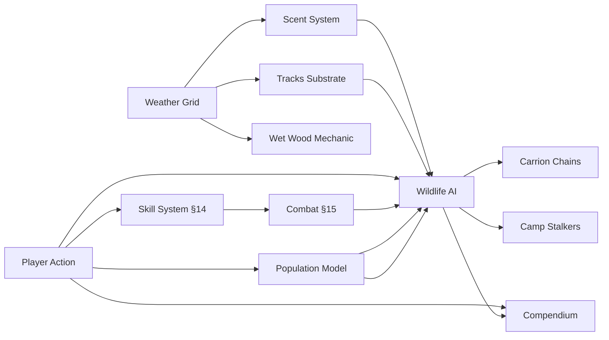

# Survival Game Design Document

> Working version for design iteration. Original at `docs/originals/survival-design.docx`.
> Edit this file directly. Re-extract from the .docx if William updates the original.

---

Working title TBD — Design Synthesis v1

## 0. Design Pillars (Locked, 2026-05-11)

Mother Nature offers two intertwined draws on a shared architectural commitment.

### 0.1 Beauty as value

The world is worth dwelling in for its own sake — atmospheric naturalism, seasonal richness, contemplative pacing, diegetic UI that doesn't break the spell. Players should want to stop and look. The Eastward-influenced art direction (§20) is not decoration; it is the value proposition. Beauty is *why a player who already has a cabin, garden, and gates keeps playing*.

### 0.2 Systems as substrate

The simulation depth — body, weather, ecology, animal autonomy, persistence — makes the world function as a sim for players who choose lower survival pressure, and as a survival game for those who choose more. Survival is the optional intensity dial; the world is the constant.

A player at 100 days who has built shelter, secured water, planted a garden, and reached "nothing will kill me now" has not finished the game. They have unlocked the sim half. The world's beauty + autonomy + emergent interactions are the post-survival game.

These reinforce each other: beauty invites dwelling; systems reward it.

### 0.3 The architectural commitment that enables both — emergent over scripted

Every game system reads from and writes to a shared world substrate (temperature, scent, sound, light, materials, time, weather, structures). **No closed system-to-system APIs. No scripted set-pieces. Interactions emerge from the substrate, not from designer scenarios.**

Consequences:

- **Greenhouse effect** is not coded — it emerges because walls retain heat, sun provides heat, plants read temperature, structures form air pockets. (See §2.5 Systems That Allow.)
- **Smoke as long-distance signal** (issue #59) is not coded — it emerges because fire produces smoke, wind moves smoke, chimneys concentrate smoke, vision reads atmospheric density.
- **Predator stalking via scent** is not coded — it emerges because animals deposit scent, scent diffuses with wind, predators read scent gradients.
- **The player base will discover compositions the developers never anticipated.**

This is the design lineage MN places itself in: Vintage Story, RimWorld, Dwarf Fortress, BoTW. Games where the developer's scripted content caps the budget, but the substrate's emergent compositions don't.

### 0.4 What this means for production

| Investment | Priority | Why |
|---|---|---|
| Shared world substrate (temperature, scent, sound, light, materials grid, time, weather state) | Foundation | Must exist before any feature builds on it |
| Atmospheric art stack (shaders, lighting, fog, day/night) | High | Beauty pillar foundation |
| Seasonal palette variety + species color range | High | Beauty pillar + temporal storytelling |
| Animal AI with autonomous behavior | High | Sim pillar — animals do their thing whether watched or not |
| Weather + ecology persistence (world runs without observer) | High | Sim pillar foundation |
| Ambient audio + soundscape | High | Beauty + sim immersion |
| Combat polish | Lower | Important but not the draw |
| Quest / objective UI | Skipped | There isn't one (per design DNA) |
| Modding pathway (data-driven extension) | Medium-high | §19.19 — enables the player base to grow the world |

### 0.5 Cross-references

- §2.5 Systems That Allow, Not Rules That Allow — emergent-over-scripted at the rules layer
- §17 Community Emerges, Not Designed — player-driven community formation
- §19 Crafting Architecture (composition rules, not recipe lists) — same pillar applied to crafting
- §19.19 Modding & Player Extension (added 2026-05-11) — the player-base-grows-the-world commitment
- §20 Art Direction — beauty as value proposition

---

## 1. The Pitch

A 2D 3/4-perspective multiplayer survival simulation where nature is the antagonist and the only goal is to live. No bosses, no quests, no win condition. Heat, cold, hunger, thirst, exhaustion, injury, and weather behave like a real body answering a real environment. The entertainment isn't progression — it's the player's own learning curve. Every run is a different survival problem, and the meta-game is everything you carry from one life to the next.

Comparable titles: Project Zomboid without the zombies, The Long Dark with other people, Rust without the raid meta. A survival simulation where the entertainment is the player's own learning curve, and where the only thing they keep when they die is what they've come to understand.

### Design North Star

Every run is a different survival problem, and the meta-game is the player's own learning curve.

This principle is the test for every design decision: does it create variance between runs, and does it reward learning? If yes, build it. If no, cut it.

### No Dominant Strategy

Foundational pillar: **no one way is the best way to play.** Every design decision is tested against this rule.

The principle says: if any single weapon, class, playstyle, server mode, progression path, or system becomes objectively optimal, the design has failed. Every "best option" must be paired with a specific cost that makes alternatives equally viable in their own lanes.

Concrete applications:

- **Combat tools** — guns are powerful AND loud, ammo-scarce, meat-damaging, socially hostile-coded. Bows are clean AND limited at range against apex predators. Snares are passive AND require patience. No tool dominates; each trades capability for cost.
- **Character archetypes** — Hunter, Forager, Trapper, Naturalist, Survivalist, Builder, Botanist, Tracker are all viable game-completion paths. A Forager must be able to complete a long arc *without ever firing a weapon* — they're not "a Hunter who can't fight yet," they're a fully realized alternative archetype with their own defensive options (better stealth, scent management, avoidance routing, deterrent crafting).
- **Playstyles** — kill-big-game runs, foraging-only runs, trap-only runs, naturalist-observation runs, builder-fortress runs all complete. No single loop is "the win condition."
- **Camp strategy** — settled fortification AND nomadic ranging are both valid. Resource depletion radius, scent buildup, and Camp Stalkers prevent indefinite settled play; weather, energy budget, and gear weight prevent indefinite nomadic play.
- **Progression** — deep specialization in one domain AND breadth across many are both viable, with different rewards (signature abilities vs more milestones unlocked).
- **MP interaction** — kill-on-sight, trade, cooperation, and pure avoidance are all viable jungle-rules approaches. None dominates; each has costs.
- **Server mode** — solo, friends-only, and public are full-fidelity experiences. Public isn't "the real game"; solo isn't "training mode." Each mode is its own complete arc.

The principle is the design's central immune system against feature creep collapsing into a single optimal path. Every new system added must be tested: does it make one existing path obviously better, or does it open a new path with its own costs?

When a system inadvertently violates this principle (a craftable that trivializes hunting; a weapon with no real cost; a class with universal applicability), the system is wrong, not the principle.

### Platform & Engine

- Target platform: Steam (PC)
- Engine: Godot — chosen for AI-assisted development workflow (text-based scenes, GDScript, full text-editable wiring of nodes, signals, and resources)
- Art style: 2D top-down or isometric

## 2. The Learning Curve as Game

Players survive longer than their last run. Each run is meaningfully different from the last. The compendium grows. The player's own knowledge grows. The game has no progression bars to fill — it has a world to learn, and learning it is the reward.

### Variance vs. Randomness

There is a critical distinction between random and variable. Randomness — "the bear attacks 20% of the time" — feels unfair and teaches nothing because there is no signal to read. Variability — "this bear is in a defensive state because there are cubs nearby, and the player can see them if they look" — produces different outcomes across runs and rewards the player who learns to read the signs.

Every system that produces variance must also produce signals the player can learn to read.

### Mechanical Behavior, Not Scripted Narrative

Every entity that exhibits behavior — wildlife, weather, predator, prey, plant — operates from mechanical state and rules, not story arcs. A bear approaches a player camp because scent + hunger + behavioral memory aligned, not because a Storyteller meta-system arranged a dramatic encounter. A wolf pack pressures a drainage because their hunger crossed a threshold, not because the design wanted the player to feel hunted.

The story is the player's, not the system's. The player tells themselves "the bear of the meadow came back for me." The system computes "hunger high + scent reached + location memory said this drainage = sometimes food." Both are true; they are not the same thing. The player's narrative is real to them; the system has no narrative state.

This principle has the same shape as Variance vs. Randomness above, applied at a deeper level. Variance vs. Randomness says: outcomes vary, but in ways the player can read. Mechanical Behavior says: behaviors emerge from agent state, not from designer-arranged story beats. Both demand observable mechanical inputs. Neither permits a hidden authorial hand.

Implication for §12.6 (Storyteller meta-agent): held-open status is now LEAN-REJECT. RimWorld's Storyteller paces narrative dramatically by adjusting probabilities behind the scenes — exactly the opposite shape. Mother Nature's principle says emergence comes from agents behaving on their own logic, not from a meta-system arranging events for dramatic effect. Adopting a Storyteller would directly contradict this principle.

The test for any new system: does its behavior emerge from observable mechanical inputs that the player can perceive and predict? If yes, build it. If no — if it adjusts probabilities or arranges events to "make the story better" — it's the wrong shape, no matter how compelling the narrative payoff might seem.

### Sources of Per-Run Variance

- Spawn variance: biome, season, time of day, starting weather. A spring forest spawn is a fundamentally different game than a late-autumn tundra spawn.
- World seed: hand-authored map geography with procedural overlays — animal populations, plant distributions, water sources, seasonal effects shift per seed. The land is learnable; the ecology is per-run.
- Anomaly events: rare per-run conditions that change the survival problem — a drought year, a harsh winter, a wildfire that already burned a region before the player spawned. Roughly one notable anomaly per run.
- Animal individuality: each meaningful animal has its own state, needs, and territory; encounters emerge from individual circumstance, not spawn rolls.
- Weather emergence: weather is simulated, not scripted; no two runs have the same storm sequence even on the same map and season.

## 2.5 Systems That Allow, Not Rules That Allow (Locked, 2026-05-10)

A sibling principle to §2 Mechanical Behavior. §2 says agents act on internal state, not narrative arcs. §2.5 says world-mechanisms exist as primitives with properties, not as enumerated features with allowlists.

A greenhouse is not a coded entity with `is_greenhouse: true` and `allows_winter_growth: true`. A greenhouse exists because **light passes through glass + heat is retained by enclosure + soil holds moisture**. Each property is a primitive the simulation tracks. When a player composes glass walls around soil, the warmer interior emerges from the physics. The "greenhouse" is the player's word for a structure the simulation produces naturally.

This is the design's commitment to emergence-via-primitives over emergence-via-features. A door is not `blocks_predator: true`; it is mass + hinge + resistance, and a predator pushes through iff `force_applied > hinge_resistance`. A snare is not `catches_rabbit: true`; it is tension + trigger + loop, and a rabbit is caught iff their pace + path + escape-attempts interact with the trigger correctly. The world emerges from primitives interacting; nothing in the world is hand-flagged as "this is a thing that does X."

### 2.5.1 The eight load-bearing primitives

Modeling all physics is unaffordable. The design picks the primitives that matter to wilderness survival and models THOSE deeply; everything else composes from them or stays abstracted.

The eight load-bearing primitives:

- **Heat** — temperature gradients, transfer rates by material, retention by enclosure, body-heat as source
- **Light** — direction (sun angle by time + latitude), intensity, transmission through materials (glass, foliage, water), shadow casting
- **Scent** — emission strength, wind-borne dispersal (already on the weather grid per §12.8), decay by distance, masking by other scents
- **Sound** — emission strength, attenuation by distance, masking by ambient (rain, wind, river), substrate-dependent (footfall on leaves vs rock)
- **Weight** — mass affects movement speed, carrying capacity, falling damage, structural stress
- **Friction** — surface interactions: snow grip, mud slowdown, ice slip, rope vs hide vs metal contact
- **Water** — liquid state, freezing/melting transitions, flow direction by terrain, absorption by materials, drying rate by humidity
- **Fire** — fuel + oxygen + heat triangle; spread rate by fuel density + wind; quench by water/wet conditions; heat output by fuel type

These eight + the existing biological state (hunger, hydration, fatigue, body temperature, injury, sleep) compose to produce: greenhouses, snowshoes, smokehouses, traps, fires, baths, cisterns, drying racks, signal mirrors, condensation rigs, salt evaporators, every survival affordance the game allows. None of these are coded as named entities; all of them are compositions of primitives.

### 2.5.2 The leave-alone condition

Pure emergence at full fidelity is infeasible. The principle has explicit acknowledgments:

- **Outside the eight**, abstraction is permitted. Plant growth is tick-based, not a full photosynthesis model. Animal digestion is a calorie-converted timer, not a metabolic simulation. Tool wear is a duration counter, not a metallurgy model. The eight load-bearing primitives are modeled deeply; everything else gets a tuned approximation.
- **Performance budgets cap fidelity**. Heat-transfer simulation runs at coarse cell resolution (composes with §12.8 hex weather grid). Scent dispersal is grid-based not particle-based. Sound is attenuation curves, not wave physics. The simulation models the right SHAPE at affordable cost.
- **Game-feel concessions are allowed where realism would punish without teaching.** Sleep doesn't have to model REM cycles. A character doesn't need a full immune-response model — sepsis cascade timing is a tuned curve, not bacterial-growth simulation.

The line: every load-bearing player-facing CAPABILITY emerges from primitives. The supporting cast (digestion, growth, plant maturation) can be tuned approximations.

### 2.5.3 The discoverability requirement

Hidden mechanisms no player can find are wasted budget. Every emergent system must be DISCOVERABLE through observation + skill saliency + Field Notes (§14.12) + Compendium (§8 → see §14.1 for current role) growth.

The greenhouse "exists" only when a Builder-Practiced character can read the diegetic cues — frost-melt on the glass face, warmer body-meter inside, dew on the underside — and form the hypothesis that "glass + enclosure + sun = warmer interior." Without §14.13 saliency surfaces, emergent systems become wiki-rewarding mechanics; with them, they become discoverable knowledge that experienced players teach newcomers via Forest Signs and word-of-mouth.

The test for any emergent affordance: a Practiced-tier character in the relevant domain CAN derive the affordance from observable primitives within reasonable playtime. If no skill tier surfaces it, the system isn't emergent — it's hidden.

### 2.5.4 Implications for cross-cutting systems

- **§3 Biomes** are environments with primitive-property profiles, not enumerated zones. A "desert" is high-light + low-water + thermal-mass-favoring + sparse-fuel — these properties produce the desert experience, not a `biome: desert` flag.
- **§13.2 Carrion Chain** is scent-emission + scavenger-utility-AI + apex-claim — not an enumerated multi-day event.
- **§15 hit-zone lethality** is already this shape — wound severity emerges from impact-point + projectile-mass + velocity + tissue-resistance.
- **§14.13 Skill-Modulated Saliency** is the discovery surface for primitives most players miss.
- **§17 Community Emerges** is the same principle applied at the social layer: communities are not authored; they emerge from primitives (proximity, trace, scarcity, specialization) interacting.

The whole design composes around this principle. Where existing sections appear to violate it (a system specified as a named feature rather than a primitive composition), the section is wrong and should be refactored toward primitives.

## 3. The World

### 3.1 Launch Biomes

Three launch biomes, each its own survival problem. Same systems, but the dominant threats, survival priorities, and daily rhythm differ enough that mastery in one biome does not equal competence in another.

#### Deep Forest

The forgiving one — relatively. The recommended starting biome for new players. Where the compendium fills fastest. The survival problem is abundance with hidden danger.

- Climate: Temperate, four real seasons. Moderate rainfall. Long growing season. Liquid water everywhere.
- Resources: Plentiful. Wood for everything. The widest plant diversity in the game — including the highest density of toxic lookalikes. Game is plentiful and varied.
- Threats: What you don't see. Dense canopy hides predators, weather, and routes. Visibility is limited; sound carries strangely; scent moves unpredictably under canopy. The forest punishes inattention more than incompetence.
- Signature experience: Getting lost. The forest is dense and repetitive, and a player who hasn't built a way to mark their path or read the sun can lose track of where they are.

#### Desert

The brutal one for new players, the puzzle one for veterans. The survival problem is scarcity managed against time.

- Climate: Hot days, cold nights. Two effective seasons: a long hot/dry season and a brief wet/cool season with flash floods and rare rainfall.
- Resources: Sparse. Wood is rare and scrubby. Water is the constant problem — sources are few, far apart, often shared with predators. Specialized plant life. Game is scarce but high-value when found.
- Threats: Heat exhaustion, dehydration, hypothermia at night, sandstorms, flash floods in canyon terrain, venomous animals. The visibility paradox — you can see for kilometers, but so can everything else.
- Signature experience: The water calculation. Every day is a math problem: how much water, where is the next source, can I get there before dehydration becomes critical, and what's between me and it.

#### Tundra

The lethal one. Where veteran players go to test themselves and where most first-time visitors die quickly.

- Climate: Cold most of the year, brutal in winter. Brief intense summer of perpetual daylight. Long winter of perpetual or near-perpetual night. Treacherous shoulder seasons.
- Resources: Concentrated and seasonal. Driftwood and stunted trees only. Short summer plant abundance. Game follows migrations strictly — missing the migration window means missing the year's main calorie source.
- Threats: Cold above all. Wet-cold from falling through ice has minutes to kill, not hours. Frostbite as permanent injury. Whiteouts. Apex predators desperate in winter. The dark itself in deep winter — six or more hours of barely-twilight, eighteen of full night.
- Signature experience: The first winter night the fire goes out. Everything else in the game leads up to "can I keep this fire alive."

Per §2.5, biomes are environments with primitive-property profiles, not enumerated zones. A "desert" is high-light + low-water + thermal-mass-favoring + sparse-fuel — these properties produce the desert experience, not a `biome: desert` flag. The biome differences above all compose from the eight primitives (heat, light, scent, sound, weight, friction, water, fire) plus per-biome flora/fauna/terrain composition.

### 3.2 Map Sizes

Map size scales with the play style. A small map for seven friends on a private server. A continent for thousands on a public world server. Same systems, same stakes — only scope changes. Per §12.9 shard model, the launch target is 7-10 km radius shards holding 100-300 active accounts.

### 3.3 Weather Simulation

Weather is simulated, not scripted. A coarse atmospheric model produces emergent weather rather than rolling from a table or running on a schedule.

#### Approach: Coarse-Grid Simulation

A grid of cells over the map (roughly 50–200 cells depending on map scale) maintains atmospheric state — temperature, pressure, humidity, wind vector, cloud density, precipitation. The simulation runs at low frequency. Visible weather effects (rain, wind gusts, cloud cover, fog) are interpolated and stylized on top.

This produces most of the emergent behavior of true atmospheric simulation at a fraction of the cost. Pressure systems drift across the map; fronts arrive over hours; warm moist air condenses into clouds and precipitation; mountains create rain shadows; valleys trap cold air. None of this is special-cased — it falls out of the simulation.

#### Player-Visible Effects

- Sky shader, rain particles, wind animation, fog density, temperature on HUD all read from the simulation cell the player occupies.
- Audio: thunder distance, wind howl, rain on canopy.
- Predictability for skilled players: the player who learns to read the sky, the wind, and the pressure trend (eventually with a craftable barometer) can forecast the weather. This is a survival skill that mirrors a real one.
- Storms have approach, peak, and aftermath. The player sees the front coming for an hour. Sky darkens, animals go quiet, wind shifts.

#### Microclimates

Terrain feeds back into the atmospheric grid. Valley floors are reliably foggier in the morning. South-facing slopes melt snow first in spring. Coasts are milder than the interior. Players learn the map in a way no scripted system can teach.

## 4. The Day-Night & Seasonal Cycle

### 4.1 The Two Clocks

- Day length: how long a single in-game day takes in real time. Sets the texture of moment-to-moment play.
- Season length: how many in-game days in a season. Sets the arc of a run.

### 4.2 Day Length

Default: 60 minutes of daylight, 20–30 minutes of night. Total cycle 80–90 minutes.

Day is the game; night is recovery. Real survivalists don't operate at night — they wake at dawn, work through the day, are at shelter before dusk. The game reflects this. Day is the survival problem; night exists for sleep and is punishment for poor planning when the player is caught out.

A 60-minute day has shape — morning, midday, afternoon. There is time within a day to do real work (a hunt, a build, travel) and time to be in the world between urgent activities. A 30-minute day delivers a survival game; a 60-minute day delivers a survival simulation.

The 20–30 minute night is short enough that a player caught out is not sentenced to an hour of hiding, but long enough to have real teeth when conditions are bad.

### 4.3 Sleep & the Time-Skip

Sleep is a conditional time-skip. The player initiates sleep at a prepared sleeping spot (bedroll, shelter, fire). The game compresses 20–30 minutes of in-game night into roughly 30 seconds of real time. The player wakes at dawn rested.

The skip is conditional on: adequate warmth (fire, shelter, clothing), sufficient food and water reserves, reasonable safety (no predator within detection range, no immediate environmental hazard), and hunger/thirst not in critical range.

If conditions go bad during the skip — fire goes out, predator approaches, weather turns — the game interrupts the skip and drops the player back into real-time at the moment of the disturbance. They wake up to a wolf at the camp edge, or to rain on their face, or to embers and creeping cold.

Prepared players effectively get a "skip night" privilege earned by their day's work. Unprepared players lose that privilege and live through what they brought on themselves. Same mechanic, different experience based on preparation.

#### Resting (When Sleep Isn't Possible)

If the player can't sleep (inadequate conditions, dangerous area, no shelter), they can rest in real-time. Rest passes time slightly faster (~1.5x) but doesn't time-skip. The player stays in control, can react to threats, and survives the night with their thumbs on the wheel — at the cost of poor recovery for the next day.

### 4.4 Seasonal Day-Length Scaling

Day length varies dramatically with biome and season. The same atmospheric simulation that drives temperature drives day length, modulated by latitude (biome) and time of year. This is one of the highest-leverage atmospheric levers — it makes the seasonal experience feel different in a way no other mechanic can replicate.

#### Approximate Day-Length Distribution

- Forest, summer: 70 min day, 15 min night. Long days, brief twilight nights.
- Forest, winter: 35 min day, 25 min night. Days are tight; nights have weight from cold.
- Desert, summer: 75 min day, 15 min night. Brief precious cool window. Inverted strategy possible (travel by night).
- Desert, winter: 50 min day, 25 min night. Cold nights with frost.
- Tundra, summer: 80 min day, 10 min night. Near-perpetual day; the midnight-sun effect.
- Tundra, winter: 20 min day, 30 min night. The signature horror — only place in the design where night outweighs day.

#### Floor & Ceiling

- Minimum night length: ~10 minutes — even at its shortest, night is still a thing.
- Maximum night length: ~30–35 minutes — past this, players will not roleplay through it.
- Twilight: 3–5 minutes of dawn/dusk. Crepuscular predators are most active here. Don't compress out.

### 4.5 Season Length

Default: 8 in-game days per season, 32-day year.

Each season is a distinct survival problem with its own threats, opportunities, and correct strategies. The eight-day length is long enough that each season has internal arc and feeling, short enough that a dedicated player sees a full year in 2–4 sessions.

#### Server-Configurable Presets

- Standard: 8 days/season, 32-day year. Default.
- Extended: 14 days/season, 56-day year. For dedicated groups who want each season to be a chapter.
- Compressed: 4 days/season, 16-day year. For learning runs, single-session play, or hardcore players.

### 4.6 The Four Seasons (Forest Template)

#### Spring — Establishment

The world recovers. Snow melts; ground becomes mud; rivers swell with snowmelt; plants come back; bears emerge desperate and irritable. Migrations arrive — birds return, fish run, ungulates move out of winter range.

- Threats: mud, wet-cold (hypothermia in spring kills players who think the cold is over), violent storms with sudden temperature drops, aggressive emerging bears, the "hungry gap" where winter stores are gone but new growth isn't ready.
- Opportunity: fish runs (huge food windfall), nesting birds, medicinals at peak harvest, rapidly lengthening days.
- Strategy: establish position, build the shelter you'll keep all year, learn local geography, stockpile preservation materials.

#### Summer — Harvest

The world gives. Long days, short nights, warm temperatures. Plant life at maximum. Animals at healthiest body weights. Predator activity peaks because prey is abundant.

- Threats: heat exhaustion and dehydration, insect-borne illness, parasites, fevers, harder-to-keep-clean wounds, thunderstorms, defensive predators raising young — and the psychological trap of summer's apparent ease.
- Opportunity: the harvest. Calories should come in faster than they're going out. Smoking, drying, salting, fermenting. Tanning hides. Running traps. Tool upgrades.
- Strategy: convert abundance into stored reserves. A summer that didn't prepare for winter is a summer wasted, and the next two seasons will tell you so.

#### Autumn — Preparation Deadline

The most strategic season. Days shorten visibly. Temperature drops. First frost arrives partway through. Leaves fall — visibility in the forest dramatically increases. Animals at peak body weight. Bears pre-hibernation hyperphagic and aggressive about food. Migrations begin in reverse.

- Threats: the hungry shoulder in reverse, dramatic temperature swings (warm afternoon to freezing night), the most dangerous bear encounters of the year, predators bulking up.
- Opportunity: the big hunt window. Largest single-kill calorie windfalls. Last harvests. Last good window for traveling — winter locks the map down.
- Strategy: top off everything. Verify stores. Reinforce shelter. End autumn with full provisioning, ample fuel, processed food, layered cold-weather clothing, and a sense of where migrating animals went.

#### Winter — The Test

The world takes back. Short days, long nights. Sub-freezing temperatures. Storms hit harder and last longer. Snow accumulates and changes the world — tracks become readable like nowhere else, but movement slows, fires need more fuel, water is locked up. Many animals migrate out, den, or die. The animals that remain are the ones built for the cold: wolves at peak hunting form, scavengers, overwintering birds.

- Threats: cold as dominant threat. Wet-cold is fast-acting and lethal. Frostbite as permanent injury. Snow-blindness. Whiteouts. A fire going out at 3 AM in a winter storm is a death sentence the player saw coming for an hour. Wolves at most dangerous because prey is lean.
- Opportunity: tracking at its best. Some big game more vulnerable in deep snow. Cold preserves meat indefinitely. Surviving a winter yields disproportionate compendium and challenge progress.
- Strategy: conserve. Stay close to base. Burn fuel efficiently. Hunt selectively. Trust the storehouse. Sleep through the worst nights. Use long dark hours for repair, processing, and long-form crafts. Wait for spring.

### 4.7 Biome Distortions of the Seasonal Template

All biomes share the same calendar synchronization, but each season's content is biome-specific.

- Desert: Two effective seasons matter — a long hot/dry stretch and a brief wet/cool window where everything that grows in the desert grows, where flash floods are real, and where conditions are forgiving enough to seek out. Migration is toward water sources, not toward warmer ground.
- Tundra: A brief intense summer of perpetual daylight, plant abundance, melted ground, calving herds — followed by a long brutal winter of darkness, cold, and scarcity. Spring and autumn are short treacherous transitions with breakup ice, freeze-up ice, and sudden storms. Players who don't harvest the boom intensely will not survive the bust.

### 4.8 Spawn Season

New characters spawn into a safe season window. For the forest: spring or summer. For desert: the wet/cool season. For tundra: summer. Veterans who have earned harder spawn windows through challenges ("survive a winter") may opt into them. Custom characters may be configured to spawn into any season the player has earned.

This applies across all server tiers. On public world servers with continuous clocks, new spawns are gated to whatever the easiest currently-available season window is across the map — even if that means spawning in a different biome than intended. Players walk to the biome they want once they're alive.

### 4.9 The Year as Meta-Arc

Surviving a full year on a single character — all four seasons, full calendar, returns to spring — is a major meta-progression milestone. By that point all season-locked compendium entries (migratory animals, season-specific plants, seasonal weather phenomena) have been unlocked. The player has, in a real sense, learned the world. "Survive a full year" is a candidate marquee challenge feeding into the custom-character unlock.

## 5. Wildlife

### 5.1 The Principle: Animals Are Agents, Not Encounters

In most survival games, animals are encounters — walk into a zone, animal spawns, fight or flee, encounter ends. In this game, animals are agents living in the world whether or not the player is there. They have hunger, thirst, fatigue, territory, social bonds. Most of the time they are doing things that have nothing to do with the player. When the player intersects with one, they are walking into the middle of its day, not triggering its appearance.

This is the source of every emergent story the game produces. A scripted bear attacks when you enter its zone — predictable, gameable, eventually boring. A simulated bear is hungry, hasn't eaten in three days, smells the deer carcass on the player's back, and is now stalking them across two kilometers of forest. The first is a mechanic. The second is a story.

Not every animal is deeply simulated — squirrels don't need a hunger meter. But every animal that matters to survival (predators, large prey, anything dangerous, anything edible) runs the same kinds of needs the player runs.

### 5.2 Tiered Danger

The respect-without-paralysis balance comes from this distribution. Players need to feel that most animals are not a threat, some require caution, and a few are genuinely dangerous — and they need to be able to tell which is which on sight.

- Ambient fauna: birds, squirrels, fish, insects. React to player but pose no threat. Functionally signal — birds going silent means something larger moved through. Fish surfacing means the water is healthy. Insects out in force means the air is warm and still.
- Small prey: rabbits, hares, pheasants, ducks, small fish. Edible, catchable with patience and the right tools. Where basic hunting skills are learned.
- Large prey: deer, elk, moose-as-prey (when not in rut), wild boar. Calorie windfalls. Hard to take down without proper tools or traps. Bringing one home is a multi-hour project that feeds the player for days.
- Mid-tier predators: wolves (especially in packs), coyotes, lynx, wolverines. Reactive threats — generally avoid healthy adult humans but pursue weakness, scavenge corpses, harass camps. Most player-predator encounters are this tier.
- Apex predators: bears (brown and black behave differently), big cats (cougar in appropriate biome), and contextually dangerous large herbivores (moose in rut, wounded boar). Uncommon encounters that genuinely change the player's plans for the day. Fighting is almost never the right answer.

Proportional rule: an average player on an average run might have one genuine apex encounter per in-game week, several mid-tier predator encounters, and constant background contact with prey and ambient fauna. Apex encounters are rare; their presence in the world — tracks, scat, distant sounds, scavenged kills — is constant. The player should always know there are bears in this forest and rarely see one.

### 5.3 Behavioral States

Every meaningful animal has a current state and transitions between states based on its needs and the world. The state determines reaction to the player. The player can't directly see the state, but the signs of the state should be readable — body posture, pace, what the animal is doing, time of day, time of year, environmental context.

- Resting / sleeping: low alertness; won't attack unless directly threatened.
- Feeding: focused on food, defensive of it. A bear at a carcass is the most dangerous bear.
- Hunting / foraging: active, alert, looking for food. Predators in this state may track players carrying food or smelling of blood.
- Traveling: moving between locations. Lower threat than hunting; higher awareness.
- Defensive: triggered by threat. A bear with cubs nearby; a wounded animal; a cornered animal. The most dangerous state for the player to encounter.
- Fleeing: running from something. Possibly the player; possibly something bigger.
- Mating / rutting: seasonal; erratic and aggressive. Where seasons interlock with wildlife to produce per-run variance.

Critical example: a bear standing on its hind legs is not in attack posture — it's trying to see and smell better. A player who learns this from a high-tier compendium entry has an advantage; a player who panics and runs has triggered a chase response.

### 5.4 Senses & Detection

Animals have sight, hearing, and smell as separate detection systems with different ranges, reliabilities, and environmental modifiers.

- Sight: line of sight, limited by terrain, vegetation, and light. Movement is more visible than stillness. A crouched player behind a bush can be invisible; the same player walking past at distance is spotted.
- Hearing: omnidirectional but attenuated by distance, vegetation, and ambient noise (wind, rain, river). Footstep noise depends on substrate and pace. Crafting sounds, voices, and fire are detectable.
- Smell: the most underused sense in survival games. Carried by wind. A bear three kilometers downwind of a fresh kill knows about it. A wolf upwind doesn't. This single mechanic produces enormous variance per encounter and rewards players who consider wind direction. It also makes carrying and storage of food strategic.

These three senses also give the player levers. Cover scent (some plants, mud, smoke). Crouch and move slowly to defeat sight. Wait for wind, rain, or river noise to mask sound. The player isn't fighting predators — they're working around them.

### 5.5 Population, Territory & Ecology

Animals do not respawn from spawn points. They exist, in finite numbers, with territories and home ranges, and reproduce slowly over seasons.

- Over-hunting a region depletes it. The player who stays in one valley shooting deer eventually has no more deer.
- Predator-prey populations are linked. Removing predators can cause prey booms then crashes.
- On multiplayer servers, this creates real territory dynamics — popular hunting grounds get hunted out; players who range further or hunt sustainably have an edge.

#### Implementation Approach

Population dynamics run on a per-region, per-species basis as a coarse simulation. Individual animals are spawned only as players approach. The abstraction matters: when an animal is killed, the regional population genuinely decreases by one and recovers slowly.

#### Apex Predator Identity

Apex predators near the player are tracked individually with persistent identity ("this bear has a damaged ear and avoids the river"). Ambient population members aren't. This middle path gives memorable apex encounters without paying the cost of individual tracking for every animal in the world.

### 5.6 Migration & Seasonality

Migrations are the strongest per-run variability lever for wildlife. The same map in spring vs. autumn has fundamentally different animals available in different places.

- Deer move down from the highlands in autumn.
- Fish run upriver in spring.
- Bears den in winter (and become threats again in spring when they're starving).
- Caribou-equivalents in tundra move from summer range to winter range.
- Birds migrate seasonally.

The player who learns the calendar gets food the player who doesn't will starve looking for. This is survival-as-curriculum baked directly into the world.

### 5.7 Tracks, Signs & Reading the World

Tracks are physical objects in the world — left by every animal as it moves, with characteristics that depend on species, size, substrate (mud, snow, dry ground, sand), and time elapsed (fresh tracks are sharp; old tracks degrade with weather).

Other readable signs: scat, scratch marks on trees, hair caught on bark, partially eaten kills (different predators leave different remains), broken vegetation along game trails, beds where deer have lain. The forest should be full of information for the player who learns to see it.

This works in two directions. The player tracks animals to hunt or avoid. Predators track players the same way — a wounded player leaves a blood trail and a wolf will follow it for kilometers. Smell-as-tracking complements vision-tracking. The wounded player who thinks they've escaped because they're out of sight is in a worse position than they realize.

### 5.8 Domesticated Animals — Deferred

Dogs, horses, and other tameable animals are deliberately deferred from launch. They are huge design levers (a dog dramatically changes threat profile via early predator detection; a horse changes traversal economics) and warrant being built as a deep system in a major content update rather than rushed for launch. AI architecture should be built with their eventual addition in mind.

## 6. The Body

Vital systems are systems, not meters. Each is deep enough that managing it is a real decision rather than a slider to top off.

#### Cold

Not a single slider. Core temperature affected by ambient temperature, wet vs. dry state, wind chill, what the player is wearing, and activity level. Wet-cold is faster than dry-cold. A player who falls through ice has minutes, not hours.

#### Heat

Heat exhaustion and dehydration linked but distinct. Time-of-day matters in desert and summer. Activity level interacts with ambient heat. Shade, water, clothing choice all factor.

#### Hunger

Calories, but also calorie type (fat vs. protein vs. carbs), digestion time, food poisoning risk from spoiled food, nutritional deficiency over weeks.

#### Thirst

Water consumption tracked. Source quality matters — purified vs. running vs. stagnant. Waterborne illness is real and slow to develop.

#### Exhaustion

Stamina for physical action; fatigue accumulating over the day; sleep debt accumulating across days. Hands shake when tired or cold (relevant for fine tasks like fire-starting). Recovery requires real sleep, which requires the conditions described in §4.3.

#### Injury

Wounds bleed, infect, scar. Bone fractures impair movement long-term. Frostbite leaves permanent reduced dexterity in affected fingers and toes. Snow-blindness as temporary visual impairment. Bites and stings carry venom and disease.

### Death-as-Lesson

Permadeath is locked. When the player dies, that life is over. Their corpse stays where it fell and so does everything they carried. There is no expected lifespan — a seasoned player making a routine water run can cross a hostile bear and be gone in thirty seconds.

But every death is meant to be a lesson, not a punishment. Predators give warning. Environmental dangers have onset. The death screen reconstructs what killed the player and why — core temperature graph, last meal timestamp, wound timeline. This converts every loss into a learning artifact rather than a frustration. "That was bullshit" becomes "oh, I see what I did."

## 7. Characters

### 7.1 The Roster

Twelve characters at launch. Each starts with different equipment, different physical traits, and a different specialization in the crafting tree.

Examples (full roster TBD):

- Hunter — masters traps, butchery, animal behavior. Strong in tundra and forest.
- Medic — wound care, infection treatment, herbal remedies. Centrally valuable in tundra (frostbite) and desert (heatstroke, venom).
- Forager — plants that heal and plants that kill. Strongest in forest, weakest in tundra.

### 7.2 Soft-Locked Crafting

Specializations are soft-locked, not hard-locked. Craft enough within your tree and you'll begin to glimpse the next, slowly broadening what you can make. Mastery in everything is a long road; other players will almost always be a faster one.

The soft-lock mechanic: making enough items in one tree gains insight into the next level — randomized skill upgrades that incrementally open adjacent crafting nodes. This preserves character identity while preventing solo isolation from feeling impossibly punishing.

### 7.3 Character–Biome Balance

No single character is optimal in all three biomes. The forager is strongest in forest, weakest in tundra. The hunter has roughly even utility but excels in tundra. The medic's value is most visible in tundra and desert. This is a feature — players naturally rotate characters when rotating maps, and the compendium fills out across both axes.

### 7.4 Custom Character Unlock

After completing enough developer-designed challenges across runs, the player unlocks the ability to build a custom character of their own. The challenges are universal (not per-character) and exist to ensure the player has genuinely engaged with the game's systems before configuring their own.

Example challenges: survive 15 days with a single character; walk X amount of steps; treat a wound in the field; weather a blizzard without shelter; survive a full year. The point is that before a player can make a custom character they have learned the different game systems through experience.

## 8. The Compendium

### 8.1 Purpose

A persistent personal knowledge base that fills only through play. The compendium is the player's meta-progression. Empty at start. Every plant, animal, weather pattern, and crafting recipe the player encounters generates an entry. Across runs, the compendium is the only thing the player keeps.

### 8.2 The Critical Design Insight

The compendium is for when the player is operating outside their current character's specialty. The expert character does not need the compendium for things in their domain — they have the knowledge, and the recipes are unlocked in their crafting tree directly. The compendium exists for the gap between what the current character knows and what past characters have learned.

#### Player Loop

Play a forager. The forager learns plants deeply. Those plant recipes are in the forager's crafting tree, available in real-time without ever opening a book.

The forager dies. The plant knowledge gets recorded into the compendium at expert tier.

Now play a hunter. The hunter's crafting tree doesn't include plant recipes. But when the hunter encounters a plant, they can consult the compendium and read the expert-tier entry the forager wrote. The hunter knows what's safe, what's dangerous, what's nutritious — but cannot craft with the plant the way a forager could (their hands don't know how). Some plant uses are accessible to anyone (don't eat the wolfsbane); some require the specialist (brewing it into a sedative).

This means specialists become genuinely valuable to other players in multiplayer. The hunter knows wolfsbane is poisonous because the compendium says so. The hunter cannot turn it into a sedative — only a forager can. Specialists trade not just goods but capabilities.

### 8.3 Skill Tiers (Static)

Entries do not have character voice. They are static skill-level recordings, written in neutral reference tone. The player can trust the compendium as a reference.

- Unknown: no entry. The plant or animal is just a colored shape with no name.
- Glimpsed: "A red berry. Looks similar to ones I've seen before, but I'm not sure." Generated when a non-specialist character encounters something briefly. Useless except as a placeholder.
- Novice: "Wolfsbane berry. Poisonous." Bare minimum — name and headline danger. Generated by a non-specialist who has actually learned the consequence.
- Practiced: "Wolfsbane berry. Poisonous if eaten. Causes nausea within an hour, can be fatal in quantity. Often grows near streams in shaded areas." Generated by a non-specialist with sustained experience, or a specialist on first encounter.
- Expert: "Wolfsbane (Aconitum). Highly toxic — alkaloid poisoning. Symptoms within 30 minutes: numbness, nausea, irregular heart rate. Lethal dose is small. Roots and leaves equally toxic. The dried root, in carefully measured quantities, can be used as a sedative — but the margin between sedation and death is narrow." Generated only by the relevant specialist with experience.

The expert entry is not just more text — it contains actionable information the novice entry doesn't. The expert knows wolfsbane has a use case as a sedative or weapon coating; the novice just knows not to eat it. Specialist runs are genuinely valuable to a long-term player because they're the only way to unlock certain uses of certain things.

### 8.4 Cost of Consultation

The compendium is a real object, not a wiki. Pulling it out costs:

- Time: the world keeps running. Predators don't wait, rain keeps falling, cold keeps biting. No consulting during a fight or while sprinting.
- Hands: reading occupies the player's hands. Can't be holding a torch, carrying water, or nocking an arrow.
- Light: can't be read in the dark without a light source.

Optional refinements: physical wear (the book degrades, pages get water-damaged); no symptom-based search (must flip to plant section trying to remember which one looked like the one eaten). The compendium is a book, not a database.

### 8.5 First-Run Behavior

The compendium is empty at start. No seeded "common knowledge" entries — every entry must represent something the player has personally lived through. Seeding entries the player didn't earn would erode the system's premise.

To compensate: the world is visually readable enough that a new player can survive without a populated compendium. Ripe berries look ripe. Predators look dangerous. Clear running water is probably drinkable; stagnant pool water is probably not. The compendium is the deep-knowledge layer; visual cues handle the surface layer.

First-run learning is forgiving in terms of how entries are earned (low interaction cost to generate first novice entries) but uncompromising in terms of what they represent. The first death is the first real lesson, and the resulting compendium entries — the things that just killed or saved the player — mean something.

### 8.6 Cross-Tier Persistence

Compendium content carries across all server tiers. Knowledge built in solo carries to private and public servers. By the time a player walks onto a world server, their compendium represents real hours of learning.

Open question for later resolution: whether the compendium is per-account or per-server on public world servers. Per-account is more rewarding but creates a soft pay-to-win dynamic for veterans on public servers. A possible middle path: per-account, but with read-only restrictions on entries until the player has survived some baseline threshold on that server.

## 9. Multiplayer Architecture

### 9.1 Three Tiers

Players progress outward from solo through private to public world servers. Each tier serves one need cleanly rather than every server trying to be everything.

#### Solo / Tutorial Tier

- Where new players learn. Where everyone builds compendium content.
- Single-player or fully instanced. Clock pauses when not playing.
- Complete game in itself — all systems, all biomes, full character roster (with early-unlocked subset visible to first-time players), full permadeath.
- Compendium and challenge progress transfers to all higher tiers.
- Unlocked from the start.

#### Private Server Tier

- Friend groups of 2–10 (configurable to small tight maps).
- World pauses when no one is online (default on, host-toggleable).
- Same systems and content as solo. Same character roster. Same compendium.
- Unlocked after baseline competence (e.g., complete one survived run, or survive 24 hours on a single character — exact threshold tunable in playtest).

#### Public World Server Tier

- Hundreds to thousands of players on persistent shared worlds.
- Continuous global clock — runs whether or not players are online.
- Regional timezone alignment — server clock aligns to primary regional player base. Servers tagged by region (e.g., "World Server EU", "World Server NA-East").
- Real seasons, persistent player camps, multi-day events that affect everyone simultaneously.
- Unlocked after demonstrated competence — a serious threshold (e.g., survive 7 days on a single character; reach a compendium completeness mark; weather a winter).

### 9.2 Why Tiered Access

New players don't enter world servers. This is a positive design decision, not a workaround. It respects the world server's integrity (no compromised difficulty, no special spawn accommodations needed) and respects new players (who deserve to fail in dignity, not in front of a thousand-player audience).

It also creates aspirational progression. Earning world server access becomes a meaningful milestone. By the time a player walks into the persistent shared world, they have a compendium, instincts, and the right to the experience.

Gates are one-time per account, not per character. A veteran with thirty deaths doesn't re-prove themselves on world server access just because their last character died.

### 9.3 Player Interaction — Jungle Rules

Jungle rules — the same as meeting a stranger in the wild in real life. The player reads them, they read the player, and what happens next is on both of you. No mechanical alignment system, no faction structure. Trade, cooperation, conflict, and avoidance all emerge from the systems and the situation.

The character-locked crafting trees give specialists genuine value to other players. The compendium-versus-tree distinction makes that value durable: knowing a thing and being able to use a thing are different, and only specialists can use the things their tree includes.

## 10. Meta-Progression

### 10.1 What Persists

- The compendium (with skill-tier entries).
- Challenge completion progress.
- Server tier unlocks (private access, public access).
- Custom character unlock and configuration.
- Spawn-window unlocks (e.g., earned ability to spawn into a winter season).

### 10.2 What Doesn't

- The character. Permadeath is total.
- Inventory, gear, shelter, stored food. All on the corpse, where the corpse fell.
- In-character knowledge of the current run's specifics — locations of resources, tracks, weather patterns.

### 10.3 The Challenge System

Universal developer-designed challenges that ensure the player has engaged with the game's systems. Examples: survive 15 days, walk X steps, treat a wound, weather a blizzard, survive a winter, survive a full year. Completing enough unlocks the custom-character builder. Specific challenge thresholds and content are TBD and will be tuned in playtest.

## 11. Open Design Items

Areas that need further design work before this becomes an implementation document:

- Character roster: twelve names, twelve specializations, twelve starting kits. Full roster definition.
- Crafting trees: specific node structures for each specialization. The mechanics of "insight" — how randomized skill upgrades unlock adjacent nodes.
- Combat & interaction feel: moment-to-moment combat mechanics for player-vs-predator and player-vs-player. Twitchy vs. deliberate. Wound persistence after fights.
- Building & shelter: modular vs. freeform placement. Degradation. Raidability in multiplayer.
- Death corpse rules: how long a corpse persists, looting rules, decomposition, predator attraction.
- Specific challenge thresholds: exact requirements for private server unlock, public server unlock, custom character unlock.
- Compendium scope question: per-account vs. per-server on public worlds.
- Sound, light, and tracking depth: how deeply player noise, light sources, and player-left tracks are simulated.
- Steam-specific scope: Steamworks integration plan (achievements, cloud saves, workshop), Steam page timing for wishlist marketing (target 6–12 months pre-launch).

## 12. Architecture Commitments (Phase 2 Research, 2026-05-09)

This section records architectural and design commitments arising from the Phase 2 research wave (`docs/_research/18-23`) and a follow-on design conversation. Items here either close, supersede, or hold-open items in §11.

### 12.1 Multiplayer scope reduced for launch

DECISION: Launch with reduced per-shard player counts. The §1 framing of "thousands of players" reframes as "thousands of concurrent players across many regional shards." Per-shard concurrent target TBD pending playtest; research suggests 64–128 as the indie-viable range. Single-shard-thousands deferred to v2.0 or never.

Rationale: indie survival multiplayer that promises single-shard CCU thousands has historically failed (Worlds Adrift, Mavericks, Crowfall). Indie survival multiplayer that delivers scoped persistent worlds at dozens-per-shard has historically shipped (Valheim, Conan Exiles, Project Zomboid).

Closes: aspirational §1 / §9.1 framing. Implementation work scopes to Conan/PZ-class servers.

### 12.2 No cabin-fever pressure

DECISION: NO cabin-fever-style mechanic. The Long Dark's pattern of punishing time spent indoors is rejected. Routine maintenance, weather pressure, and wildlife pressure carry the de-camping motivation without a separate mechanic.

Rationale: cabin fever in The Long Dark divides its audience and inverts the survival fantasy by forbidding the player's natural response to bad weather (wait it out). Mother Nature's pressure to leave shelter comes from food/water/fuel running out, not from an artificial timer.

### 12.3 Combat / weapons — RESOLVED → see §15

STATUS: RESOLVED 2026-05-09. Pre-industrial ranged tools (knife, axe, spear, bow, crossbow, atlatl, slingshot) and limited firearms (.22 rifle, shotgun, hunting rifle) are IN. Lethality is hit-zone-based, not HP-bar. Each weapon has a specific cost matrix that prevents dominance, per the No Dominant Strategy pillar (§1, "No Dominant Strategy"). Full spec lives in §15.

### 12.4 Logout model

DECISION: Sleeping-bag tether.

- Safe regions (own camp, claimed territory): logout vanishes the body.
- Wilderness: body sleeps for 5–10 minutes (during which combat-loggers can be punished) and then despawns to a tracked "sleep state" rejoined on next login.

Rationale: balances anti-combat-log without permanent AFK vulnerability. Avoids Rust's full-vulnerability model that punishes solo players who can't predict raid windows; avoids Valheim's vanish-on-logout that lets anyone combat-log to safety.

Closes: ambiguity in §9 about what happens to disconnected character bodies.

### 12.5 Compendium per-account vs per-server

DECISION: Per-account by default for solo and friends-only servers. Public servers default to compendium-isolated — a veteran starts a public-server run with the same blank compendium as a new player. Server administrators can flip the policy at server creation.

Rationale: resolves the soft-pay-to-win risk on public servers without forfeiting the personal long-arc the compendium represents. Account-shared for the personal arc, server-isolated for the social arc; the player chooses by choosing the server.

Closes: §8.6 / §10.1 open question.

### 12.6 Storyteller meta-agent — LEAN REJECT

STATUS: LEAN REJECT (as of 2026-05-09). A RimWorld-style meta-agent pacing weather/wildlife/event rhythms across biomes was surfaced by Phase 2 research as the highest-leverage genre import. However, the §2 "Mechanical Behavior, Not Scripted Narrative" principle (added 2026-05-09) directly contradicts the Storyteller pattern: a meta-agent that adjusts probabilities to pace narrative dramatically is exactly the kind of "designer-arranged story beats" the principle rejects. Final rejection deferred only because the Storyteller question can be revisited if playtest reveals that pure agent-driven emergence produces flat pacing.

### 12.7 Sanity / morale 7th meter — held open

STATUS: OPEN. The 6 body meters in §6 are physical. Adding sanity/morale/isolation as a 7th would shift Mother Nature toward Don't Starve's psychological-horror lane and away from the realist Long Dark/PZ lane the design is committed to. Recommendation: skip for v1; revisit if playtest surfaces a need.

### 12.8 Architectural patterns confirmed by Phase 2 research

Validated and committed without dispute:

- Server-authoritative state via Godot 4 high-level multiplayer API (MultiplayerSpawner, MultiplayerSynchronizer, typed `@rpc`).
- Per-shard SQLite WAL save with hourly/daily/weekly rolling backups.
- Account-level central database (separate from per-shard world DB) for compendium, characters, challenges, custom-character unlocks.
- Hex grid weather (~100 cells, 6 floats per cell, 0.5 Hz server tick, semi-Lagrangian advection, front director for storms, server-authoritative with 9-cell client-window deltas).
- Barometer item + telegraphed front lifecycle (APPROACH → ARRIVE → PEAK → DEPART) as the predictability mechanic.
- Scent-on-the-weather-grid for wildlife — directional smell with wind advection. (The differentiator: no surveyed game does this properly.)
- Apex individual identity capped at ~10 tracked individuals near player; ambient prey via per-region per-species population counters with Lotka-Volterra-with-carrying-capacity dynamics.
- Tracks as substrate-aware decay-buffer objects; symmetric API — predators read player tracks via the same `emit_track()` path.
- Compendium event-sourced: append-only `ObservationEvent` log + pure `project(entity_id, events) → CompendiumEntry` function. Tier promotion is grep-able from the event log. (Event sourcing is now optional with the wrong-info mechanic removed — a simple counter-per-entity would also work — but is retained for future-extensibility headroom.)
- Daily state-preserving server restart, no wipes ever.
- Regional in-world clock offset per shard so prime-time content aligns with regional evening hours.

These commitments are the architectural defaults; deviations require explicit rationale.

### 12.9 The Shard Model (Locked, 2026-05-10)

A shard is a named persistent region with bounded population and geography. This is the unit of multiplayer reality in MN — players don't play "on a server," they live in **Northwood** or **Saltflats** or **Brokeneck Pass**. The shard's identity, history, difficulty tier, and community are tied to its name and its accumulated state.

#### Shard size and population

- **Radius**: 7-10 km. Diameter 14-20 km. Comparable to DayZ Chernarus (15 km × 15 km), Project Zomboid Knox (12 km × 5 km), Wurm server (8 km × 8 km). Falls on the larger end of survival-game shard sizes — justified by MN's community-emergence pillars (§17) requiring room for distinct territories, apex-individual ranges, and biome ecotone diversity within one shard.
- **Population target**: 100-300 active accounts per shard. Large enough to meet strangers; small enough that veterans recognize most names. Per-shard isolation per §12.8.
- **Per-shard concurrent players**: 32-128 expected, with surges at peak hours. Matches §12.1 indie-viable range.

#### Time compression and traversal

- **Default time compression**: 24:1 game-time to real-time. One in-game day in 60 real-minutes. One in-game season (per §4.5 default 8 days) in ~8 real-hours.
- **Edge-to-edge walk**: ~5-7 game-hours at Practiced wilderness pace = ~12-18 real-minutes pure walking, ~2-3 real-hours including camp + sleep + eat breaks at the 24:1 compression.
- **Day-trip from base**: ~3-5 km out = ~30-60 real-minutes round trip with foraging stops.
- **Compression is shard-configurable**. Casual shards may run slower; hardcore shards may approach 12:1 (closer to real-time).

#### Character-shard binding

- **One character per shard**. A character belongs to ONE shard. They live, build, fail, and die there.
- **Account is not shard-bound**. The compendium, Field Notes, and learned knowledge accumulate at the account level across all characters on all shards (per §12.5 default for solo/friends-only; public-shard policy per §12.5).
- A player can have a Northwood Hunter AND a Brokeneck Builder simultaneously. Knowledge transfers; presence does not. No character ferries gear or skills between shards.
- **Why**: keeps "this place is real" intact. No master character imported into a fresh shard to dominate. Each shard's economy and territory belong to the characters who built up presence there.

#### Shard lifecycle

- **Birth** — designer-curated seeding. A new shard is spawned when current shards of a similar biome are saturating, OR by player petition (a community wants its own shard). Not auto-spawn.
- **Growth** — open to new player landings. World develops history.
- **Peak** — at population cap, new landings auto-route to sister shards.
- **Dormancy** — if active accounts drop below ~10 over a 30-day window, shard is marked DORMANT. Existing characters can still play; new landings re-routed.
- **Archive** — dormant shards persist for ~1 game-year of further decline before world-state is snapshotted + frozen. Returning players see "Northwood archived. Your character is preserved as a Field Notes entry on your account but cannot be played." Characters become history.

**No auto-merge.** Players have hated this in MMO history; merging shards erases territorial work. Dormant shards just sleep. Players who want a new active shard create new characters on existing live shards.

#### Landing — how players arrive

- **Shard browser** at character-creation. Public shards listed with metadata: name, current population, age (real-days), dominant biome mix, average session length, founding character (in-fiction lore), difficulty tier, public/private/invite-only.
- Player **picks** a shard, or **random-selects** by preference filters (biome, population, difficulty).
- **Friend invitations** are out-of-band. A friend shares the shard name via Discord, text, voice. They land there. No in-game friend-list, no party UI (per §17.5 Proximity-Only Communication).
- **Entry points (trailheads)** — each shard has multiple designer-set spawn locations chosen for ecological-plausibility reasons (see §17.6 Trailhead Convention for the difficulty-tier interaction).
- **Diegetic arrival framing** varies per entry point: trailhead, riverbank, beach, crashed-vehicle, abandoned-cabin. Starting gear varies by entry-point lore — a plane-crash spawn gets more salvageable parts; a hiked-in spawn gets a packed kit.

#### Returning — how players resume

- **Sleeping-bag tether logout** per §12.4. Wake exactly where you slept. World-state and trace around you persisted.
- Character's biological meters (hunger, thirst, fatigue, body temp) **pause** during logout. World processes (weather, animal migration, plant growth, decomposition) continue at the shard's configured rate.

#### Permadeath cascade flow

- Character dies. Field Notes generated on the account. Compendium updated per §12.5 policy.
- Player chooses: **re-land** on SAME shard at a different trailhead (different character), OR **migrate** to a different public shard.
- Same-shard re-landing — your prior character's gear is at the death site if unlooted. Forest Signs your prior character left are still there. The world remembers.
- Different difficulty rules apply at Death Sentence (per §17.6) — same-shard re-land may be blocked entirely.

#### Shard-level difficulty flag

The shard's difficulty tier (Mother Nature / Hard / Death Sentence per §17.6) is set at shard creation and is part of its identity. Difficulty is NOT a per-player setting within a shard — all players on a shard play at that shard's tier. Communities of like-minded players cluster around shards of their preferred intensity.

Cross-references: §12.4 logout model; §12.5 compendium per-account; §12.8 per-shard SQLite WAL; §17 Community Emerges; §17.6 Difficulty Tiers; §17.4 Trace as Object.

---

## 13. Brainstorming — Mechanic ideas (pending development)

STATUS: BRAINSTORMING. None of the items below are committed design. Each is a candidate mechanic that extends a system already in §6–§9 and §12.8. Every entry needs further development before it ships. Items marked OPEN-CONCERN have a known design-discipline question that must be resolved before implementation.

### 13.1 Player communication — non-verbal signaling

**Forest Signs.** On public-world servers (and optionally elsewhere), players leave persistent in-world marks — broken branches, stacked stones, scratched bark — to communicate without chat. A hunter marks a trail leading to a known bear den to warn allies or lure rivals into a trap.

- Rides on: persistent per-shard world DB; jungle-rules-no-chat commitment.
- OPEN-CONCERN: symbol vocabulary needs explicit design. Dark Souls works because messages are templated. If any stick arrangement can mean anything, the world fills with noise. Define a tight alphabet (~10–15 templated meanings: warning, kill site, water, trap, do-not-pass) and let players invent grammar within it.
- Storage: every sign is a small entity in the per-shard DB; needs decay rules so the world doesn't accumulate forever.

### 13.2 Wildlife behavior extensions

**Carrion Chains.** A killed large animal becomes a multi-day event. The carcass first attracts ambient fauna (crows, flies), then mid-tier scavengers (coyotes), then an apex predator (bear) who claims and defends the territory until the meat is gone.

- Rides on: scent-on-weather-grid; wildlife utility AI; apex individual identity.
- Implementation: carcass is a scent-emitting entity with intensity decaying over time; AI utility curves include "scavenge" priority modulated by hunger; apex claim creates a temporary territory the player cannot easily re-enter.
- Per §2.5 emergence-via-primitives: Carrion Chain is scent-emission + scavenger-utility-AI + apex-claim composing; not a hardcoded multi-day event. Run 10 (Trapper) surfaced that trapline clusters are lower-intensity, longer-accumulation analogs — same scent-persistence primitive, different intensity profile. The "Carrion Chain" should be reframed as the SCENT-PERSISTENCE chain in future spec.

**Camp Stalkers.** A specific bear or wolf that successfully scavenges a player's poorly-secured food storage learns the lesson permanently. That individual stops hunting natural prey, loses caution, and becomes a personal antagonist — testing defenses, waiting just outside firelight.

- Rides on: apex-individuals-capped-at-10; persistent per-shard wildlife identity.
- Player response paths: better food storage, kill the stalker, relocate camp.
- Multiplayer interaction: another player who kills a Camp Stalker bear gets a notable trophy; the original player's threat ends. Emergent shared story.

**The Starvation State (Desperate Predators).** When local prey populations crash (harsh winter, player overhunting), remaining predators enter a "Desperate" behavioral state. Wolves coordinate daytime attacks on healthy adults. Bears push through fire and traps. Localized overhunting becomes an emergent lethal consequence.

- Rides on: Lotka-Volterra-with-K population model; wildlife AI behavior states.
- Multiplayer note: on shared servers, one player's overhunting can destabilize ecology for everyone in the region. Compendium must communicate WHY predators are aggressive ("ravenous: prey scarce") so players can diagnose the cause.

**The Corvid Escort & Shadow Scavengers.** Crows and ravens follow apex predators because they know a kill is coming — a player who notices a slow-moving canopy flock can deduce a bear or cougar below. Mid-tier predators (coyotes, wolverines) shadow apex predators from a safe distance for scraps — a player tracking coyote prints might suddenly realize the coyotes are tracking a grizzly.

- Rides on: wildlife utility AI; sense systems; apex identity.
- Cost: adds corvid behavior class with "follow apex" utility. Bounded.
- Value: layered environmental storytelling — the player who reads the world deeply gets free intelligence.

### 13.3 Tracking & observation

**Track Age & Weather Erasure.** Tracks degrade based on the weather grid, not a uniform timer. The sharpness of a hoofprint in mud tells the player whether the animal passed ten minutes or ten hours ago. A sudden downpour washes away blood trails completely. A hunter who shoots a deer just as a storm front arrives faces a brutal decision: rush the tracking job and risk spooking the wounded animal into a sprint, or wait out the storm and lose the trail entirely.

- Rides on: substrate-aware tracks (§12.8); hex weather grid; front lifecycle (APPROACH → ARRIVE → PEAK → DEPART).
- Implementation: each track records substrate, age, and weather exposure since creation; renders to the player as a graded sharpness cue.

### 13.4 Player action & consequence

**Wet Wood & Fire.** Wood items have a wetness state tied to the weather grid. Wet wood burns poorly, produces more smoke (more visible to other players AND wildlife), and outputs less heat. Players must gather and store fuel before a storm front arrives — dry firewood becomes high-value temporary currency.

- Rides on: hex weather grid (humidity field); scent/visibility systems for smoke.
- Implementation: every wood item has a `wetness` float that updates from cell humidity when not sheltered; combustion behavior reads wetness directly.
- High value: forces planning loop, ties storm prediction to concrete reward.

**First Principles of Field Dressing + Scent Beacon.** A dead moose is too heavy to carry — players must decide what to strip, what to debone, what to leave. Higher yield demands more stationary time at the carcass. The moment butchery begins, fresh blood scent catches the wind; the longer the player stays, the wider the scent radius grows, acting as a dinner bell for every downwind predator.

- Rides on: scent-on-weather-grid; wildlife AI utility curves.
- OPEN-CONCERN: time scale. "Hours" of real-time at a carcass is a frustration trap and an AFK-vulnerability invitation in a 64-player shard. Compress: ~5–10 min real-time for full debone, 2–3 for rough strip. The whole loop's tension is *watching the tree line while you work* — duration must be short enough that the player stays present.

**Decoy Sounds.** Throwing a rock to snap a branch in the opposite direction shifts a predator from "Hunting" to "Investigating," directed away from the player.

- Rides on: hearing attenuation system; predator AI sense states.
- Cost: trivial. Rocks are likely already throwable.

**Trap Bycatch (Execution Paths).** A snared rabbit doesn't disappear into an inventory slot — it remains in the world as a struggling, noisy agent. The struggling rabbit becomes bait. A player checking their trap line might find the snare broken with fresh wolf tracks, or arrive just as a wolverine claims the catch.

- Rides on: wildlife as persistent agents; scent and noise systems.
- Behavioral consequence: forces players to check trap lines often or accept losses to predators.

### 13.5 Long-term body state — OPEN-CONCERN

**Metabolic Debt.** Beyond the instantaneous hunger meter, prolonged starvation imposes a recovery debuff — a player who starved for days suffers a multi-day reduction to maximum stamina even after eating, as the body recovers.

- Rides on: §6 body-meter system.
- OPEN-CONCERN: this is structurally the same shape as the cabin-fever mechanic rejected in §12.2 (long-term debuff carrying forward from a past condition). Before committing, confirm whether the cabin-fever objection ("don't want pressure that compounds suffering across multiple play sessions") applies here too.
- If kept, bind tightly to avoid frustration-stacking:
  - ONE visible tier ("Recovering"), not a stacking ladder.
  - Capped at ~-25% stamina max.
  - Recoverable within 24–48 game hours via calorie surplus, not just elapsed time.
  - Surfaced explicitly in HUD and compendium so the player knows what triggered it and what ends it.
- Without those guardrails: hidden state, compounding penalties, and reverse-catharsis (player solved the problem but still feels bad for days). All three are frustration mechanics, not depth.

### 13.6 v1 leverage ranking

If the v1 launch must pick a subset, highest-leverage candidates (each is a forcing function for the planning loop and rides on already-committed systems):

1. **Carrion Chains** — turns kills into multi-day events; ties scent, AI, territory together.
2. **Wet Wood & Fire** — concrete reward for storm-prediction; uses existing humidity field.
3. **Camp Stalkers** — emergent personal antagonist; uses apex-individual identity directly.
4. **Track Age & Weather Erasure** — completes the tracking system; uses substrate + weather grid.

Forest Signs depends on whether public-world servers ship in v1. The remaining items (Corvid Escort, Shadow Scavengers, Decoy Sounds, Trap Bycatch, Field Dressing duration, Metabolic Debt) are excellent v1.x material — enrichment without being load-bearing.

All of §13 is brainstorming. Commit nothing until each item has its own design pass.

---

## 14. Skill System Architecture (Locked, 2026-05-09)

STATUS: LOCKED through 14 design decisions taken in conversation 2026-05-09. Numbers in this section (magnitudes, thresholds, time-scales) are proposals for tuning in playtest, not committed values. The architecture is locked; the dials are open.

This section supersedes §8's mechanical-progression role. §8 must be rewritten to its new role as a read-only lore log when build begins. §6 (body meters) and §13 (perception ladder) need integration passes to fold into the structure below.

Per §2.5 (Systems That Allow, Not Rules That Allow), the skill system honors emergence: skills do not enumerate "this character can build a greenhouse" or "this character can hunt deer." Skills modify the character's interaction with PRIMITIVES — how fast they swing an axe, how acutely they read tracks, how cleanly they butcher. The character's CAPABILITIES emerge from primitives + skill modulation, not from feature allowlists. Mastery is observable performance change against the same physics; it is not a license to access new content.

### 14.1 Four artifacts

The progression system is built from four interacting pieces:

- **Compendium** — read-only lore log. Per-account. Persists across deaths. Pre-populated to Expert tier in the character's domain at start; otherwise filled by observation. Holds *what the player has seen and understood*. No mechanical capability gate; pure reference.
- **Passive skill tree** — auto-applied perks. Per-character. Resets on death. Removes specific debuffs (sub-baseline) or adds capped bonuses (above-baseline). Holds *what the character automatically is*.
- **Active skill tree** — toggleable abilities. Per-character. Resets on death. Each skill is an action the player triggers. Holds *what the character can do on input*.
- **Linked-skill graph** — relatedness map. Globally defined design content. Each skill names its links. Determines which skills can emerge from which actions. Holds *the structure of knowledge transfer*.

The Compendium is data. The two trees are character state. The Linked-skill graph is the bridge between actions and learning.

### 14.2 The debuff-removal inversion

Baseline = a clueless modern human dropped in wilderness. Mastery direction has two regions:

- **Sub-baseline (debuff removal)** — every novice starts with the full debuff stack: walking pace tax, running stamina tax, hiking tax, terrain friction tax, noise emission, scent emission, tracking-literacy tax, plant-ID tax, animal-behavior-reading tax, fire-starting fumble, knot slippage, cold tolerance reduction, sleep efficiency reduction, etc. Skills *remove* these debuffs. A character at "competent baseline" in a domain has all that domain's debuffs removed.
- **Above-baseline (mastery bonuses)** — past competent baseline, mastery yields capped bonuses (proposed 15–30% over baseline depending on attribute). Domain-locked: a master cook is only special at cooking, not at carrying. Slow accrual: above-baseline takes ~2–3× the time of sub-baseline.

The skill tree IS the debuff-removal map. Every passive skill = remove or reduce a specific debuff. Every active skill = an ability the baseline novice literally cannot perform until trained.

The cognitive debuffs are removed via the Compendium's expert-tier grants — a Hunter's "bear-reading" debuff is removed because the Hunter starts with Expert compendium on bears.

### 14.3 Multi-axis quality grading

Every produced/processed/gathered item carries three attributes that scale with the character's debuff stack:

- **Action time** — duration to complete (novice 4h shack vs expert 1h)
- **Output quality grade** — A → A+ → S above baseline; B / C / D / F below
- **Failure mode** — primary failure is continuous degradation (a grade-D shelter is leaky and short-lived, *predictably*). Catastrophic failure (probabilistic full destruction) is reserved for genuinely extreme conditions where physics is itself stochastic — a category-4 storm hitting a grade-D shelter may roll for collapse.

Quality flows through the world: a grade-D shelter renders as recognizably worse, decays differently, performs at reduced spec. Not "a normal shelter with a hidden penalty"; an observably worse object.

By action type:
- **Production / processing** (build, butcher, craft, cook, preserve) — full time + grade + failure axes
- **Gathering** (firewood, water, plants) — quality axis applies (novice grabs wet wood, expert picks dry deadfall)
- **Real-time** (movement, combat, perception, navigation) — execution-friction axis instead of completion-time

### 14.4 XP and emergence

Progression mechanics, unified across both trees:

- **XP-by-action** — every action ticks XP for the relevant skill plus its linked skills. Doing fishing ticks fishing AND linked skills (trapping, patience-craft, etc.).
- **Linked-skill graph bounds emergence** — emergence is deterministic via the graph. No randomness in which skills ARE eligible; randomness only in which of the eligible skills emerge first within a tier.
- **Mastery diminishing returns (both trees)** — once a skill is mastered, XP from same-context repetition drops to near-zero. To keep progressing, vary the activity. Setting the same snare 100× doesn't level Trapper post-mastery.
- **Novelty multiplier** — post-mastery, only novel context refreshes a trickle. New biome, new species, new tool, new conditions = small XP returns. Same context = nothing.
- **Tier-crossing is deterministic** — same total accumulated experience yields the same tier crossing for everyone. Public, transparent, MP-fair.
- **Within-tier skill selection is random** — when crossing into Practiced, you draw 2–3 of the 8 Practiced skills randomly. Every Practiced player has the same NUMBER of Practiced skills, just a different SHAPE. Variety without power asymmetry.
- **Milestone unlocks are experience-gated** — special perks unlocked by unfakeable conditions ("first moose kill while alone," "survived a category-3 storm in the open," "tracked an apex individual across three drainages"). Retroactive announcement only — never pre-listed; discovery is the genre's emotional engine.

### 14.5 Master-only signature abilities

Above-baseline mastery includes both quantitative bonuses AND signature abilities — unique active skills a baseline player literally cannot perform regardless of equipment.

Examples (target ~2–3 per node, ~20 across the game):
- Master cook: medicinal stew · preservation-grade smoking
- Master builder: smoke-vented winter cabin · raised flood-tolerant platform · multi-room layout
- Master hunter: read-the-herd (predict deer movement 24h ahead)
- Master tracker: back-track-to-source (read a trail backward to find origin point)

Signature abilities are LOW frequency, HIGH significance. They give long-arc players a moment of "I just did something a normal person literally couldn't" — the emotional payoff that justifies 100+ hours of investment.

### 14.6 Player perception model (Hybrid)

Debuff state is hybrid-visible:

- **Real-time gameplay** shows only the felt consequence — winded, cold, noisy, slipping. No labels, no debuff sheet on the HUD. Pure diegesis during play.
- **Compendium back-room** holds the labeled debuff inventory. The player can open a "current state" view to see "Walking pace tax: -30%; Cold tolerance: -25%; Tracking literacy: removed; ..." and see what's still holding them back.

The real-life parallel: while hiking you don't think "+30% stamina cost," you just feel tired. If you reflect, you know what you're missing. The game preserves that gap.

### 14.7 Multiplayer fairness

The architecture intrinsically resists MP meta-breaking without per-server-mode policies:

- Tier-crossing thresholds are equal for everyone (no information asymmetry on power timing)
- Random within-tier selection adds character-flavor variance, not power asymmetry (every Practiced Hunter has the same NUMBER of skills)
- Mastery diminishing returns kill repetition farming
- Linked-skill graph kills "spam any action, hope for a rare"
- Resource hoarding helps once for the unlock, then yields nothing
- Group help-farming fails (XP ties to the actor)
- Datamining the optimal path yields "vary your activity" — which is the design's intent

### 14.8 Power-creep + permadeath trade-off

Veteran characters are observably more capable than new ones — within their specialties, ~15–30% better, plus a few signature abilities. This gap is intentional and bounded:

- Bonuses are CAPPED — no infinite ladder
- Bonuses are DOMAIN-SPECIFIC — master cook still gets bitten by bears at baseline lethality
- World does not scale to player level — bears, weather, hunger remain themselves
- Compendium persists per-account — death loses character muscle memory but not learned knowledge

Permadeath stings; that's the point. But a new character is sub-baseline, not doomed — they're at the same starting point everyone began. The veteran's death is a real loss of competence + mastery; the replacement's challenge is real but survivable.

### 14.9 Onboarding requirement

Because baseline characters are deliberately impaired, the new-player experience needs explicit framing: "you are a clueless human in the wilderness — this is intentional." Without that frame, players will read the impairment as bugs or unbalanced design.

The character intro / tutorial owes the player an honest contract: starting weak is the design. Mastery is the long arc.

### 14.10 What this restructure changes elsewhere

When build begins, three sections need work:

- **§8 Compendium** — full chapter rewrite. Loses mechanical-gate role; becomes pure read-only lore log + observation system + back-room debuff inventory.
- **§6 Body meters** — debuff treatment integration. The six meters' baseline values become the "competent" reference; novice characters operate with reduced effective ranges (smaller warm window, lower stamina cap, faster fatigue, etc.).
- **§13 Brainstorming** — the perception ladder (PRESENCE / IDENTIFICATION / INFERENCE) folds into the Passive tree. Focus mode (L3) and Inspect (L4) become Active skills. L1 ambient and L2 character mutter become Passive auto-perks tied to debuff removal.

### 14.11 Iteration history

Five structural passes plus one refinement landed here:

1. Compendium-tier-as-mechanical-gate (original §8, pre-2026-05-09)
2. Skill nodes with cross-overlap (early conversation 2026-05-09)
3. Passive/Active two-tree split
4. Linked-skill graph + mastery diminishing returns
5. Debuff-removal inversion (sub-baseline framing)
6. Two-region progression refinement (above-baseline mastery + signature abilities + quality grading)

Locked 2026-05-09. Future passes welcome but should reference this baseline rather than starting fresh.

### 14.12 Field Notes — death-triggered ethology entries (framework locked, catalog deferred)

STATUS: FRAMEWORK LOCKED 2026-05-09. Catalog content deferred until empirical death data from playthroughs/playtest establishes what actually kills players.

**Purpose.** Solve the discoverability cost of emergent design. Players who don't bring real-world wilderness ethology knowledge into Mother Nature still need a way to learn predator/weather/body mechanics. Field Notes are death-triggered compendium entries written as ethology — they describe what the killer-thing DOES, leaving strategic synthesis to the player.

**Trigger model.**
- Death-only triggers. Significant survivals do NOT add entries. Death is the teaching mechanism — that's the point of permadeath.
- Each death cause unlocks one entry once per account. Subsequent same-cause deaths add nothing.
- Triggers fire at the moment of character death, indexed by cause-of-death.

**Format.** Each entry is ethology-style prose, ~150-200 words. The entry describes the killer-thing's MECHANISMS — its inputs, behavioral outputs, environmental dependencies — at a level the player can read and apply. Entries do NOT prescribe strategy ("press X to do Y"); they describe mechanism. Player synthesizes the strategy.

Example shape (placeholder — actual entries written after empirical death data):
> *"Wolves rarely hunt alone. A pack of three or more is bold; a lone wolf is cautious. Pack-hunger crosses a threshold when local prey populations decline. A pack approaching a solo human will fan and flank during assessment — they have not committed yet. Running triggers chase response. Standing tall and vocalizing reduces aggression weight. Wolves do not respond to 'play dead.' Wolves remember individual humans who have hurt them."*

That entry tells the player about wolf MECHANISMS. It does not tell them "drop fish + retreat = survive." The player applies mechanism to context.

**Framing — "Field Notes."** Diegetic in-fiction framing: the entries are presented as journal-style notes from past characters. "After your last character froze in a storm, you find their field notes contained these observations…" — fictional cross-character knowledge inheritance. Account-bound; persists across deaths and characters.

**Persistence and per-server rules.**
- Solo + friends-only: field-notes entries persist per-account across all deaths and all servers — the meta-progression layer for permadeath
- Public servers: per §12.5, compendium is server-isolated; this includes field-notes entries. Veteran on public starts with no entries. Honest fresh start. Veteran's player-knowledge persists; the character's compendium does not.

**Visibility.**
- Locked entries are HIDDEN — not listed-as-locked. Players don't see "??? — earn this through experience." Discovery of a new entry post-death is a moment of meaning, not a checklist tick.
- Unlocked entries appear in a "Field Notes" section of the compendium, browseable anytime.

**Catalog scope (deferred).** Final list of entries depends on what actually kills players. Provisional taxonomy for ~10-12 entries:
- Per-species predator entries (wolf, bear, cougar, possibly moose for defensive)
- Hypothermia / cold death
- Hyperthermia / heat death (desert biome)
- Starvation
- Dehydration
- Drowning
- Injury / infection
- Storm exposure
- Death by player (multiplayer; one general entry)

This list is provisional. The actual catalog will be authored after sufficient death encounters in playthrough/playtest reveal the real shape of how players die. Theorizing the catalog now would produce expected-deaths content, not actual-deaths content.

**Implementation cost.**
- Framework: trivial. Compendium system already supports tagged entries with conditional visibility; adding a death-cause-trigger class is a small spec on top.
- Catalog content: ~150-200 words per entry × ~12 entries = ~2000 words of ethology prose. Authored late in development after death encounters are observed.

**Writing discipline (when catalog is built).**
- Describe MECHANISM, not strategy
- Use second-person reflective voice in framing ("you watched a wolf pack take you down...")
- Keep tone of a real field naturalist's notebook, not a game tutorial
- Reference observable signals, not internal stats
- Never include UI directions or button prompts

### 14.13 Skill-Modulated Saliency (Locked, 2026-05-09)

STATUS: LOCKED. The render-pipeline expression of the §14 debuff-removal model and §13 perception ladder. Defines how skill differential surfaces in 2D top-down rendering without UI clutter, hand-holding, or floating world labels.

**Principle.** Every player sees the same world, rendered the same way at the entity-data level. Skill modulates **visual saliency** — subtle contrast, saturation, and depth cues that bias the trained eye toward relevant entities. The novice and the expert see the same pixels representing the same entities; the expert's pixels for entities in their domain are subtly more vivid, drawing the trained eye more readily.

This matches real-world perceptual science. Trained experts don't have superhuman vision — they have biased visual attention that surfaces relevant features in their visual field. A birder spots a bird in the foliage; a non-birder walks past. Same world, same data, different attentional bias. Mother Nature models this through per-entity per-skill rendering shaders.

**Per-entity saliency tiers:**

- **NO SKILL**: entity renders as-is, no saliency boost. Default appearance.
- **MEDIUM SKILL**: subtle saliency increase — slightly higher contrast and saturation for the entity. The trained eye begins to catch it more readily against the background.
- **EXPERT SKILL**: clear saliency increase — entity visibly draws the eye against background. Color depth, edge contrast, and visual prominence are noticeably elevated, but never garish.

The shading is continuous across these tiers as skill grows. There is no point at which the entity "pops" with an outline or glow — saliency increases smoothly with mastery.

**Examples across archetypes:**

| Entity | No skill | Medium | Expert |
|---|---|---|---|
| Wild onion in meadow | leaves render as-is | leaves slightly deeper purple, eye catches it | leaves stand out vividly against the meadow |
| Cougar in thicket | cougar visible, blends with foliage | cougar's edges slightly sharper against branches | cougar visibly distinct from cover |
| Bear track in mud | impression in dirt | track edges slightly more defined | track stands out, age and direction read at a glance |
| Storm front cloud | cloud renders normally | front-edge slightly more visible | front structure pops against sky |
| Wolf at distant ridge | dark shape, blends with terrain | canid silhouette slightly sharper | wolf shape distinct, gait readable |

The same plant, the same cougar, the same track in the same place. What differs is how much the entity DRAWS THE EYE for the trained character — purely a rendering-pipeline effect.

**What this rule explicitly excludes:**

- Floating world labels naming entities ("Wild Onion" floating above the plant)
- Outlines or glows around entities
- Highlight markers or arrows
- Color-coded threat indicators
- Tooltip-style world tags
- Any visual UI element painted on the world's surface

The world stays visually clean. Recognition (entity name, state, inference) lives in interaction channels, not in world overlays.

**Recognition channels (active player engagement, NOT world labels):**

- **Cursor hover** — corner-of-screen text, 1-2 lines, skill-tier-appropriate. Player asks "what's that?" by moving their cursor; the game answers at the level of detail their skill provides.
- **Inspect action [E]** — committed engagement. Player walks up and presses [E]; pulls compendium-tier-appropriate description into a corner panel.
- **Character mutter** — sparse audio cues, max ~1/30-60s per skill domain. Diegetic first-person voice ("eyes in the brush…"). Fires for high-relevance entities only.
- **Action menu** — right-click on entity offers skill-expanded interaction options ("examine" only for novice; "examine / harvest / identify" for Practiced Forager).

**Implementation notes (technical):**

- Each entity carries a `skill_domain` tag (predator-reading, plant-id, tracking, weather-reading, etc.)
- Renderer queries player's passive-tree skill in that domain per frame
- Saliency shader applies per-entity at three levels (none / medium / high) based on skill
- Shader effect is subtle: ~+5–10% saturation/contrast at medium, ~+15–20% at expert (tunable)
- Multiplayer: saliency shading is purely client-side. Each player's client renders saliency overlays based on their local player's skill. World data is unified across clients.
- Computational cost: trivial. Standard shader pipeline pattern. Same compute path for all entities; only the shader parameters vary.

**Why this is the right unification across archetypes:**

1. Real-world authentic — experts have biased attention, not different vision
2. Consistent across all archetypes — same rule for plants, predators, tracks, weather, scat, terrain hazards
3. Cleanest possible interface — no UI elements, no tags, no markers
4. Multiplayer parallel-rendering works — each client adjusts saliency per its local player
5. Subtle, never garish — skill growth feels like getting better at seeing, not acquiring magic vision
6. Project Zomboid extension — PZ's skill-modulated foraging-tile rendering generalized to every domain

**Reference implementation.** Project Zomboid does limited skill-modulated rendering (foraging skill modulates tile-content visibility). Mother Nature applies the same shader-saliency principle across every domain — predator-reading, plant-ID, tracking, weather-reading, animal-behavior, substrate-reading, edibility, fire-craft, all driven by the same per-entity per-skill shader query.

### 14.13.1 Saliency Degradation Under State (Locked, 2026-05-10)

**Status: LOCKED.** Closes issue #63. Extends §14.13 baseline saliency with state-driven degradation — perception narrows when body and mind are in cascade. This is the mechanism by which compounding cascades (cold, sepsis, caloric debt, sleep deprivation) become lethal: perception fails before the body does, which is why the player makes the wrong call.

**Principle.** A Master Hunter at peak condition reads the world at full saliency. The same Master under fatigue + cold + caloric debt + injury reads the world worse than a fresh Practiced Hunter. Skill is permanent in the abstract; expressed skill is conditioned on body state. Reality-based — real fatigue, hypothermia, and starvation measurably narrow human perception.

**Five named levels** the player learns as vocabulary:

| Level | Player feels | World renders | Character behaves | Recovery window |
|---|---|---|---|---|
| **Sharp** (0-30% degradation) | Alert, capable | Cues full saturation; full audio range | Steady gait, clear voice | N/A — baseline |
| **Fading** (30-60%) | "I'm tired" | Cues slightly dimmer; minor audio falloff | Occasional mutter, slight slow | Minutes — eat, sip, sit briefly |
| **Narrowed** (60-80%) | "I'm in trouble" | Cues significantly dimmer; missing background | Visible stumbles, breath audibly stressed, voice strained | Hours — full meal, fire, rest |
| **Tunneled** (80-95%) | "I'm dying" | World almost lifeless; only immediate dangers visible | Slow, confused movement; broken speech ("can't... think") | Half-day — emergency intervention |
| **Below** (95-100%) | Incoherence, possible hallucination | World may render misleading cues | Character no longer mechanically reliable | Irrecoverable without rescue |

Field Notes use these names. Compendium discusses degradation in these terms. Players learn the vocabulary by experience: "I went into Narrowed in that storm" becomes common shorthand. The labels are diegetic-when-spoken, never UI text.

**Eight state modulators** compose multiplicatively up to a saturating cap:

- `fatigue` — sleep debt + recent exertion
- `caloric_debt` — cumulative calorie shortfall
- `cold_stress` — proximity to hypothermia stage 1-3
- `heat_stress` — proximity to hyperthermia
- `pain` — active injury distraction
- `illness` — cognitive fog from fever / infection
- `environmental_overload` — storm noise, whiteout, sensory input reduction
- `emotional_stress` — sustained predator pressure, recent traumatic event

Each contributes 0-30% degradation; two severe + two moderate reaches Tunneled. No single modulator alone reaches Below — that requires multiple compounding. This is the cascade-lethality mechanism.

**Sub-baseline floor:** degradation can suppress a Master to below-novice performance in extreme conditions, but stops at ~50% of novice baseline. Mastery is never erased; only suppressed. The floor preserves the principle that learned skill is permanent — extreme adversity can dampen it, never destroy it.

**Four diegetic channels** for player perception (no UI overlays, no HUD bars, no popups — strict diegetic discipline per §12.8 + §14.13 commitments):

| # | Channel | When it fires | Cost | Notification class |
|---|---|---|---|---|
| 1 | **Voice mutter** | Threshold crossing (Sharp→Fading, etc.) | event-driven | character speech, diegetic |
| 2 | **Peripheral viewport desaturation** | Continuous, scales with level | ~0.01 ms/frame | post-process shader, diegetic |
| 3 | **World saliency dimming** (the existing §14.13 shader, modulated by level) | Per visible entity | included in baseline shader | render effect, diegetic |
| 4 | **Back-room compendium diagnostic** | When player opens compendium | async on-demand | review tool, opt-in |

Channel 2 (peripheral desaturation) is the always-on continuous signal:

| Saliency level | Center viewport (where you look) | Outer viewport (peripheral) |
|---|---|---|
| Sharp | full saturation | full saturation |
| Fading | full | -10% saturation |
| Narrowed | -5% | -30% |
| Tunneled | -15% | -60% washed out |
| Below | -30% | -80% nearly monochrome |

Post-process shader gradient with viewport-radial falloff. In 2D top-down, "peripheral" maps to outer-third of the viewport (away from the player character) — where the player isn't actively focused. The center stays useable; the edges fade. Real-world analog: tunnel vision under fatigue/cold/stress is documented human perception physiology. The shader is modeling reality, not telegraphing UI state.

**Recovery curves** proportional to underlying state recovery:

- **Eat to caloric surplus** → degradation clears over 12-24 game-hours (caloric debt is slow to repay)
- **Sleep full cycle** → fatigue clears in one jump (significant); partial rest = partial
- **Warmth + cover** → cold_stress clears over ~30-60 game-minutes
- **Heal injury** → pain clears proportional to wound severity (sepsis cascade may gate this)
- **Treat illness** → illness clears proportional to medical treatment quality + folk-remedy delay (per §14.12 cascade-counterplay)

**Three observable playtest metrics** distinguishing "I need to get better" from "I feel cheated":

| Metric | Learnable threshold | Cheated signal |
|---|---|---|
| **T_recognize** — time between degradation onset and player realizing | ≤ 5 game-min (mutter fires; world dims) | > 10 min → degradation feels random |
| **T_recover** — intervention to first visible improvement | ≤ 1 game-hour (food/sleep/warmth produces observable change) | > 2 hours → recovery feels unclear |
| **T_review** — Field Notes generation per death | 100% of degradation-related deaths reviewable with intervention windows | Missing chain → death feels arbitrary |

**Interaction with cascade systems:**

Saliency degradation IS PART of the §14.12 cascade-death framework. Hypothermia stage 1 → mild reduction. Stage 2 → significant. Stage 3 → severe (this is when players misread terrain and hallucinate). Sepsis cascade does the same. Caloric collapse the same. The degradation IS the mechanism by which compounding cascades become lethal — perception fails before body does, which is why you don't recognize you're dying until it's too late.

Per playthrough evidence: Run 02 (Ari hypothermia Day 20), Run 03 (Tova sepsis Day 21), Run 08 (Kai triage stress Day 18-19), Run 12 (Pell deprivation), Run 18 (Reni caloric collapse) — five independent runs surfaced this need. Plus the Run 11 hemlock near-miss on Day 2 (fatigued Bo could have failed plant-ID under degradation).

**Interaction with three saliency modes** (positive-selection, negative-selection, delta-against-prior-state):

All three modes degrade equally. A degraded Hunter doesn't catch positive-selection cougar cues. A degraded Bowyer (Run 09) accepts bad staves they'd reject when fresh (negative-selection fails). A degraded Iri (Run 16) misses patch-state-changes (delta-read fails). Same shader pipeline; one `need_state_modulator` parameter multiplies before the per-mode render.

**Difficulty-tier scaling** (§17.6):

- **Mother Nature baseline**: degradation curves as specified above
- **Hard**: onset ~25% earlier (Ari would have lost terrain-reading at Day 17, not Day 20)
- **Death Sentence**: onset ~50% earlier; underlying cascade progression also ~50% faster; compounding effect on top

**Implementation notes:**

- State composition: 8 modulators → single level. Cached per character. Recomputes only when one of the 8 state inputs crosses a threshold (~10-15 events per game-hour per player). Cost: ~0.001 ms per frame amortized at 100 CCU.
- Peripheral desaturation: post-process shader, single uniform (saliency level). Cost: ~0.01-0.05 ms per frame. Standard pattern.
- Voice mutter trigger: event-driven on level crossings; queues into character behavior queue.
- Compendium diagnostic: lazy-loaded when player opens compendium. Per §14.6 Hybrid C reviewable channel.

**Adversarial:**

- *"Doesn't the dimmed world feel like bad eyesight rather than skill loss?"* — Yes, deliberately. Real fatigue + cold + hunger DO produce that sensation. The player's brain attributes it correctly: "I'm in bad shape." That IS the lesson.
- *"Won't the Tunneled level be where 'I felt cheated' clusters?"* — Tunneled is already cascade-stage. The fix isn't softening Tunneled; it's making Narrowed impossible to miss so players intervene before Tunneled triggers.
- *"What about a player who genuinely can't read peripheral desaturation (vision impairment, etc.)?"* — Voice mutter and back-room diagnostic remain available. Accessibility settings may allow scaling the peripheral effect independently of the world-saliency channels. Filed as accessibility consideration for build phase.

**Falsification:** if playtest shows players reaching Narrowed/Tunneled without registering Fading first (T_recognize > 10 min), the mutter + peripheral-desat thresholds are firing too late. Push them earlier. If players feel the desaturation is a HUD element rather than a felt perception, the gradient is too aggressive — narrow it inward.

**Cross-references:**

- §14.13 (parent — baseline saliency by skill tier)
- §6 body meters (state inputs feeding the modulators)
- §14.12 Field Notes (cascade-death review surfaces degradation timeline)
- §14.6 Hybrid C (back-room diagnostic for compendium-side review)
- §17.6 Difficulty Tiers (per-tier degradation scaling)
- `docs/_engineering/perf-budget.md` (cost-class allocations)
- Run 02, 03, 08, 11, 12, 18 (playthrough evidence corpus)

### 14.14 Compendium Update Rule (Locked, 2026-05-10)

STATUS: LOCKED. Tightens §14.1's ambiguous "filled by observation" framing. **Compendium updates only on active engagement.** Passive walking past, brief glances, and proximity-without-attention do NOT add entries. The trained eye sees more (§14.13 saliency), but learning still requires choosing to engage.

**Why interaction-driven, not passive:**

- Passive walk-past would auto-log 50+ entries per minute walking through a meadow, filling compendium with junk and trivializing the learning loop
- Matches §14.13 Recognition channels (cursor hover, Inspect [E], character mutter, action menu) — all active player triggers, never proximity-triggered
- Honors §14 debuff-removal — skill is earned by engagement, not gifted by location
- Honors §2 mechanical behavior — knowledge requires real cognitive work; engagement is choice

**The four compendium growth paths:**

| Path | Adds entry when | Example |
|---|---|---|
| **Direct engagement** | Player actively interacts (hover ~2-3 game-sec, Inspect [E], right-click action menu, combat, crafting, processing, "Study technique", field-dressing, sustained observation 30+ game-sec) | Inspect an unknown plant → compendium adds basic ID entry |
| **Archetype-tier inheritance (§14.1)** | New character starts with their domain's expert-tier knowledge granted | New Hunter starts with bear-behavior entries |
| **Skill-tier-up grants** | Character reaches new skill tier; tier-appropriate entries unlock automatically | Forager-Expert promotion grants tincture entry |
| **Account inheritance (§12.5)** | New character on same account inherits compendium from prior characters (per-account; public-shard policy varies) | Returning to Northwood, your second Hunter starts with first Hunter's accumulated entries |

**What does NOT update compendium:**

- Walking past entities (no engagement)
- Brief glance / cursor passing
- Being in proximity to other players' activity without stopping to watch
- Hearing another player name something in proximity-voice (creates a TENTATIVE entry only; proper entry requires personal engagement)
- Saliency surfacing a cue (saliency is the READING surface, not the LEARNING surface)

**Saliency and compendium are coupled but distinct:**

| System | What it does | When it fires | Updates compendium? |
|---|---|---|---|
| Saliency (§14.13) | Renders cues with higher contrast/saturation based on existing skill + compendium | Continuously, passive | No |
| Compendium | Stores knowledge entries the character has learned | Only on active engagement | Yes — this rule defines when |

A Master Bowyer walking past 100 oak staves: saliency surfaces them all; compendium does not auto-populate. Only the stave the player hovers, inspects, or right-clicks adds an entry.

**Character mutter is expression of existing knowledge, not new learning:**

When the character mutters "that's a willow tree," they're verbalizing an EXISTING compendium entry for the player's benefit. The mutter doesn't ADD to compendium — it surfaces what's already there. A character with no willow entry doesn't mutter; they see "tree" at baseline saliency.

**Field Notes exception (§14.12):**

Death-triggered Field Notes auto-generate at character death, even without active engagement during the death. This is correct because:
- Death is the most consequential interaction
- Notes are constructed from accumulated state + the cascade
- They're written by the survivor of the account about the dead character
- They include lessons the dead character experienced but never logged

**Interaction with §19 Crafting Architecture:**

Critical: the §19.2 five-axis access model (Object × Inventory × Skill × Compendium × Workshop) requires reading with the right separation between SKILL and COMPENDIUM:

- **Skill (§14 passive tree)** enables GENERIC VERB CATEGORIES on right-click menus
- **Compendium** adds SPECIFICITY within those categories (named techniques, named recipes, specific parameter knowledge)

A Forager-Practiced character has the generic verb "Process for medicinal preparation" available on plants — because of SKILL, not compendium. What compendium adds is the specific named options within that verb (Decoction, Poultice, Tincture as named sub-options).

Without a specific compendium entry, the sub-menu still shows generic experimental options ("Experiment with ethanol vial") that allow exploration. Experimentation produces compendium entries through the engagement of running the process — this is the primary growth path for new techniques.

**The "experimentation as discovery" mechanic:**

A character with skill but no specific compendium entry can still attempt crafts via generic-verb options. Outcome varies:
- Sometimes useful (player learned tincture from willow + ethanol experiment)
- Sometimes wasteful (bad combination, wasted materials)
- Sometimes dangerous (mixed jimsonweed with poultice → toxicity)

The outcome of each experiment IS a compendium update. Experimentation is the primary route from skill to knowledge.

**Reference capture (per §19.11.5, §19.16.7):**

"Study technique" on another player's structure or crafting work is an explicit active engagement (~30+ game-sec sustained observation). It adds a compendium entry capturing the observed technique. The studied character doesn't need to be present at the time — partially-completed work or recently-vacated workshops can be studied. Knowledge spreads through the world's social fabric.

**Cross-references:**

- §14.1 (parent — Compendium artifact definition; this section clarifies "filled by observation")
- §14.13 (saliency — passive reading surface)
- §14.13.1 (saliency degradation — compendium-side back-room diagnostic for state)
- §19.2 (five-axis access; this section disambiguates skill vs compendium roles)
- §12.5 (compendium per-account vs per-server inheritance)
- §17.5 (proximity-only communication — affects reference learning)
- `docs/systems/bear-ai.md` ("observation entries" interpretation)

#### 14.14.1 Compendium is a clean account-level reference

The compendium reads as a dev-style unified field guide. **No character attribution surfaces in the player-facing view.** Each entry is a polished writeup synthesizing the account's accumulated knowledge.

When character A adds an observation, then character B's archetype-tier grant upgrades the entry, then character C engages with the same topic — the player sees ONE clean entry that reflects the current-best knowledge. The journey-of-learning lives in §14.12 Field Notes (character-attributed narrative), not in compendium (reference).

The internal data layer preserves provenance (which character contributed what, when, at which tier) for Field Notes generation and analytics; this metadata is never displayed in the player-facing reading view.

#### 14.14.2 Character-active knowledge is a separate per-character layer

Compendium is account-level reference. **In-game perception is driven by a separate per-character layer: character-active knowledge.**

When a character actively engages with an entity (per §14.14), TWO updates fire:
1. **Compendium update** (account-level) — adds to the shared reference
2. **Character-active knowledge update** (per-character) — adds to THIS character's experiential knowledge

Saliency (§14.13) and character mutter respond to **character-active knowledge + current skill state**, NOT to the account-level compendium.

A Novice character on an account with rich Expert-tier compendium does NOT auto-perceive Expert-level cues. Their character has to engage personally to build their own experiential knowledge.

#### 14.14.3 Engagement updates both layers

Active engagement is the single trigger that updates both:

- **Compendium** receives the engagement contribution at the character's current skill tier (Novice engagement adds Novice-tier observations; Expert engagement upgrades the unified writeup)
- **Character-active knowledge** records the same engagement as a per-character experience

When the character dies, character-active knowledge is lost (per §14 character-state resets at death). Compendium persists (account-level).

#### 14.14.4 Skill state drives mechanical capability (existing rule, restated)

Per §14.9, skill state — not compendium — determines what a character CAN DO. A Novice with full Expert compendium reading available still operates at Novice mechanical tier:

- Saliency renders at Novice cue density
- Right-click options filter at Novice skill verbs
- Mechanical operations resolve at Novice quality
- Character mutter triggers at Novice recognition level

The compendium is reference; the skill state is capability.

#### 14.14.5 The game interacts with the player at the current character's state (LOCK)

**Authoritative rule:**

The in-game experience — saliency, mutter, right-click options, action verbs, mechanical capability — responds to the CURRENT CHARACTER's state (skill + character-active knowledge + inventory + workshop). It does NOT read from the account-level compendium.

The compendium is a separate PLAYER-FACING reference tool. The player can read it for metagame planning. The character does not have automatic access to it during play.

This creates a clean separation:

- **Compendium layer**: account knowledge, clean dev-style writeups, read-only reference for the PLAYER
- **Gameplay layer**: current character's skill + character-active knowledge + inventory + workshop, drives all in-game interaction

A Novice character whose account has Expert-tier compendium gets:
- Free metagame reading access (player can plan)
- ZERO automatic in-game capability enhancement
- The character must EARN every cue, every option, every mechanical capability through their own actions

This honors:
- §14.9 (backstory ≠ mechanical capability)
- §14.13 (saliency is character's perceptual state)
- §14.13.1 (saliency degrades with character state, not account state)
- §1 (no dominant strategy — account-grinding to fill compendium doesn't grant in-game bypass)
- §17.1 (No Designed Tribes — no meta-progression unlocks beyond per-character mastery)

#### 14.14.6 Scenario walkthrough — Novice → Expert → Novice

**Lirien (Novice Forager, lived 14 days):**
- Engaged with willow, plantain, yarrow
- Compendium gains Novice-tier entries for these plants
- Character-active knowledge gains these entries for Lirien
- Lirien dies; character-active knowledge ends with her; compendium persists

**Maren (Expert Forager, second character):**
- Archetype-tier grant fires; existing compendium entries UPGRADE to Expert-tier writeups
- Specific observations from Lirien (e.g., "south-bend stream willows") are folded into the unified writeup at appropriate detail
- Maren's own engagements refine entries further
- Maren dies

**Ren (Novice Forager, third character — current):**

Player opens compendium:
- Reads Expert-tier writeups (account-level inheritance)
- Knows generally about willow tincture preparation, plant ID, look-alike risks
- Can use this as planning reference

Ren walks into the forest:
- Sees a willow → her character does NOT auto-recognize it; her saliency is at Novice tier
- Right-clicks willow → menu shows Novice options only (Examine, Cut for firewood)
- Process-for-medicinal-preparation verb is ABSENT (requires Forager-Practiced+ skill)
- Character does NOT mutter "willow" (her character-active knowledge is empty for this character)

To gain in-game perception of willow, Ren must:
- Engage actively (Inspect [E], hover, right-click action) → adds to Ren's character-active knowledge
- This adds a Novice-tier observation to compendium (which already has Expert-tier writeups; Ren's contribution is additive)
- Her character-active knowledge now has willow; future encounters render with Novice-tier saliency

To gain mechanical Expert capability, Ren must:
- Develop her Forager skill through engagement-derived XP
- Reach Forager-Practiced → medicinal preparation verb becomes available
- Reach Forager-Expert → full Expert capability + auto-recognition of Expert-tier cues

**The compendium is the player's library. The character earns everything.**

---

## 15. Combat & Weapons (Locked, 2026-05-09)

STATUS: LOCKED. Resolves §12.3. All weapons in this section are IN; their cost matrices implement the No Dominant Strategy pillar (§1). Magnitudes (effective ranges, ammo weights, sound radii) are tuning proposals, not committed values.

Per §2.5: hit-zone lethality is already primitive-based. Wound severity emerges from impact-point + projectile-mass + velocity + tissue-resistance. No HP bars, no buff-numbers across §17.6 difficulty tiers — the same bear bite is the same bite, the same arrow is the same arrow. Difficulty changes the WORLD, not the §15 math.

### 15.1 Weapon roster

Pre-industrial:

- **Knife** — universal melee + utility tool. Every character starts with one.
- **Hand axe** — utility + heavy melee. Builder starts; others can craft.
- **Spear** — thrown 15-25m, thrust melee. Universal low-tier; craftable from straight wood + knife.
- **Bow + arrows** — primary hunting tool, 30-60m effective range. Recurve craftable; arrows consumed but recoverable from misses and successful kills.
- **Crossbow** — 40-80m, slower reload. Master-tier craft (Builder/Hunter mastery required).
- **Atlatl** — 20-40m thrown spear, paleolithic. Naturalist/Forager flavor weapon.
- **Slingshot** — 10-25m, small game only (squirrel, bird, rabbit at close range).

Firearms (limited per the No Dominant Strategy pillar):

- **.22 rifle** — small game efficiency tool. 50-100m effective. Sharp crack audible ~1km. Light ammo, can carry many rounds.
- **Shotgun** — 5-30m slug, 10-40m shot. Camp/predator defense and waterfowl. Heavy shells, very scarce.
- **Hunting rifle** (.30-06 / 7mm class) — 100-300m+ big game tool. Thunderous report carries 2-3km, broadcasting position drainage-wide. Heavy rounds, very scarce.

### 15.2 Starting kit by node (proposal — magnitudes tunable)

| Node | Starting weapons |
|---|---|
| Hunter | bow + 8 arrows + knife |
| Tracker | bow + 6 arrows + knife |
| Trapper | snares + spear + knife |
| Survivalist | spear + knife + atlatl |
| Builder | hand axe + knife + spear |
| Forager | knife + slingshot |
| Botanist | knife only |
| Naturalist | knife + atlatl |

Non-starting weapons can be learned over time via the §14 progression system (slower for non-domain skills). A Forager who chooses to learn bow can; it just takes longer than for a Hunter.

Firearms are NOT in any starting kit by default. They are scenario-dependent (the "hiked-in modern hunter" scenario from Run 01 might include a rifle; a "shipwrecked" scenario might not). Starting-scenario weapon allocation is a separate decision per character/scenario combination.

### 15.3 Lethality model — hit-zone, not HP

Wildlife hits resolve as one of three outcomes:

- **Vital hit** (lung, heart, head): instant or near-instant kill. Animal may run 50-100m before collapse — recovery is a tracking job (§13.3 Tracks system fires).
- **Wound** (gut, leg, shoulder, hip): animal flees, leaves blood trail, can be tracked, recoverable if pursued well, escapes if abandoned. Wounded animal becomes a moral and practical decision point — chase or let go.
- **Miss**: animal flees, no kill, no info, no trail.

This model integrates directly with §13.3 substrate-aware tracks: the wounded-animal blood trail degrades with weather (per §13.3 weather erasure). A storm front arriving mid-tracking forces the same brutal decision as the Carrion-Chains design — rush the recovery or lose the animal.

For player characters: same model. Vital hit by arrow or bullet is potentially fatal. No "respawn after 50 arrow hits." Combat between players (jungle-rules MP) is a serious choice with serious stakes — DayZ-early-days feel.

For apex predators (bear, moose, large wolf): bow shots typically wound rather than drop. Multi-hit kills with bow are real but risky. Hunting rifle drops bear in 1-3 shots reliably. Shotgun slug at 5m drops a charging bear (defensive use). This is the design intent — apex predators stay genuinely dangerous; the player has tools but the encounter is not trivial.

### 15.4 Weapon cost matrix (the No Dominant Strategy implementation)

| Axis | Bow | .22 rifle | Shotgun | Hunting rifle |
|---|---|---|---|---|
| Effective range | 30-60m | 50-100m | 5-30m slug / 10-40m shot | 100-300m+ |
| Sound | quiet whoosh | sharp crack ~1km | loud boom ~1.5km | thunderous, 2-3km |
| Wildlife disturbance | local | regional | regional | drainage-wide |
| Ammo per shot | 1 arrow (recoverable, craftable) | 1 round (light, scarce) | 1 shell (heavy, very scarce) | 1 round (heavy, very scarce) |
| Carry weight per shot | minimal | low | medium | high |
| Lethality on small game | excellent | excellent | poor (shot ruins meat) | terrible (round destroys carcass) |
| Lethality on big game | requires good shot placement | useless | poor (close-range only) | one or two shots |
| Lethality on apex predator | usually wounds, doesn't drop | useless | drops at very close range, defensive | drops in 1-3 shots |
| Meat damage to carcass | minimal | minimal | significant | severe (ruins large portion) |
| Stealth signature | excellent | poor | terrible | catastrophic |
| Maintenance burden | low (string, arrows) | medium (cleaning, oil) | medium-high | high (cleaning kit, oil, condition) |
| MP social signal | neutral | neutral | hostile-coded | very hostile-coded |
| Failure mode if neglected | string snap | misfire, jam | misfire, jam | misfire, accuracy drift |

The matrix is the principle in spec form: every weapon's strength is paired with a specific cost. Bow Hunter has stealth + sustainability + low impact, sacrificing apex-predator-stopping power. Rifle Hunter has range + power, sacrificing meat yield + scent stealth + ammo sustainability + MP neutrality.

No row in the matrix has a strictly dominant weapon. A Hunter choosing rifle for a moose hunt accepts that the report broadcasts their position regionally and that the recovered carcass has a damaged shoulder. A Hunter choosing bow accepts the longer tracking job and risk that the animal escapes.

### 15.5 Wounded-self mechanics

Player wounds use the same vital/wound/miss model:

- **Vital wound** to player (chest, abdomen, head): potentially fatal without immediate care; serious blood loss; reduced effective stats from the moment of wound onward
- **Wound** to player (limb, hip): bleeding, mobility reduction, infection risk if not cleaned, scarring affects long-term performance within §14 caps
- **Bandage / treat / clean**: active skills; quality of treatment affects healing curve per §14 quality grading

Long-term wound consequences integrate with §14 — a poorly-treated leg wound that leaves a scar may impose a small permanent debuff (capped by §14 magnitude rules; can be partially compensated by re-mastering relevant passives).

### 15.6 Forager game-completion path constraint (downstream)

Per the No Dominant Strategy pillar (§1), a Forager player must be able to complete a long survival arc without ever firing a weapon. This constrains future system design:

- Defensive options that don't require combat skill: snares, perimeter trip-lines, deterrent fires, scent management, avoidance routing
- Avoidance mastery: better stealth passives, faster threat-sign recognition, route-planning around predator territories
- Cooperative options on multiplayer: partner-up so a combat-oriented player handles threats while the Forager handles supply

Any future system that makes combat *required* for survival (forced encounters, mandatory kills, locked-content gating) violates this pillar and is wrong by definition.

### 15.7 What this resolves

- §12.3 closed (cross-references §15)
- G2 from Run 01 closed (CRITICAL gap → resolved)
- Hunter active skill tree (§14) gains a complete action set including bow-shot, draw-strength, arrow-recovery, shot-placement
- Carrion Chains (§13.2) — kills now have a clear how-they-happen mechanism
- Camp Stalkers (§13.2) — players have a defensive option vs persistent threats (shotgun for close-range bear; bow for ambush-from-distance)
- Wounded-animal tracking — integrates with §13.3 substrate-aware tracks + weather erasure
- Multiplayer interaction — PvP is possible with real stakes, no respawn-grind dynamics
- Field-dressing + scent beacon (§13.4) — assumes a kill happens; now the kill is reachable

### 15.8 What's deliberately not specified yet

- Specific ammo counts per starting kit (tunable)
- Sound-radius numbers (tunable)
- Maintenance interval for firearms (tunable)
- Crafting recipes for arrows, bows, crossbows (will be designed as part of crafting tree)
- Specific scenarios that include firearms in starting kit (will be designed as part of character scenarios)
- Bullet drop / drift physics fidelity (Real or arcade — to be decided in implementation)
- Whether handguns exist (currently NO; can be revisited)

These are tuning and content questions, not architectural ones. The architecture is locked.

---

## 16. System Interaction Graph

STATUS: ACTIVE. This section is a hub pointing to detailed system specifications and causal-chain notes that live in `docs/systems/` and `docs/chains/` respectively. The dual-layer structure keeps the design doc as architecture-level reference while detail lives in dedicated notes that support graph-based navigation (any markdown reader; Obsidian users get backlinks and graph view automatically).

### 16.1 Why split

The cause-and-effect graph between game systems (over-hunting → prey decline → predator hunger → aggression rising; player camp scent → bear behavioral memory → Camp Stalker pathway; etc.) is hard to track with inline §-references alone. Splitting into per-system and per-chain notes lets each system's inputs and outputs be explicitly linked, and lets multi-system causal chains be tracked as first-class artifacts.

### 16.2 High-level system map



This is illustrative, not exhaustive. The full graph (with all systems, mechanics, and states as nodes) emerges from the linked notes' wikilink connections when viewed in Obsidian or any graph-aware markdown tool.

### 16.3 Detailed notes

- **System notes**: `docs/systems/` — one note per system or mechanic, explicit inputs/outputs, internal-vs-player-facing distinction
- **Causal chains**: `docs/chains/` — one note per multi-system cause-effect chain, with sequence + diegetic signals + counter-actions

Both folders have READMEs explaining the conventions and `_index.md` files listing all current notes.

### 16.4 Conventions

- All cross-references between notes use Obsidian-style wikilinks `[[note-name]]` — these work in any markdown viewer as plain text and as live links in Obsidian, VS Code with Foam, etc.
- Cross-references to this design doc use §-numbers
- Each note distinguishes what the **system** tracks (engineering reference) from what the **player** experiences (in-game observable)
- No UI alerts ever — signals are always observable in-world or reviewable in [[compendium-observations]]
- Tags classify notes by category for filtering (`#wildlife`, `#causal-chain`, `#ecology`, etc.)

### 16.5 Initial population (2026-05-09)

System notes:
- `bear-ai.md` — full 8-output utility AI, 5 attack pathways, individual identity, 5 personality variance

Chain notes:
- `overhunting-predator-aggression.md` — paradigmatic ecology pressure chain

More notes will land as systems get specified through ongoing playthrough scripting and design discussion. Future high-priority spec targets surfaced in Run 01: water system (G11), shelter construction (G6), movement modes (G9), sleep system (G36), food caches (G41), apex predator economic intelligence (G42).

---

## 17. Community Emerges, Not Designed (Locked, 2026-05-10)

The design's intent for multiplayer is that communities form because of mechanical pressure, not because the game tells players which factions exist or which roles they must fill. The design stance is **create conditions, not author outcomes**.

A clarification matters: this is not "no design." Conditions are themselves design. Freedom without costs produces solo play; costs without freedom produces guilds-on-rails. MN's commitment is that the design's job is the AFFORDANCES (you can build, you can hide caches, you can leave Forest Signs) and the COSTS (you cannot do everything alone, specialization is irreducible, trust is hard-won, traces of action persist). The community is what emerges.

Five pillars support emergence. The sixth sub-section establishes difficulty tiers and the Trailhead Convention.

### 17.1 No Designed Tribes

No factions, no guilds-as-mechanic, no alliance UIs, no reputation systems, no class quotas. Players invent whatever groupings they invent, in whatever language they invent. The game does not bless or recognize tribes.

- **Why**: Designed tribes (Alliance/Horde, faction-pick-at-character-creation, karma-score reputation) override the slow-trust dynamics that produce real communities. Players play their faction rather than themselves.
- **Leave-alone condition**: A shard MAY host a long-running player-organized tribe with rituals, names, and territory. The game does not stop them; it just doesn't author them. The Group Charter convention (issue #41) is a player-authored social-contract artifact, not a game-issued one.
- **Mechanical apparatus**: Forest Signs (§13.1) is the writing surface. Group Charter is the typography. The game provides primitives for player invention; the typography is not designer-supplied.

### 17.2 Specialization at Full Mastery

No character covers all needs at full mastery. A cooperative settlement of specialists outproduces a solo generalist by mechanical inevitability — not by penalty. Cooperative formation is rewarded, not enforced.

- **Why**: This is the load-bearing community-emergence force. Run 17 (multiplayer settlement playthrough) demonstrated coop didn't increase yield-per-m² but increased viability of the larger plot. Without specialization pressure, solo is always viable and community is optional.
- **Architecture**: §14 multi-axis quality grading + §14.5 master-only signature abilities + above-baseline cap (15-30%) per §14.2 — together these guarantee no character at full mastery covers the full survival surface. A Master Hunter is genuinely better than a Practiced Hunter at hunting; same Master Hunter is sub-baseline at masonry. The deltas accumulate; trade and cooperation become the natural economic shape.
- **Leave-alone condition**: solo play remains possible (Run 12 Survivalist Pell survived 30-day mobile fieldcraft solo). Community is REWARDED, not gated.
- **Settlement-scale economy**: §17.5 Proximity-Only Communication, combined with character-shard binding (§12.9), means trade and cooperation happen in physical proximity. A settlement is the natural form of specialist-density. Run 17 surfaced the gaps (MP1-MP9 multiplayer-specific) needing follow-on spec.

### 17.3 The World Has Memory

World STATE persists between sessions. Your camp, traps, kill cache, Forest Signs, dug pits, worn paths — all still there when you return. The world is not deleted-and-reloaded per session.

- **Character state pauses on tether logout** per §12.4 — you don't decay while logged out. Real lives are respected.
- **World processes (weather, plant growth, animal migration, kill decomposition) run at the shard's configured rate** per §12.9. The CLOCK is shard-configurable; the MEMORY is non-negotiable.
- **Multi-day mechanics (Carrion Chain, sepsis cascade, garden harvest cycle) tune to whatever the shard's time rate is** — they are durations, not absolute clocks.
- **Why**: Without async persistence, MN becomes "instance loaded on first login" and no one builds anything together. Territory, settlements, and the work of community require a world that holds its shape between sessions.
- **Leave-alone condition**: The clock RATE can pause when no players are present on a shard (configurable per shard). Casual shards may opt for this; hardcore shards may run continuously. The principle is memory, not perpetual motion.

### 17.4 Significant Actions Leave Traces; Traces Decay; Trace is Shard-Local

Every significant player action leaves persistent world-state. Structures, felled trees, kill sites, Forest Signs, abandoned camps, dug pits, worn paths. The land remembers what's been done.

- **Significant** filter: structures, fellings, kill sites, signs, camps, pits, repeated-path-wear. NOT every footstep, breath, or gesture.
- **Decay is biome-appropriate**: stumps weather + are absorbed by undergrowth over ~2-3 game-years; unmaintained shelters rot; paths fade in a season without re-wear; Forest Signs are removable by passers-by; kill sites lose visual trace in ~weeks.
- **Maintained = persistent**: a cabin lived in stays a cabin; a cabin abandoned becomes a ruin over 1-2 game-years.
- **Aggregate density is managed by decay rates**, not by per-player quotas. The world ages, the world heals.
- **Trace is per-shard** (per §12.9 character-shard binding). Cross-shard trace does not exist. Per-shard isolation keeps storage bounded; per-shard decay keeps render-density manageable.
- **Storage**: ~14 GB/month raw per active shard, decay-pruned to ~150-200 GB steady state after a year. Modest infrastructure.
- **Why**: Iri's notebook (Run 16 managed-wild playthrough) is the player-side analog of territorial knowledge. The world also needs to carry the marks for that knowledge to be shareable. Without trace, two players occupy the same map but live in different worlds.

### 17.5 Proximity-Only Communication

Voice, text, and gesture are all in-fiction proximity. No global chat. No party-text-feed. No friend-status indicators. No whisper-from-anywhere. To talk to someone, you have to find them.

- **Proximity scarcity makes neighbors valuable**. A friend across the shard is functionally unreachable until you spend the days to walk there. Geography matters.
- **Forest Signs** (§13.1) is the asynchronous-mediated channel. Leave a note in the world; the next traveler reads it. Async communication exists; it is mediated through the world, not through UI.
- **Out-of-game coordination** (Discord, voice, text) is unrestricted. Friends arrange to play together via outside channels; they land on the same shard and meet in-fiction.
- **Why**: Forces real geography to matter and forces in-fiction first-contact dynamics (per Run 02 Beat 10 disarm-walk protocol, c58 DayZ voice-proximity ref). The community-emergence force depends on players actually finding each other to interact.
- **Leave-alone condition**: technical voice infrastructure is a build-phase decision. The principle is "no global channel"; the technical implementation (proximity voice, push-to-talk radius, text in nearby chat bubbles) is open.

### 17.6 Difficulty Tiers (Locked, 2026-05-10)

Three named tiers. Difficulty is **shard-level** (set at shard creation), NOT per-player. The shard's tier becomes part of its identity; communities of like-minded players gravitate naturally.

#### Mother Nature (baseline)

The game as designed. Permadeath, cascade-based deaths, realist commitment, hit-zone lethality, skill-modulated saliency, diegetic UI. The floor — no easier tier exists.

- Compendium inherits across characters on the account per §12.5
- Field Notes inherit per §14.12
- New character on a shard gets full archetype competence (Hunter starts knowing hunting basics)
- 24:1 time compression, 7-10 km radius shard per §12.9
- Death → choose to land new character on same shard immediately
- Predators are naive — they investigate before committing per the bear-ai.md utility-AI baseline; commit-on-detection does NOT fire
- Trailheads have no special safety budget (predators don't commit on detection at baseline anyway)

#### Hard

The world bites back harder. Density and history shift; commit-rates increase.

- Resource density ~25-30% lower (fewer berries, fish, game, timber per hectare)
- Predator pressure ~25% higher (more apex individuals per shard, faster behavioral-memory accumulation, longer Carrion Chains)
- Weather harshness up: more storms, faster cold-onset, sharper season edges
- Cascade speed ~25% faster (sepsis faster, hypothermia earlier, caloric debt accumulates faster)
- Compendium **partial-inheritance**: Field Notes inherit; discovered-plant/material entries reset (account knows ramps exist; new character's compendium doesn't auto-mark them)
- Death-respawn cooldown: 24 real-hours before new character on same shard
- Trace decay slightly slower (the world remembers your prior camp longer)
- Trailheads have ~24-game-hour decaying safety budget — mild reduction (~40-50%) for first day, then normal

#### Death Sentence

The ironman tier. The world is denser with hostile entities, has accumulated history of human deaths, and is compounding pressure on every system.

**Density (more entities, same rules):**

- Predator population ~2× baseline (within real-world bounds — Yellowstone-tier predator-rich regions, not fantasy density)
- More apex individuals per shard; expanded apex-individual rosters
- **Group predators (wolf packs) operate as default coordinated AI**, not exception
- Expanded disease vector roster: ticks, biting flies, leeches, water-borne pathogens at biome-realistic but unsoftened levels

**History (the world remembers across player deaths):**

- DS shards spawn with **pre-baked ecological history**. The region has had prior human presence (real prior characters + designer-seeded ghost-presence at shard birth). The world predates your character.
- Apex individuals are **pre-primed at shard seed**: cougars on Path C territories already exist; bear behavioral-memory of human-camps already established; wolf packs have decided humans-are-prey.
- **Predator-behavioral-memory persists across player deaths** — the cougar that killed your prior character is still there. Same individual, same memory, same territory. Next character lands and inherits the consequence.

**Compounding (time has consequences):**

- Weather has memory: rain → mud → slower travel → calorie cost; cold snap → reduced sleep quality → cumulative fatigue
- Carrion Chain decay rate slower (scent persists ~2× as long); trapline-as-scent-broadcaster works against you harder
- Resource regrowth ~50% rate — over-harvest becomes a real economic problem; ecosystem can be wounded
- Disease cascade speed ~2× faster

**Refusal list — what DS REFUSES (the "never cheated" guarantee):**

- **No buff-numbers**: a wolf bite is the same wolf bite. §15 hit-zone math identical to baseline.
- **No spawn-on-player**: every predator was on the map before you saw it. Reachable by stalking, scent-following, ambush-from-cover — never materializing at close range.
- **No accelerated player meters without cause**: hunger/thirst/sleep curves are biology, not difficulty. Faster starvation comes from low-resource zones, not from a doubled tick rate.
- **No designer-RNG punishments**: every painful event must be RECONSTRUCTABLE as a chain of in-world consequences. §14.12 Field Notes principle holds — every death is reviewable.
- **No invisible mechanics**: hostility comes from entities and states the player CAN observe (saliency-permitting) — tracks, scent posts, scat, broken brush, kill remains, weather signs.

**Predator commitment profile on DS:**

DS predators **commit on detection** rather than entering an investigation phase. The behavioral utility-AI from bear-ai.md is unchanged in structure; weights shift toward attack because predators are pre-conditioned as food-experienced.

| Predator | Detection trigger | DS response |
|---|---|---|
| **Bear** | Scent at ~150-300m downwind | Silent downwind approach, ambush from cover. No territorial-bluff phase. No false-charge. Commits. |
| **Cougar** | Visual or scent at ~50-100m | Silent stalk, pounce at first viable angle. No tail-twitch warning. Pre-positioned for ambush from above/cover. |
| **Wolf pack** | Scent at ~500m+ | Coordinated approach, beta-wolves drive prey toward alpha's ambush, encirclement before commitment. |
| **Lone wolf** | Scent + visual | Stalk → harass-to-exhaustion → kill at vulnerable moment (rest, sleep, injury). |

These are utility-AI weight shifts in the existing bear-ai.md framework, not new code paths. The AI still evaluates hunger, energy, terrain, time-of-day. DS biases attack-utility weight upward and starts predators in food-conditioned state. See bear-ai.md "Difficulty-tier parameterization" section for implementation detail.

**Minimum saliency-warning window**: ~5-15 seconds between first-detectable-cue and lethal contact. Master-tier §14.13 saliency reads the warning (silence of prey species, distant scat-fresh, broken brush, scent-post smell, wind shift); novice doesn't. Skill IS the difference between survival and death.

**Detection is the skill check; the kill is the consequence**:

Counterplay remains:
- §14.13 saliency surfaces warning signs to trained characters
- Wind awareness — scent travels with wind; downwind player is undetected
- Active scent-management (charcoal, mud, smoke-clothing-prep, scent-mask plants)
- Route selection (drainage choice, ridge vs valley, water crossings)
- Cover concealment (line-of-sight breaks reduce pounce accuracy)
- Defensible structures (cabin, cave, high ground)
- Counter-signals (gunshot, fire flare, shouting — with §1 cost: broadcasts location)

**DS death-respawn rules:**

- **One life per shard option**: shard policy may enforce "one character per account per shard, ever." Character dies → cannot re-land on this shard. Character becomes Field Notes entry on account + permanent dead-body world-object for next player to find. Account-knowledge inherits to characters on OTHER shards.
- **Alternative DS policy**: 72 real-hour respawn cooldown, then new character lands at a different trailhead. Shard owner sets policy at creation.
- **Compendium does NOT inherit** between characters at DS — every new character starts with archetype baseline only. Forces re-derivation.
- **Field Notes inherit** (per §14.12 death-as-teaching) but can't be used as gameplay shortcut.
- **Time compression** configurable down to 12:1 (edge-to-edge ~4-6 real-hours; a game-day ≈ a real-life evening).
- **Trace decay** is much slower at DS — failures haunt the shard for game-years.

#### 17.6.1 The Trailhead Convention

Spawn points are not generic. Each shard's trailheads are specific in-world locations chosen for **ECOLOGICAL reasons** that produce lower predator density at the start. Not magic safe zones — terrain + recent-disturbance affordances that earn the buffer.

**Trailhead types** (ecologically-justified spawn locations):

| Type | In-fiction reason | Why it works |
|---|---|---|
| **High ridge above treeline** | Character descended a cliff path or crashed at altitude | Cougars don't favor open rock; bears rarely range above 2500m; line-of-sight clear |
| **Fresh burn scar (2-3 game-weeks old)** | Walked out of recent wildfire | Wildlife displaced; smoke-residue masks human scent; charred ground still warm |
| **Mid-river island** | Boat crash or washed-ashore | Mainland predators don't cross deep current; visible approaches |
| **Recently-abandoned cabin site** | Prior occupant departed weeks ago | Human-pressure residue still deterring wildlife |
| **Mesa edge with single approach** | Hiked in along ridge spine | Geographic isolation; one predictable predator approach vector |
| **Glacial moraine / scree field** | Recent climber emergency | Unstable terrain that predators avoid |

**Safety budget per trailhead** (DS tier — tighter than earlier draft per 2026-05-10 conversation):

| Phase | Game-time | Real-time at 24:1 | Predator reduction |
|---|---|---|---|
| Strong | First 24 game-hours | ~1 real-hour | ~60% |
| Decaying | Next 24 game-hours | ~1 real-hour | ~30% |
| Normalized | Hour 49+ | — | 0% (full DS density) |

- **Radius**: ~200-300m around the trailhead. Small bubble forces the player out into normal-density terrain for water/food within the safe window.
- **Per-use depletion**: 2 deaths at the same trailhead exhaust its budget. Third character lands at full DS hostility from minute one.
- **Saliency surface**: smoke residue, cliff height, scree instability, water sound, fresh burn ground — all observable cues. Player CAN tell their trailhead is initially safer; the explanation is in-world, not labeled.

**Tier scaling for the convention:**

- **Mother Nature baseline**: trailheads are simply low-traffic terrain. No special safety budget. Predators are naive; no commit-on-detection.
- **Hard**: ~24 game-hour decaying safety (mild ~40-50% reduction for first day, then normal).
- **Death Sentence**: 48 game-hour budget with the 60% → 30% → 0% decay above, plus per-use depletion.

**What the window is FOR (one ~2-hour real-time session of orientation):**

- Read trailhead Field Notes from prior dead characters
- Find immediate water source
- Build a lean-to or find defensible cover
- Scout 200-300m in each direction
- Identify wind direction, terrain drainages, and one predator territory boundary

Not enough time to skill-up. Just enough to **not die in the first 10 minutes** and form a plan for after the buffer drops.

#### 17.6.2 Cross-references

- §12.9 shard model — shards carry a difficulty flag
- §14.12 Field Notes — every DS death must be reviewable
- §14.13 saliency — warning channel for incoming predators
- §15 combat — hit-zone math identical across tiers
- §17.3 World Has Memory — shard clock-rate may be tuned with difficulty
- §17.4 Trace as Object — DS slows trace decay
- `docs/systems/bear-ai.md` — difficulty-tier parameterization spec

#### 17.6.3 Falsification criteria

- If playtest shows Hard feels mechanically indistinguishable from Mother Nature (the 25% deltas are imperceptible), the multipliers need to scale up OR the axes need qualitative differences not just quantitative.
- If DS new-character deaths happen at Day 8 with no skill-development progress (<10% of players reach Day 4), the trailhead buffer needs extending OR saliency surfaces need sharpening.
- If DS deaths feel "unfair" / "unreadable" despite in-world threads being present, the saliency surfaces are failing — the fix is more saliency (better cues, more compendium hints from prior characters), not less hostility.

---

## 18. Build Discipline — Profile-Driven Scope (Locked, 2026-05-10)

The design's commitments (§1, §2, §2.5, §14, §15, §17) define what Mother Nature IS. This section defines the constraint that decides what ships in v1: a profile-driven performance budget. Every committed system has a cost; the cost must fit the target hardware; systems that don't fit are cut, deferred, or downgraded — never the principles.

### 18.1 Hardware tiers and the binding caps

MN ships against two hardware tiers simultaneously. They bind differently — most simulation work is gated by Steam Deck (per-CPU-core perf), most visual work is gated by Recommended (per-frame budget at higher FPS).

| Tier | Spec | Target FPS | Total frame budget | Game logic ceiling |
|---|---|---|---|---|
| **Minimum** | Steam Deck OLED (4-core Zen 2 @ 2.4 GHz, 8 RDNA 2 CUs, 16 GB) | 30 FPS sustained | 33.3 ms | ~10-15 ms |
| **Recommended** | 2022-era 6-core CPU + GTX 1660 class + 16 GB | 60 FPS sustained | 16.7 ms | ~6-8 ms |
| **Aspirational** | Modern desktop (8-core + RTX 3060 class) | 120 FPS | 8.3 ms | — (free headroom) |

Every system must fit BOTH binding tiers. The Aspirational tier is free headroom — players with better hardware get smoother frames, not new content.

### 18.2 Three cost classes

Every committed system classifies into one of three cost classes with its own budget rule:

- **Always-on** — runs every frame for every player. **HARD aggregate cap: ≤3 ms (Recommended) / ≤6 ms (Steam Deck).** Saliency shader, body meters, character animation, UI, input.
- **Periodic** — runs at server tick rate (0.5-1 Hz). **HARD cap per tick: ≤5 ms (Recommended) / ≤10 ms (Steam Deck).** Amortizes to <0.5 ms per frame. Weather, scent, AI, decay processing.
- **Async** — runs on-demand, cached. **HARD cap per call: ≤50 ms.** Trace queries, compendium lookups, shard browser, Field Notes generation.

Anything that doesn't classify cleanly is a smell — the system hasn't been bounded for performance.

### 18.3 The discipline — profile-then-decide

Every new design proposal goes through four states:

1. **PROPOSED** — added to [`docs/_engineering/perf-budget.md`](../../docs/_engineering/perf-budget.md) with: cost class, estimated load (with confidence tag), binding hardware tier, cut alternatives. Estimates are back-of-envelope at this stage.

2. **VERIFIED** — profile-tested on the binding hardware tier confirms the estimate within tolerance. Until verified, a system cannot ship.

3. **SHIPPED** — verified and in v1 build.

4. **CUT / REFORMATTED / DEFERRED** — failed verification or scope decision moved it out of v1. Decision recorded in perf-budget.md decision log with date + rationale.

**No system ships as "I think it fits."** Profile data is the gate.

### 18.4 Cut hierarchy

When a system overruns budget, the cut order is fixed:

1. **First — cut from §13 brainstorm.** Nothing in §13 is load-bearing; it's all uncommitted candidate mechanics.
2. **Second — defer to v1.x or v2.** Wild-Tender sub-node (Run 16), managed-wild patch-state notebook, multiplayer settlement systems (Run 17), other surfaced-but-not-essential systems.
3. **Third — scope-cut.** Fewer launch biomes (3→2), fewer archetypes (8→5), smaller shard radius (10→7 km), fewer apex individuals tracked (10→6), shorter shard lifecycle commitments.
4. **Fourth — fidelity downgrade.** Weather grid 100→64 cells, scent grid coarsened, saliency levels reduced (5→3: Sharp/Narrowed/Tunneled only), shorter trace-decay timescales.
5. **NEVER — cut constitutional pillars.** §1 No Dominant Strategy, §2 Mechanical Behavior, §2.5 Systems Not Rules, §14 Skill Architecture, §15 Combat, §17 Community Emerges. If cost forces a pillar to change, the **hardware target changes**, not the pillar.

The pillars define what MN IS. Performance defines what's allowed to ship as MN. Inverting that ordering produces a different game.

### 18.5 What this commits operationally

- **Every committed system has a perf-budget entry.** No silent additions.
- **Every estimate has a confidence tag.** 🟢 HIGH (algorithm-known) / 🟡 MEDIUM (pattern-based) / 🔴 LOW (novel-to-MN).
- **Every system has a cut alternative documented before it ships.** "If this doesn't fit, the next-best version is X."
- **Five prototypes gate v1 vertical slice** (per perf-budget.md): saliency shader cost, apex AI utility-eval cost, trace SQL query at scale, multiplayer bandwidth at 100 CCU, saliency-degradation composition at 100 players. Without these measured, scope commitments are guesses.

### 18.6 What this protects

This discipline is asymmetric. It says: it's better to ship a smaller honest MN than a bloated MN that doesn't run. It says the design's pillars are inviolable; the design's scope is negotiable. It says profile data wins arguments.

The risk this guards against: scope creep collapsing under its own weight late in development, forcing emergency cuts that compromise pillars because everything is interconnected. The discipline catches scope problems at proposal time, when reformatting is cheap.

### 18.7 Cross-references

- [`docs/_engineering/perf-budget.md`](../../docs/_engineering/perf-budget.md) — operational manifest, every system × class × estimate × actual × status × cut alternative
- [`docs/_engineering/game-estimation.md`](../../docs/_engineering/game-estimation.md) — analytical projection, hardware targets, frame budget waterfall, P0/P1/P2 prototypes
- §12.1 (Multiplayer scope reduced for launch) — the original scope-reduction commitment this discipline extends
- §17.6 (Difficulty Tiers) — difficulty is shard-level config; doesn't affect per-frame budget
- All constitutional pillars listed in §18.4 above

---

## 19. Crafting Architecture (Locked, 2026-05-10)

STATUS: LOCKED. Closes issue #14 (Crafting system — design space umbrella). The crafting framework all sub-systems plug into: cooking, fishing, hide-tanning, fire-craft, shelter, weapon-crafting, snare-making, clothing-craft, container-craft, medicinal-prep, bone-tool-crafting, pelt-combining. Each is an application of §19 to a specific domain.

This section is the umbrella architecture for ALL crafting in Mother Nature. Per §2.5 (Systems That Allow, Not Rules That Allow), crafting is COMPOSITION RULES over primitives, never enumerated recipe lists.

### 19.1 Composition rules, not recipe lists

The core architectural decision: **crafting outputs emerge from primitive operations on materials, not from designer-supplied recipe templates.**

A bow doesn't have a recipe `{wood: 1, sinew: 2, string: 1, tool: drawknife} → bow`. A bow EMERGES from:

- A wood stave (with grain, moisture, species, defect properties)
- Tools applied to it (drawknife removes mass, scraper tillers, file refines)
- Skill modulation (Bowyer-Practiced reads grain; Master spots crysal risk)
- Process duration (3 days for crude, 3 weeks for tournament-grade)
- Materials combined (stave + cordage + bowstring + glue, each with primitive properties)

The "recipe" is the **composition rule** — this combination of primitives + tools + skill + time produces this output class. Outcome quality emerges from inputs. There is no recipe book to find. There is no "you unlocked Bow Crafting" notification.

**What this means for the build:**

- No crafting menu listing 200 recipes
- Materials are world objects with specific properties, not generic stacks
- Tools are world objects whose effects operate on material properties
- Outputs are objects with derived property profiles (your bow has draw 42#, accuracy variance 12cm @20m, durability 200 shots)
- Two characters making the same kind of item produce different items

Reference games: Wurm Online (closest), Dwarf Fortress masterwork system, Don't Starve Together (early). Diverges from: Minecraft, Valheim, Terraria recipe-list models.

### 19.2 The five-axis access model

What a character can CRAFT at any moment is determined by five interacting axes. **The axes have distinct roles** — skill enables generic verb categories; compendium adds specificity within those categories. Per §14.14:

| Axis | What it gates | When it updates | Example |
|---|---|---|---|
| **Object** | Whether the verb applies to this material's properties | World state | Oak stave is shapeable, splittable, burnable; sandstone is abradable but not shapeable |
| **Inventory** | Whether the character has the tool | Pick up / drop / break | Drawknife present → "shape stave" verb appears. Absent → it doesn't |
| **Skill (§14 passive tree)** | Whether the GENERIC VERB CATEGORY appears at all | XP from successful actions | Forager-Practiced enables "Process for medicinal preparation" verb. Without Forager skill, that whole verb category is absent. |
| **Compendium (§14.14 active engagement)** | Adds SPECIFICITY (named techniques, named recipes, specific parameter knowledge) within skill-enabled verb categories | Active engagement (per §14.14) | Within "Process for medicinal preparation": Decoction/Poultice appear if compendium has those entries; Tincture appears as named option only if compendium has tincture entry. Without entries, generic "Experiment with ethanol vial" option remains for discovery. |
| **Workshop proximity (§19.6, §19.8)** | Whether workshop-dependent verbs appear and quality multipliers apply | Proximity to workshop primitive | Forge nearby → "Smelt iron" verb appears (otherwise hidden). Shaving horse → tillering at 2× quality. |

**The right-click menu on any object is the INTERSECTION of these five axes, with roles distinguished:**

- **Generic verb appearance** = Object + Inventory + Skill + Workshop
- **Named-specificity within verbs** = Compendium
- **Quality multipliers** = Skill tier + Workshop quality + Material quality

This means a Forager-Practiced character with no tincture knowledge can still attempt one — the generic verb "Process for medicinal preparation" appears (skill-enabled), and the experimental sub-option "Experiment with ethanol vial" is available even without compendium specificity. Running the experiment IS the engagement that adds the tincture entry to compendium for next time.

**Concrete examples:**

A character WITHOUT Forager skill encountering willow bark:
```
Right-click willow bark →
  • Examine
  • Cut for firewood
```
(No medicinal verbs — skill blocks the entire verb category. No tincture option appears regardless of compendium state.)

A Novice Forager (no tincture compendium entry, has Forager-Practiced skill):
```
Right-click willow bark →
  • Examine
  • Process for medicinal preparation →
    • Decoction (compendium has this — named option)
    • Poultice (compendium has this — named option)
    • Experiment with ethanol vial (generic experimental verb)
  • Cut for firewood
```
The Novice can experiment with ethanol → run process → compendium gains tincture entry. Skill enabled access; engagement filled compendium.

A Master Bowyer at workshop with drawknife + scraper + file + tillering jig (full compendium):
```
Right-click oak stave →
  • Examine ("good grain, slight knot at 18cm, suitable for selfbow")
  • Shape stave with drawknife
  • Carve mallet head
  • Cut for arrow shafts (4-6 viable)
  • Split for tool handles
  • Cut for firewood
```
Same stave, four more options vs the inexperienced character. Each named option requires either skill + compendium entry, or skill + experimental verb access.

Concrete:

**Novice Forager with knife + hatchet only:**
```
Right-click oak stave →
  • Examine
  • Cut for firewood
  • Split with knife (rough)
```

**Master Bowyer at workshop with drawknife + scraper + file + tillering jig:**
```
Right-click oak stave →
  • Examine ("good grain, slight knot at 18cm, suitable for selfbow")
  • Shape stave with drawknife
  • Carve mallet head
  • Cut for arrow shafts (4-6 viable)
  • Split for tool handles
  • Cut for firewood
```

### 19.3 Reference: the eight load-bearing primitives (per §2.5)

Crafting operates on the eight primitives MN models deeply:

**heat, light, scent, sound, weight, friction, water, fire**

Plus biological state (hunger, hydration, fatigue, body temp, injury, sleep) and material primitive properties:

### 19.4 Material primitive properties

Every material in the world has properties that determine its behavior under tool effects:

- **grain** — orientation of internal structure (matters for wood, leather, fiber)
- **moisture** — water content (matters for wood, hide, food)
- **integrity** — current condition vs new (decays over time/use)
- **hardness** — resistance to deformation
- **flexibility** — ability to bend without breaking
- **conductivity** (thermal, electrical) — heat/cold transmission
- **species/composition** — what it's made of (oak vs pine; iron vs steel)
- **defects** — knots, cracks, microbial damage, prior wear

Properties combine with tool effects to produce outcomes. The same drawknife on different stave properties produces different bows.

### 19.5 Tool effects

Every tool applies one or more primitive effects to materials:

- **cut** — sever the material along a plane (axe, saw, knife)
- **abrade** — remove material gradually (drawknife, scraper, file, sandstone)
- **shape** — change geometry without removing mass (mallet, hammer, draw-press)
- **heat** — apply thermal energy (fire, hot stones, forge)
- **compress** — pack or fuse via pressure (mortar pestle, press, weight)
- **pierce** — create perforations (awl, drill, needle)
- **bind** — connect via flexible tension (cordage, rope, sinew, glue)
- **break** — fracture along weak lines (wedge, splitter, mallet+chisel)

These compose. A bow involves cut (felling) → abrade (drawknife shape) → abrade (scraper tiller) → bind (string attach). A medicinal tincture involves compress (mortar pestle) → heat (mild) → bind (ethanol solvent).

### 19.6 Skill modulators

Per §14, character skill modulates work in domain-specific ways:

| Modulator | What it affects |
|---|---|
| Process speed | Master is faster (~25-50%) than Novice at same task |
| Output quality grade | Master can achieve A; Novice ceilings at C-D |
| Tool wear rate | Master uses tools efficiently; Novice wastes edges |
| Saliency on quality cues | Master sees what needs doing; Novice misses signals (per §14.13) |
| Failure mode awareness | Master catches problems early; Novice discovers them at end |
| Batch size (per §19.10) | Master executes multi-step batches; Novice does one step at a time |
| Above-baseline mastery bonus | Capped 15-30% above baseline competent per §14.2 |

### 19.7 Output quality emergence

The grade of any crafted item emerges from the inputs interacting:

**Quality formula (conceptual):**
```
output_grade = f(skill_modulator × material_quality × tool_quality × workshop_quality × time_invested) - random_variance
```

- **Skill sets the floor**: A Novice cannot produce Grade A regardless of materials. Their ceiling is C-D.
- **Materials set the ceiling**: Rotten wood produces poor output regardless of skill. A Master scraps it.
- **Workshop provides quality multipliers**: Same task at a shaving horse vs on lap produces measurably different output.
- **Time investment** earns refinement: A bow rushed in 3 days vs tillered over 3 weeks differs in performance.
- **Variance** is small and reality-based — even a Master has occasional defects.

### 19.8 Workshop infrastructure

Workshop primitives enable, accelerate, or improve compositions:

| Workshop | Built from | Enables | Quality effect |
|---|---|---|---|
| Stone hearth / fire pit | stones + clay | cooking, water boiling, stone work | enables |
| Drying rack | poles + cordage | drying meats, herbs, hides | enables + airflow improves grade |
| Smokehouse | small enclosed structure + smoke source | cold-smoking meat, fish | enables + temperature control improves grade |
| Workbench / shaving horse | logs + pegs | fine woodworking | improves grade + speed |
| Tanning frame | poles + cordage | hide processing | enables + stretching improves grade |
| Mortar & pestle station | stones | botanical prep | enables + size enables larger batches |
| Cold-smoke pit | dug pit + chimney | preservation | enables + draft improves grade |
| Forge (later tier) | masonry + bellows + fuel | metallurgy | enables |

Workshops are EMERGENT structures per §2.5 — built from materials, not unlocked. They become persistent territorial assets per §17.4 (settlements form around shared workshop infrastructure).

### 19.9 Tool wear and item decay

**Tool wear** — real per-use degradation:

- Knife edge dulls per cut (substrate-dependent — wood is mild, bone is harsh)
- Saw set wears per stroke
- Mallet face dents per strike
- Bowstring frays per shot
- Axe head loosens per swing in dry conditions

Maintenance crafts (sharpening, re-setting, re-serving, re-wedging) partially reverse wear. Maintenance is its own composition rule with skill modulation.

**Item decay in storage** — primitive property:

- Wood rots if wet
- Leather mildews if wet + warm
- Metal rusts if wet + exposed to oxygen
- Food spoils per temperature + air + microbial load
- Cordage frays per UV + tension cycles
- Hides stiffen if not properly preserved

Storage quality (dry, cool, sealed, smoked) matters as a primitive condition. A cabin's interior is dryer than a lean-to; a cellar is cooler than ground level; a smokehouse is microbial-suppressed. Players who build proper storage extend their gear lifespans.

### 19.10 Compendium as knowledge, not unlocks

The compendium stores **knowledge** (account-persistent per §12.5), NOT recipes-as-unlocks.

Compendium entries describe HOW things work:

- *"Bow-making (Bowyer-Practiced+): requires stave, cordage, bowstring, drawknife, scraper, time. Stave quality matters most."*
- *"Smoked salmon (Forager-Practiced+, smokehouse access): requires fish, salt, smoking wood. Cold-smoke for cure, hot-smoke for preserve."*
- *"Stone tools (Survivalist-Practiced+): requires basalt/flint cobble, hammerstone."*
- *"Hemlock vs wild parsnip distinguishing features: stem-hair, leaf-base shape, scent."*

These are reference material. The compendium tells you what your account-of-characters has learned. The right-click action menu tells you what THIS character with THIS inventory at THIS location can attempt right now. Knowledge + access produces options.

### 19.11 Structure Building

Per §2.5 emergence-via-primitives, structures are PLACEMENT-BASED COMPOSITION, not blueprint selection.

#### 19.11.1 Core mechanism

A cabin isn't a thing the game has. A cabin is what you've assembled when you've assembled it. The game recognizes emergent structure-properties:

- Walls enclose a space → indoor zone (temperature regulated, scent contained, partial predator-blocking)
- Roof covers it → waterproof against weather
- Door provides access → entry point
- Hearth in fire-safe location → heating + cooking
- Smoke-vented → smokehouse function (if specifically configured)

No `is_cabin: true` flag exists. Cabin properties emerge from the spatial configuration of primitives.

#### 19.11.2 Construction verbs

The player works through verb operations:

- **Mark structure outline** — drag a rectangle/polygon defining footprint
- **Lay foundation course** — place stones along outline (with style parameters)
- **Stack wall course** — place logs/timbers/stones with corner technique parameter
- **Frame ridge** — place ridge pole
- **Lay rafters** — place perpendicular roof beams
- **Lay roof covering** — apply thatch/sod/shingles/slate/hide
- **Hang door** — place door frame + door object + hinges
- **Build hearth** — place stones in fire-safe location with smoke management
- **Chink walls** — fill gaps between logs (moss, clay, daub)

Each verb has style parameters chosen at placement:

- Foundation: material (stone/earth/brick), pattern (random/coursed/decorative), width (single/double/triple course)
- Wall: material (round log/hewn timber/stone/adobe/sod), corner technique (saddle/dovetail/scarfed/mortise-tenon)
- Roof: shape (gable/hipped/pyramid/shed/flat/A-frame/domed), material (thatch/shingle/sod/slate/hide)
- Door: style (plank-batten/framed-panel/hide-flap/carved-relief/glass-pane)
- Finish: bare/debarked/plastered/lime-washed/painted/carved-relief

#### 19.11.3 Aesthetic vocabulary

Aesthetic variety emerges from layered choices at each step. The vocabulary needed:

- **8-10 wall materials**: log, hewn timber, timber-frame + wattle-daub, stone, adobe, sod block, driftwood, mixed
- **6-8 joinery techniques**: saddle notch, square notch, dovetail, scarfed, mortise-tenon, earthbond (adobe), ashlar (cut stone)
- **6-8 wall finishes**: bare wood, debarked, plastered, lime-washed, painted, carved relief, paneled, stuccoed
- **5-7 roof shapes**: gable, hipped, pyramid, shed, flat (low-snow biomes), A-frame, domed
- **5-7 roof materials**: thatch, split shingle, sod, slate, hide, plank, tile-if-salvage
- **4-6 door styles**: plank-and-batten, framed-and-panel, hide-flap, carved-relief, glass-pane-if-salvage
- **4-6 window treatments**: none, oilskin, parchment, horn-pane, glass-if-salvage, shutter-no-pane
- **8-10 decorative placements**: carvings, painted symbols, hung antlers/bones, planted vegetation, hearth-stones, threshold-carving, banners, wind chimes

**Total: ~50-70 primitive options.** Combinatorial output: thousands of visually distinct structures. Reference: Wurm Online achieves visible structural variety with ~30-40 components; MN at 50-70 should produce more distinct screenshot-shareable structures.

#### 19.11.4 Limited modern-material salvage

MN's setting is wilderness-realist. Modern architecture (steel/glass/concrete) is NOT achievable through native materials.

**Salvage as exception**: Per Run 15 (Karuk's greenhouse glass), occasional modern materials may be found at remote ruined sites. Specifically:

- Glass panes (windows, partial walls — sealed at edges with daub or pitch)
- Salvaged steel beams (rare; structural)
- Concrete blocks (rare; foundations)
- Metal sheeting (rare; roofing accents)
- Plastic sheeting (rare; weatherproofing)

These are HIGH-RARITY salvage. They allow aesthetic ACCENTS within vernacular builds — a stone cottage with a salvaged glass picture window; a sod-roofed longhouse with a steel-reinforced door. They do NOT enable fully modern architecture (insufficient material flow + missing tool-effects for industrial fabrication).

Per §17.4 trace persistence, salvaged materials accumulate at ruins; players who explore find them.

#### 19.11.5 Reference capture

When a player walks past another player's structure, they can right-click a wall: **"Study technique"**. Compendium gains an entry describing the approach: *"Timber-frame infill walls — vertical posts with horizontal beams, wattle-and-daub between. Studied at Lirien's homestead, Northwood shard."*

This captures the technique as observed knowledge — NOT a recipe-unlock. You could already use the primitive verbs. What "Study technique" does is **show you that someone else used this combination of primitives to produce this effect.** Apprenticeship-by-observation.

Optionally, "Study technique" can produce a SKETCH PLAN — your character's interpretation of the structure as a plan you can execute (or modify). Skill modulates fidelity — Master sees techniques accurately; Novice misses details and the plan reflects that.

Forest Signs (§13.1) extend this — Builders can leave instructional marks: "saddle notch here, dovetail at corners only" carved on a sample post.

### 19.12 Batch Processing

#### 19.12.1 Two-layer system

**Layer 1: Player-issued batch granularity** — the player chooses how much to issue per command:

| Granularity | Example verb | What it does |
|---|---|---|
| Single | "Place this log" | One placement action |
| Run | "Stack course (this wall)" | Place all logs along one wall side, one course high |
| Full course | "Stack course (all walls)" | Complete one course around all walls |
| Multi-course | "Stack walls to height 4" | Continue stacking until reaching height 4 |
| Wall section | "Build this entire wall" | Frame + stack to specified height |

Higher batches consume more game-time but require fewer player actions. The character does the work over time.

**Layer 2: Skill-modulated batch ceiling** — what batches are AVAILABLE depends on skill:

| Skill tier | Maximum batch | Why |
|---|---|---|
| Novice Builder | Single | Lacks experience to plan multi-step work |
| Practiced | Run (one wall side) | Can sustain single line of thought |
| Expert | Full course | Can hold structure in mind |
| Master | Multi-course / wall section | Can plan and execute substantial work as one decision |

A Master Builder's "stack walls to height 6" is in-fiction realistic — masters see the whole job; novices handle one log at a time.

#### 19.12.2 Batch safety

Batches preserve all the integrity features of individual placements:

- Character does the work, time passes, materials consumed in sequence
- Mistakes can happen mid-batch (a defective log can abort the batch and require human attention)
- Saliency degradation (§14.13.1) affects individual placements within a batch
- Interruption by predator approach, weather, injury pauses the batch (resumes per §17.3 world memory)
- Skill check at each batch step

### 19.13 Plan Mode

#### 19.13.1 Principle

Player-created spatial design, NOT designer-supplied blueprint. The plan is a record of the player's own intent — different player, different plan; the same plan slot doesn't exist as designer content.

Plans are personal artifacts; blueprints would be recipe-lists.

#### 19.13.2 Four diegetic tool tiers

| Tier | Tool | Where | Fidelity | Persistence | Cost |
|---|---|---|---|---|---|
| **Casual** | Stick in dirt / drawing on snow | Anywhere | Rough — 1 structure outline | ~1 game-hour (weather erases) | Free |
| **Field** | Charcoal on bark | Anywhere outdoors with material | Medium — multiple components | Persistent in inventory | Charcoal + bark fragment |
| **Workbench** | Drafting board + stylus | At workbench/workshop | High — full structures with detail | Persistent; portable | Crafted workbench + stylus |
| **Settlement** | Permanent drafting table | At settlement workshop | Highest — multi-player viewable | Persistent; shared | Built table + paper/parchment |

The casual tier ensures "I want to think for a moment" is a free affordance. Higher tiers reward investment and enable cooperative settlement-scale planning.

#### 19.13.3 Plan workflow

**Sketch phase** (no materials consumed, no time taken):

1. Right-click drafting tool → "Begin sketch"
2. Character takes position (kneeling/standing at table), animation plays
3. World shader shifts: existing structures dim, ghost placements render bright translucent
4. Player issues construction verbs as GHOST PLACEMENTS
5. Materials list updates as plan is built
6. Time estimate updates based on character skill
7. §14.13.1 saliency may surface warnings ("roof angle inappropriate for thatch in your biome")

**Plan storage:**

- Field tier and above save plans to character inventory
- Settlement table holds plans for shared access (viewable by anyone in proximity)
- Plans are physical artifacts (a paper/parchment document) — can be carried, traded, destroyed
- Field Notes (§14.12) reference plans by name when characters die mid-build

**Execution phase:**

- Switch to build mode
- Plan elements show as faint ghosts overlaid on world
- Player issues batch commands that resolve against the plan
- Character works through plan in priority order (foundation → walls → roof → doors)
- Plan elements transition: ghost → in-progress → built

**Mid-build adjustment:**

- Right-click drafting tool → "Adjust active plan"
- Modifications recalculate materials and time estimates
- Already-built sections affected by changes are flagged with rework cost
- Player accepts or rejects each adjustment

#### 19.13.4 Multiplayer plan-sharing (per §17.5)

- Settlement drafting table is visible to anyone in workshop area (proximity per §17.5)
- Anyone can VIEW plans on table
- Editing requires "Claim drafting" — locks the table to one editor
- Lock auto-releases when claimer leaves area
- All edits logged with character name (per §14.12 traceability)
- Sub-task claiming: members claim specific structures ("I'll build the smokehouse")
- Settlement-scale construction emerges from coordinated execution without shared UI

#### 19.13.5 Emergency exit

The character is in plan mode; a bear arrives.

**Principle: any incompatible action drops plan mode immediately.**

| Trigger | Behavior |
|---|---|
| Movement key (W/A/S/D) | Character drops drafting, plan auto-saves at last committed state, full movement resumes |
| Weapon equip | Character drops drafting tool, hand goes to weapon |
| Space (dedicated panic key) | Pure "exit now" — no direction input needed |
| Right-click world (not drafting interface) | Treated as non-drafting action |
| Take damage | Auto-exit triggered by injury |
| Predator within X meters | Optional auto-exit + character mutter (player setting) |

All execute in one frame. No save delay. No "exiting plan mode..." animation. Character drops what they're doing and acts.

**Commits happen at click-confirm, not at exit.** If exiting mid-preview (player hovering ghost placement, not yet clicked-confirm), the preview is dropped. Plan state remains at the last confirmed placement. No partial-placement weirdness.

#### 19.13.6 Resume mechanics

Player survives, returns to drafting tool:

- Right-click tool → "Resume sketch" (or "Adjust plan")
- Character resumes at the exact state of exit
- Same plan, same view, same camera angle
- Saliency state may have shifted (e.g., fatigue now showing — degraded cues per §14.13.1)
- No re-entry tax beyond walking back

Drafting tools remain in the world during emergencies — dropped stick visible at the dirt sketch; dropped charcoal beside the bark; pencil on workbench. Diegetic trace of the interruption.

#### 19.13.7 Quick-look review mode

For consulting an already-saved plan without editing:

- Right-click plan in inventory → "Review"
- Character pulls out plan for ~10-30 game-seconds, looks at it
- World renders plan as ghost overlay
- No editing capability
- Interruptible; exits at first incompatible action

### 19.14 Multiplayer crafting interactions

Per §17.2 (Specialization at Full Mastery), crafting drives the cooperative economy:

- A Master Bowyer's Grade-A bow is genuinely better than a generalist's Grade-B
- Workshop access ≠ between players — settlements pool workshops
- A character who has a smokehouse + skill can preserve another player's hunt
- A Master Builder's plan is a tradeable artifact (sold/given to settlement)
- No shared crafting UI — physical proximity workshop space with multiple players' tools and materials

Per §17.5 (Proximity-Only Communication), trade negotiations happen in-fiction in proximity. No global market UI; no auction house.

### 19.15 Sub-domain hooks

Each of the sub-domains feeds into §19 framework:

- **§19.X.1 Cooking** — heat application primitives + ingredient primitive properties; per #18
- **§19.X.2 Fishing** — bait + line + skill + water-primitive interaction; per #17
- **§19.X.3 Hide-tanning** — frame workshop + tanning materials + time-staged process; per #16
- **§19.X.4 Fire-craft** — ignition source primitives + fuel properties + airflow; per #13
- **§19.X.5 Shelter** — uses §19.11 Structure Building model; per #2
- **§19.X.6 Weapon-crafting** — uses §19 composition rules + §15 weapon-system integration
- **§19.X.7 Snare-making** — tension/trigger/anchor primitives + bait + scent management; per #10
- **§19.X.8 Clothing-craft** — fabric/hide primitives + sewing/lacing + weather property output
- **§19.X.9 Container-craft** — material + sealing + shape primitives
- **§19.X.10 Medicinal-prep** — plant + heat + solvent + time + folk-medicine principle (§14.12 cascade-intervention)
- **§19.X.11 Bone-tool-crafting** — bone primitive + abrasion + binding; per #N10 from playthroughs
- **§19.X.12 Pelt-combining** — hide + thread + sewing primitive; per #N15 from playthroughs

Each sub-domain is its own issue and its own spec document, all sharing the §19 umbrella.

### 19.16 Item Crafting (parallel to §19.11 Structure Building)

§19.11 Structure Building walks through the framework applied to spatial placement of walls, roofs, doors. This section walks through the same framework applied to **portable items** — tools, weapons, clothing, food, medicines, containers. The mechanics are identical; only the application differs.

#### 19.16.1 The same right-click + verbs + skill model

A character with a felled oak stave on the ground walks up to it. Right-click → context-filtered menu (per §19.2 five-axis access):

**Master Bowyer at workbench:**
```
Right-click oak stave →
  • Examine ("good grain, slight knot at 18cm, suitable for selfbow")
  • Shape stave with drawknife
  • Carve mallet head
  • Cut for arrow shafts (4-6 viable)
  • Split for tool handles
  • Cut for firewood
```

Same primitive verbs as structures (cut, abrade, shape, heat, compress, pierce, bind, break — §19.5), applied to portable materials.

#### 19.16.2 Concrete walkthrough — Eira's bow (per Run 09)

Eira has prepared a stave. She wants a 42# longbow.

1. **Day 1**: Right-click stave → "Rough out with drawknife." Process bar runs ~3 game-hours. Saliency at her Master Bowyer tier surfaces grain runout; she avoids cutting across it. Stave transitions: raw → rough-shape (mass reduced, profile emerging).
2. **Days 2-4**: Right-click stave → "Initial tillering." Master batch: she can scrape both limbs in alternating passes (batch verb available at her tier). Stave transitions: rough → tillered-coarse.
3. **Day 5**: Right-click stave → "String temporarily for test draw." Bow flexes; Eira sees stack pattern; her saliency catches that the left limb is stiff.
4. **Days 6-8**: Refinement scraping on left limb. Saliency-tier sees what novice would miss.
5. **Day 9**: Right-click stave → "Cut nocks." Awl + file.
6. **Day 10**: Right-click stave → "Apply finish" — bear fat or beeswax. Style parameter: glossy / matte / dyed.
7. **Day 11**: Bowstring — separate composition: sinew + twisting + serving. Right-click cordage → "Make bowstring." 
8. **Day 11**: Right-click bow → "Brace and tiller-test." Saliency confirms even bend.
9. **Output**: bow object with properties: draw 42#, accuracy variance 12cm@20m, durability 200 shots, fade rate 0.5/year. Grade A.

No "Bow Recipe" was selected. The bow emerged from primitive operations applied across 11 game-days. A Novice attempting the same workflow on the same stave would produce a Grade C-D bow with weaker properties — same workflow, different skill modulation.

#### 19.16.3 Concrete walkthrough — Bo's willow-bark tincture (per Run 11)

Bo has gathered willow bark + has ethanol vial + mortar/pestle station at camp.

1. Right-click willow bark in inventory → "Process for medicinal preparation." Options surfaced by her Forager-Practiced+ tier:
   - Decoction (water boil — pain relief, short shelf)
   - Tincture (ethanol macerate — longer shelf, slower onset)
   - Poultice (crushed fresh — topical only)
2. Bo picks Tincture. Right-click tincture → parameters: concentration (light/standard/strong), maceration duration (1 week / 2 weeks / 4 weeks).
3. Bo picks Standard + 2 weeks. Process initiates: bark goes into ethanol vial, sealed.
4. ~14 game-days later, Bo right-click vial → "Strain and store." Output: tincture object with properties: analgesic strength (medium), shelf life (~2 game-years), side-effect profile (mild stomach upset at high doses).

No "Willow Tincture Recipe" was selected. The tincture emerged from primitive operations (plant matter + solvent + time + skill).

A Novice doing the same: forgets to seal the vial → evaporation → weak output. Or misidentifies the bark (saliency-failure on plant ID) → wrong species → ineffective or toxic.

#### 19.16.4 Concrete walkthrough — knife sharpening (maintenance)

Simple, frequent activity. Worth showing because it surfaces the §19.9 tool-wear primitive in action.

1. Knife has integrity = 73% (dulled from cutting hide yesterday).
2. Right-click knife in inventory → "Sharpen with sandstone." (Sandstone is in inventory; whetstone is a workshop alternative for higher quality.)
3. Saliency at Practiced+ tier surfaces blade-angle preview (master sees correct bevel; novice grinds randomly).
4. Process bar ~5 game-minutes.
5. Output: knife integrity → 92%. Edge profile updated.
6. If at workbench with quality whetstone: integrity → 98%, longer-lasting edge.

The maintenance loop. Tools degrade through use; maintenance reverses it partially; no maintenance = eventual tool failure.

#### 19.16.5 Concrete walkthrough — field dressing a deer (multi-step process)

Player has just killed a deer. The carcass is in the world. Time pressure: Carrion Chain (§13.2) starts emitting scent; predators may converge.

1. Right-click carcass → "Begin field dressing." Process bar starts (~10 game-minutes for full dress at Practiced; ~5 at Master).
2. Saliency shows priority order: gut → bleed → quarter → debone (Master sees this; Novice may miss critical steps and waste meat).
3. Mid-process, scent emission grows (per §19.X carcass scent primitive). Player can interrupt for combat readiness.
4. Output: multiple items — heart, liver, hide, primary quarters (4), trimmings. Each has its own integrity decay (per §19.9) and processing options.
5. Field dressing TIME affects yield: rushed dress = ~30% meat waste, prolonged dress = high yield but greater scent buildup and predator risk.

Per §19.X.X Field Dressing sub-issue (#35), this gets full domain spec. The framework is shown here.

#### 19.16.6 Aesthetic variety for items

Items have aesthetic options paralleling structures:

| Item type | Aesthetic variants |
|---|---|
| Bow | Plain finish / oiled / dyed (berry-stain, charcoal-black, ochre-red) / carved grip / inlaid antler / wrapped grip with cordage pattern |
| Knife | Plain bone handle / wood handle / wrapped with sinew / carved relief / inlaid stone bead / pommel cap |
| Cloak | Plain leather / dyed / fringed edges / fur-trimmed / beaded / painted symbols |
| Mug / vessel | Plain wood / burned-pattern / engraved / dyed / inlaid clay |
| Bowstring | Plain sinew / colored thread / decorative serving pattern |

These are choices at the FINISH stage of each craft. Plain options are always available; decorative options require skill + materials + time. Master craftspeople produce items that are recognized and valued — the §17.2 specialization economy drives demand for distinctive aesthetic work.

#### 19.16.7 Reference capture for items

Same mechanism as structures (§19.11.5). Walk past another player at their workshop, right-click their bench: "Study technique." Compendium gains an entry: *"Bow carving — relief along grip, wrapped serving on string, finished with bear-fat oil. Studied at Eira's workshop, Northwood shard."*

Apprenticeship-by-observation. The world is the teaching surface; no recipe-unlock notification.

#### 19.16.8 Plan mode for complex item crafts

Per §19.13, plan mode applies to items too. A Master Bowyer can sketch a plan for a custom commission:
- Stave species + length specification
- Target draw weight
- Grip style and decorative scheme
- Bowstring serving pattern
- Quiver match

Plan tracks the craft chain across days. Sub-tasks can be claimed by other settlement members (apprentices). Field Notes (§14.12) capture commissioned-craft history — who made what for whom.

For SIMPLE items (sharpening, basic food prep), plan mode is overkill. The framework supports complexity without requiring it for trivial tasks.

#### 19.16.9 Batch processing for items

Per §19.12, batch verbs apply:

| Item activity | Batch granularity |
|---|---|
| Sharpening multiple tools | Single (one tool) → Batch (all dulled tools at this workstation) |
| Processing harvested plants | Single → Batch (all bark from this stand) |
| Carving arrow shafts | Single → Batch (12 shafts from this stave) |
| Preparing tinctures | Single → Batch (sealed-vial multi-batch for shelf stock) |
| Tanning hides | Single → Multi-hide rack (parallel processing) |

Skill modulates batch ceiling per §19.12.2.

#### 19.16.10 Workshop interactions for items

Per §19.8, workshops provide enable + accelerate + quality-multiply. Item crafting strongly benefits:

- **Workbench/shaving horse** → woodwork at 2× quality grade vs improvised
- **Forge** (later tier) → metallurgy enables knife/axe/tool crafts not otherwise possible
- **Mortar & pestle station** → botanical prep at consistent quality
- **Drying rack** → hide processing + herb preservation
- **Smokehouse** → meat preservation + cold-smoke salmon

A Master crafter without their workshop is reduced to field-quality output. A solo nomad with a knife produces what a knife alone can produce. The workshop is the multiplier.

#### 19.16.11 Cost (per §18 perf-budget)

Item crafting reuses the same systems as structures: composition rules evaluation, material primitive tracking, tool wear, batch sequencing. No new perf-budget entries needed — the §19 entries already cover item crafting cost. Aggregate ~1-2 ms always-on + <1 ms periodic at 100 CCU, 🟢 HIGH confidence.

### 19.17 Cross-references

- §2.5 — Systems That Allow, Not Rules That Allow (umbrella principle)
- §14 — Skill System Architecture (mastery integration)
- §14.13 — Saliency (rendering of craft-relevant cues)
- §14.13.1 — Saliency Degradation (state affects craft quality)
- §15 — Combat & Weapons (weapon-crafting feeds in)
- §17.2 — Specialization at Full Mastery (cooperative economy)
- §17.4 — Significant Actions Leave Traces (built structures persist)
- §17.5 — Proximity-Only Communication (no shared crafting UI)
- §18 — Build Discipline (perf-budget tracking)
- `docs/_engineering/perf-budget.md` — cost-class entries
- Run 05 (Maren cabin), Run 09 (Eira bow), Run 10 (Heath trapline), Run 11 (Bo medicine), Run 17 (multiplayer settlement) — playthrough evidence

### 19.18 What this resolves

- Closes issue #14 (Crafting umbrella)
- Establishes the framework for all crafting sub-systems
- Commits to composition-rules over recipe-lists
- Commits to placement-based structure building
- Commits to player-created plans, not designer blueprints
- Commits to ~50-70 primitive vocabulary for aesthetic variety
- Commits to limited modern-material salvage (rare accents within vernacular builds)
- Provides the diegetic plan-mode interface with four tool tiers
- Provides emergency-exit safety for plan mode
- Per §18 cut hierarchy: workshops are tier-3 scope-cut candidates if budget tightens (could ship with stone hearth + drying rack only at v1, smokehouse + forge later)

### 19.19 Modding & Player Extension (Locked, 2026-05-11)

STATUS: LOCKED. Direct consequence of §0.3 (emergent-over-scripted) and §19.1 (composition rules over recipes): if everything is data-driven, modding is near-free as a design consequence.

**The architectural commitment:**

- **Material library**: every material (wood species, stone types, hides, fibers, etc.) lives in data files (`.tres` Resources in Godot + JSON descriptor for mods). Properties: density, durability, insulation, flammability, decay rate, visual sprite reference, audio profile.
- **Part schemas**: every constructible primitive (wall, roof, beam, window, door, foundation, decoration piece) is a data file. Defines: dimensions allowed, attach points, accepted materials, derived properties (insulation per area, load capacity, fire resistance).
- **Composition rules**: how parts attach to other parts — declarative, not procedural. A wall attaches to a foundation below, walls beside, a roof above.
- **Tool effects**: how each tool's operation transforms material properties (drawknife removes mass; scraper smooths; file refines edge) — data, not code.
- **Skill effects**: how skill levels modulate outcome quality — data tables, not code branches.

**What this means for modders:**

- Adding a new material = drop a `.json` or `.tres` into `mods/<modname>/materials/` + a sprite. Game picks it up.
- Adding a new part type = same shape — schema file + sprite. The composition engine handles the rest.
- Adding a new tool = same. Its effects on materials are declared as data.
- Adding new compendium entries (recipes-as-knowledge per §19.10) = same — data file describing the entry.

**What modders can NOT do without engine code changes (deliberate boundary):**

- Change the substrate (temperature physics, scent diffusion, time loop, persistence model) — these are engine-level
- Add new fundamental rules (gravity, fire propagation behavior, animal AI structure) — engine-level
- Change multiplayer architecture — engine-level

The boundary: **modders extend the vocabulary; the engine enforces the grammar.** New nouns (materials, parts, tools, creatures, herbs) are mod territory; new verbs (how time works, how scent diffuses, how structural integrity computes) are engine territory.

**Why this matters for the design:**

- The §0.2 systems pillar implies a deep simulation; deep simulations attract communities that want to extend them; the data-driven architecture makes that extension cheap
- The §0.3 emergent commitment means new modded content automatically participates in emergent interactions (a modder's new "ironwood" material is fire-resistant per its data; greenhouse-effect physics will read it correctly)
- The §17 community-emerges pillar gets material reinforcement: not just emergent community formation, but emergent *content production*

**What I'd expect to see in practice (from the lineage):**

- **Vintage Story**: modding community produces thousands of new materials, mobs, mechanics per year via data files
- **RimWorld**: same — Steam Workshop hosts ~30K mods, all data-driven
- **Stardew Valley**: SMAPI + Content Patcher allow data-driven content extension; community-produced content rivals base-game content volume
- **Project Zomboid**: similar pattern, scripted Lua extends the data layer

MN aims for this same property at launch — not after years of refactoring.

### 19.20 Cross-references

- §0.3 — emergent-over-scripted architectural commitment
- §0.4 — modding pathway listed as medium-high priority investment
- §2.5 — Systems That Allow, Not Rules That Allow
- §19.1 — composition rules, not recipe lists (this section's parent commitment)
- §19.11 — Structure Building (the most affected sub-system)
- §19.16 — Item Crafting (also fully modding-compatible)

---

## 20. Art Direction (Locked, 2026-05-10)

STATUS: LOCKED. Visual reference target: **Eastward** (Pixpil Games, 2021). MN's art direction commits to pure 2D pixel-art with 3/4 oblique perspective and rich post-processing — distinctive atmospheric mood through palette, light, and particles, while staying within the §18 hardware-tier budget.

This section commits the visual identity that supports the screenshot-virality marketing strategy without requiring HD-2D (3D environments) and without pushing past Steam Deck capability.

### 20.1 Visual reference target — Eastward

The defining visual characteristics of Eastward that MN inherits:

- **Mid-density pixel art** — characters at ~24-32px tall with rich detail per sprite; not minimalist (RimWorld) or super-pixely (early Stardew). High pixel-art quality at a moderate grid resolution.
- **Color palette per scene/region** — each location has distinctive grading. Lush greens, sickly yellows, warm interiors, cold underground. Color tells the story.
- **Strong day-night lighting contrast** — selective bloom on light sources at night; interior firelight is a recognizable warm pool; night is genuinely dark.
- **Atmospheric particles** — light beams through trees, dust motes in light shafts, rain, fog drift, embers. Constant subtle movement adds life.
- **Detailed sprite work with rich frame-by-frame animation** — each character moves distinctly; animations have personality.
- **Environment detail** — every screen has many carefully-placed small objects (clutter that suggests life). Backgrounds feel hand-painted in pixels.
- **3-quarter top-down camera perspective** — slight downward angle that shows ground while revealing character fronts; not pure top-down, not isometric. Allows character faces to read.
- **High resolution sprites at moderate pixel grid** — pixel work visible but not chunky retro.

MN screenshots should evoke the same visual weight Eastward achieves: every frame feels deliberate, atmospheric, hand-crafted.

### 20.2 Camera perspective — 3-quarter oblique

Per §1 (Art style: 2D 3/4-perspective or isometric), MN commits to **3-quarter oblique**:

- Camera angle: ~20-35° downward from horizontal
- Player character renders with visible front + slight top view
- Ground occupies majority of screen
- Distant terrain has slight perspective foreshortening

This perspective:
- Matches Eastward's framing
- Reads more atmospheric than pure top-down
- Keeps character readability (faces, body language visible)
- Allows depth cues without requiring 3D rendering
- Compatible with §14.13.1 peripheral viewport desaturation

#### 20.2.1 Camera & scale spec (locked 2026-05-11, empirically validated via `mother-nature-code` camera_test.tscn)

| Parameter | Value | Rationale |
|---|---|---|
| Native render viewport | **640×360** | Clean 3× integer upscale to 1920×1080; pixel-perfect |
| Default gameplay camera zoom | **0.8×** | Effective 800×450 world units visible — between Eastward (intimate) and Don't Starve Together (survival-wide). Calibrated against Stardew Valley reference: slightly tighter than Stardew's character-to-viewport ratio. |
| Character height | **40 world units** | ~9% effective viewport height; reads as "character" (Eastward-grade intimacy) while leaving room for spatial awareness |
| Tile size | **24 world units** | Updated from §20.3's earlier 32px estimate. Empirical testing showed 24 gives better track-symbol clarity and procedural-placement density at the chosen viewport. |
| Stylized track symbol | **14 world units** | Species-distinguishable at gameplay distance; survives the atmospheric post-FX stack |
| Texture filter | **nearest-neighbor** | Pixel-perfect, no smoothing |

The 0.8× default camera zoom is the production baseline — every gameplay camera inherits it. Cutscene or photo-mode cameras may use 1.0× for Eastward-strict framing on key moments.

**Trade-off being chosen**: slightly less character intimacy than Eastward's tightest framing, in exchange for the spatial-awareness needed for predator-stalk warning, track-trail reading, and multiplayer presence at viewport edges. This serves the **§14.13 Skill-Modulated Saliency** layer (recognition needs spatial context) and **§14.12 Field Notes** (track-trail reading must be diegetic).

#### 20.2.2 Palette discipline by asset layer (refined 2026-05-11)

The world's bones are restrained; the world's life is vivid.

| Layer | Palette discipline |
|---|---|
| **Ground / earth / paths / stone** | Restrained earth tones — browns, ochres, dusty greys, muted greens. The base. |
| **Rocks / mineral / cliff** | Cool greys, slate, occasional warm sandstone. Restrained. |
| **Structures / wood / metal / fabric** | Earth tones aging into rusts, weathered browns, leathered greens. Restrained. |
| **Characters / animals** | Naturalistic fur/skin/clothing. Muted earth-tone wardrobe. Selective accent colors permitted (a red scarf, a rust-colored hood). Restrained. |
| **Foliage / trees / bushes** | **EXPANDED.** Saturated species and seasonal variety — magenta blossoms, gold-yellow autumn, teal pine, rust-orange birch, deep purple seasonal accents. Range is *intentional* — species and season signal location and time via color. |
| **Water / sky / atmosphere** | Per-region grading — emerald rivers, slate seas, autumn-tinted skies. Tied to atmospheric shader stack. |

**Design rationale:**

- Earth + character + structure layers use restrained palette so the world reads coherent and atmospheric (Eastward mood)
- Foliage + water + sky carry the *vivid* register — they're where seasonal storytelling, species identification, and biome character live
- Per-species foliage color (magenta-blossom tree → grows near water; gold-yellow leaves → autumn deciduous) serves the **recognition-as-verb** pillar (§14.13, issue #68): players read the world by reading its colors
- Saturated foliage against muted bones creates atmospheric punch without chaos

**Reference**: the multi-color tree palette in the parametric-construction inspiration screenshot (2026-05-11 generation) demonstrates the foliage-expanded range. Adopted only for foliage and water/sky; rejected for earth/structure/character.

### 20.3 Sprite work specifications

| Asset class | Sprite scale | Animation frames | Estimated hours per asset |
|---|---|---|---|
| Player character archetype | 28-40px tall | Idle (4-8), walk (8 per direction × 4 dirs), action (6-12 per common verb), reaction (variable) | ~80-200 hours per archetype |
| Apex individual (bear, cougar, wolf, etc.) | 32-48px | Idle, walk, run, attack (multiple), defensive postures, dying, dead | ~40-80 hours per |
| Ambient wildlife (deer, fox, rabbit, birds) | 16-32px | Idle, walk/flight, alarm reaction | ~20-40 hours per species |
| Plant / herb / mushroom | 12-32px | Sometimes static; some animated (grass sway, flower bobbing) | ~5-15 hours per object type |
| Tools, weapons, consumables (inventory icons) | 24-48px | Static + held animation per usage | ~5-20 hours per |
| Environment tiles per biome | 24px tile base + variants (updated 2026-05-11) | Variants for season, lighting state, weather | ~80-200 hours per biome |
| Structures (cabin, smokehouse, etc.) | Variable | Plus construction-state visuals (in-progress, complete, decayed) | ~40-80 hours per structure type |

**Total estimated asset work for v1**: 1.5-2.5 years solo, ~9-15 months small team (3-5 with dedicated pixel artist + 3D-free environment specialist).

### 20.4 Color palette per biome and time

**Per-biome signature palettes:**

| Biome | Signature palette | Color grading mood |
|---|---|---|
| Deep Forest | Cool greens, forest browns, occasional warm-orange highlights (sunlight breaks) | Lush, mysterious, dappled |
| Desert | Warm ochres, salmon-pinks, deep oranges, occasional violet shadow | Stark, exposed, hot-day / cold-night contrast |
| Tundra | Cold blues, whites, slate-grey rock, sparse warm accents (driftwood, blood) | Brutal, sparse, ice-and-stone |

**Per-time-of-day modulation:**

| Time | Color shift |
|---|---|
| Dawn | Cool blues lift into warm pinks/oranges; mist visible |
| Midday | High saturation, neutral grading |
| Dusk | Warm amber dominates; long shadows |
| Night | Cold dark palette; selective bloom on fires and eye-shine |

**Per-season modulation:**

| Season | Forest | Desert | Tundra |
|---|---|---|---|
| Spring | Vivid greens, wet textures | Brief greening, wildflower colors | Slush, mud, ice-break |
| Summer | Full lush green, dappled light | Bleached overexposed look | Tundra-bloom green, 24hr daylight |
| Autumn | Reds, oranges, browns | Cooler ochres, longer shadows | Brief golden window, frost dust |
| Winter | Snow-overlay, blue-white | Cold-night palette, sparse warm | Total monochrome blue-white, dark long nights |

Color grading is per-scene / per-cell driven by the §12.8 hex weather grid + day-night cycle. Implemented as a single screen-space color-LUT shader.

### 20.5 Lighting and atmosphere

**Dynamic 2D lighting per scene:**

- **Fires cast radial warm-pool lighting** — saturation boost + warm color shift within ~3-5m radius
- **Sunlight angle** affects shadow direction and ambient color across day cycle
- **Night is genuinely dark** — saturation crushes; selective bloom on light sources
- **Storm lighting** — flashes briefly illuminate during lightning; rain reduces ambient saturation
- **Predator eye-shine** at night — small bloomed pixels visible at predator eye locations (saliency cue per §14.13)

**Atmospheric depth (without 3D):**

- **Distance fog** as flat overlay — far elements desaturated and lightly hazed
- **Light shafts through trees** — animated rays during sunrise/sunset/dappled-forest moments
- **Heat shimmer** in desert midday — particle-distortion shader
- **Snow drift / dust drift / pollen drift** as ambient particles per biome

### 20.6 Particle effects

| Effect | Trigger | Visual |
|---|---|---|
| Rain | Weather state (per §12.8 grid) | Slanted streaks; surface wetness shader |
| Snow | Weather + temperature | Drifting white particles; accumulates on surfaces |
| Falling leaves | Autumn / shaken trees | Multi-color drift |
| Dust motes | Sunbeam through windows / canopy | Tiny floating particles |
| Fire embers | Fire active | Small warm-orange particles rising |
| Smoke | Fire + wind direction (per §13.4) | Drifting gradient toward wind |
| Scent visualization | Per §13.2 carrion / §13.4 wet wood | Optional faint drift; can be toggled / saliency-tier-gated |
| Predator eye-shine | Night + predator within visual range | Small bloomed pixels |
| Master-crafted item glint | Master-tier crafted items at rest | Subtle sparkle |
| Blood | Combat / injury | Splatter + slow drip |
| Tracks | Per §13.3 | Animation: pressed earth, fading per substrate + weather |

Particles are cheap (<1 ms total per frame) and add the "life" that distinguishes atmospheric games from utilitarian ones.

### 20.7 Post-processing pipeline

**Render order:**

1. Background tiles (terrain)
2. Mid-ground objects (plants, items, structures)
3. Character + wildlife sprites (per Y-sort for depth)
4. Foreground overlays (foliage, drifting particles)
5. Lighting pass (2D dynamic lights + ambient)
6. Color grading LUT (per-biome / per-time / per-state)
7. Atmospheric fog (flat overlay)
8. Particles
9. Bloom (selective, on bright elements)
10. Film grain / texture overlay (subtle)
11. Saliency-degradation peripheral desaturation (per §14.13.1)
12. UI overlay (HUD, hand-held compass, character mutter)

### 20.8 Compute cost (per §18 perf budget)

| Element | Cost on Recommended | Cost on Steam Deck | Confidence |
|---|---|---|---|
| Sprite rendering (~40-80 visible sprites) | 1-2 ms | 2-3 ms | 🟢 HIGH |
| Background tile rendering | 0.5 ms | 1 ms | 🟢 HIGH |
| 2D dynamic lighting (limited light count) | 0.5-1 ms | 1-2 ms | 🟢 HIGH |
| Particle effects | 0.3-0.7 ms | 0.7-1.5 ms | 🟢 HIGH |
| Color grading LUT | 0.1 ms | 0.2 ms | 🟢 HIGH |
| Bloom (selective) | 0.3 ms | 0.5 ms | 🟢 HIGH |
| Film grain / vignette / peripheral desat | 0.2 ms | 0.3 ms | 🟢 HIGH |
| **Total rendering** | **2.9-4.8 ms** | **5.7-8.5 ms** | |

**Within current §18 budget** on both tiers:
- Recommended: rendering ~6-8 ms total (was estimated at this level)
- Steam Deck: rendering ~10-15 ms total (was estimated at this level)

The Eastward-tier art direction FITS within current hardware-tier commitments. No need to drop Steam Deck minimum or raise Recommended target.

### 20.9 Asset authoring requirements and risks

**The honest scope:**

Eastward's art was produced by a small dedicated pixel-art team over 5+ years (~3-5 artists). MN at the same quality is a 1.5-2.5 year solo asset effort or ~9-15 month small-team effort.

**Specific risks:**

1. **Procedural placement vs hand-authored feel.** Eastward authored every scene by hand. MN is procedurally generated. Each biome's tile-set + placement rules must produce hand-crafted-feeling environments through composition. This is the hardest art-tech challenge.
2. **Animation breadth.** MN has more distinct action animations than Eastward (combat, crafting, hunting, processing, fire-tending, sleeping, dying). Each archetype needs comprehensive animation coverage.
3. **Apex-individual variation.** Per §12.8, ~10 named apex individuals per shard. Each needs distinct sprite work to support apex-individual identity (Tova-killer bear is recognizable across encounters).
4. **Quality consistency.** Mid-development style drift can produce inconsistent visuals. Strong art-bible discipline required.

**Mitigation:**

- Asset library + tile-set approach (rather than one-off per location)
- Procedural variation through palette + accent + layering (rather than unique sprites per location)
- Animation-state reuse (idle/walk/attack/etc. modular per archetype)
- Outsourced contract pixel-art work for repetitive assets (plants, props) — preserves consistency on signature work (characters, apex individuals)

### 20.10 Falsification

If early vertical-slice produces:
- Procedural environments that feel "mushy" or repetitive vs Eastward's hand-crafted scenes — art-tech approach needs revision (more tile variants, better procedural rules, or hand-painted background base + procedural overlay)
- Animation work proves more expensive than estimated — scope-cut animations to essential set (idle, walk, primary action only)
- Color grading produces visually fatiguing screens — palette work needs tuning
- Eastward-quality is unachievable at the team size / timeline — fall back to Don't Starve-tier stylized 2D (less pixel-detail, stronger silhouettes, lower asset cost)

### 20.11 Cross-references

- §1 (art style commitment — 2D top-down)
- §3 (biome distinctiveness through art)
- §4 (day-night cycle / seasonal scaling drives palette work)
- §13.4 (wet wood / smoke visualization)
- §14.13 (saliency-modulated rendering)
- §14.13.1 (peripheral viewport desaturation — already in spec)
- §17.4 (significant actions leave traces — visual aging of structures)
- §18 (Build Discipline — art-direction cost fits budget)
- `docs/_engineering/perf-budget.md` — entries for Art Direction (to be added)
- **Visual reference**: Eastward (Pixpil Games, 2021)
- Secondary references: Hyper Light Drifter (color/atmosphere), Don't Starve (silhouettes/animation), Stardew Valley (palette-per-time-of-day)
